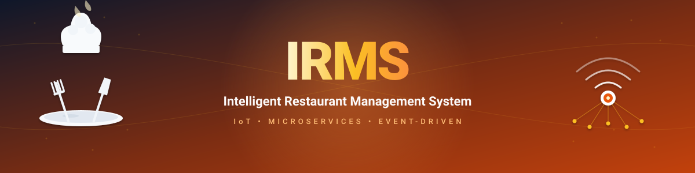

<p align="center">
  
</p>

<h1 align="center">IRMS — Intelligent Restaurant Management System</h1>

<p align="center">
  <em>An IoT-enabled, event-driven microservices platform that automates ordering, kitchen coordination,<br/>
  inventory tracking, and operational analytics for modern restaurants.</em>
</p>

<p align="center">
  <a href="docs/architecture/01-overview.md"></a>
  <a href="docs/diagrams/architecture/event-driven-architecture.md"></a>
  <a href="https://nodejs.org"></a>
  <a href="https://docs.docker.com/compose/"></a>
  <a href="#license"></a>
</p>

---

## Table of Contents

- [Overview](#overview)
- [Key Features](#key-features)
- [Architecture](#architecture)
- [Tech Stack](#tech-stack)
- [Repository Layout](#repository-layout)
- [Quick Start](#quick-start)
- [Service Catalog](#service-catalog)
- [Event Catalog](#event-catalog)
- [Development Workflow](#development-workflow)
- [Documentation](#documentation)
- [Contributing](#contributing)
- [License](#license)

---

## Overview

**IRMS** is a reference implementation of a cloud-native restaurant operating system. Customers order from tablet/QR menus, kitchen staff manage tickets on a real-time Kitchen Display System (KDS), and managers monitor live operations and inventory through an analytics dashboard. IoT sensors (load cells and temperature probes) stream telemetry that drives automated alerts when stock runs low or cold-chain thresholds are breached.

The system is organized as seven independently deployable microservices that communicate asynchronously through Apache Kafka, fronted by an Nginx API gateway and two React single-page applications.

## Key Features

- **Self-service ordering** — Tablet and QR-menu interfaces with table session resolution.
- **Real-time kitchen display** — Socket.io powered KDS with ticket status workflow.
- **IoT telemetry pipeline** — MQTT → Gateway → Kafka → InfluxDB (time-series) → alerts.
- **Predictive analytics** — Live dashboard with order-flow and forecasting endpoints.
- **Event-driven backbone** — Loose coupling via Kafka topics (`orders`, `kitchen_ready`, `kitchen_completed`, `alerts`, `sensor.telemetry`).
- **Polyglot persistence** — PostgreSQL for transactional state, Redis for caching, InfluxDB for sensor data.
- **Observability-ready** — Health probes on every service, container-native logging.

## Architecture

```
                           ┌──────────────────────────────────────┐
                           │           API Gateway (Nginx)        │
                           │                :8080                 │
                           └──────────────────────────────────────┘
                                          │
        ┌───────────────┬─────────────────┼────────────────┬──────────────┐
        ▼               ▼                 ▼                ▼              ▼
   ┌─────────┐    ┌──────────┐     ┌──────────┐     ┌───────────┐  ┌────────────┐
   │  Auth   │    │ Ordering │     │ Kitchen  │     │ Analytics │  │   Tablet/  │
   │  :3001  │    │  :3002   │     │  :3003   │     │   :3007   │  │  Manager   │
   └────┬────┘    └────┬─────┘     └─────┬────┘     └─────┬─────┘  │  Frontends │
        │              │                 │                │        └────────────┘
        ▼              ▼─── Kafka ───────▼───── Kafka ────▼
     Postgres       (orders)         (kitchen_*)        Redis
                                          │
                                          ▼ (alerts)
                                    ┌──────────────┐
                                    │ Notification │
                                    │    :3006     │ ─── SMTP
                                    └──────────────┘
                                          ▲
                          ┌───────────────┴───────────────┐
                          │     (sensor.telemetry)        │
                  ┌───────┴────────┐               ┌──────┴──────┐
                  │  IoT Gateway   │ ── MQTT ──    │  Inventory  │
                  │     :3004      │   ┌────────┐  │    :3005    │ ── InfluxDB
                  └────────────────┘ ◄─┤ Sensors│  └─────────────┘
                                       └────────┘
```

**Style:** Microservices + Event-Driven + IoT Gateway.
**Synchronous:** REST over HTTP through Nginx.
**Asynchronous:** Kafka topics for inter-service events; MQTT for device ingress.

For detailed views (module, component-and-connector, deployment, runtime scenarios), see [`docs/architecture/`](docs/architecture/) and [`docs/diagrams/`](docs/diagrams/).

## Tech Stack

<table>
  <tr>
    <td align="right"><strong>Backend</strong></td>
    <td>
      
      
      
      
    </td>
  </tr>
  <tr>
    <td align="right"><strong>Frontend</strong></td>
    <td>
      
      
      
      
      
    </td>
  </tr>
  <tr>
    <td align="right"><strong>Data</strong></td>
    <td>
      
      
      
    </td>
  </tr>
  <tr>
    <td align="right"><strong>Messaging&nbsp;&amp;&nbsp;IoT</strong></td>
    <td>
      
      
      
    </td>
  </tr>
  <tr>
    <td align="right"><strong>Infrastructure</strong></td>
    <td>
      
      
      
      
    </td>
  </tr>
</table>

<details>
<summary><em>Detailed version map</em></summary>

| Layer            | Technology                                        |
| ---------------- | ------------------------------------------------- |
| Backend runtime  | Node.js 20+, Express 5                            |
| Frontend         | React 18, Vite 5, TailwindCSS 3, Radix UI, Recharts |
| Async messaging  | Apache Kafka 7.4 (KRaft on Zookeeper), KafkaJS client |
| IoT ingress      | Eclipse Mosquitto 2.0 (MQTT 3.1.1)                |
| Realtime UI      | Socket.io 4.x                                     |
| Relational store | PostgreSQL 15                                     |
| Time-series      | InfluxDB 2.7                                      |
| Cache            | Redis 7                                           |
| Gateway          | Nginx (Alpine)                                    |
| Orchestration    | Docker Compose v2                                 |

</details>

## Repository Layout

```
IRMS/
├── api-gateway/             # Nginx reverse proxy + WebSocket routing
├── database/                # PostgreSQL bootstrap (init.sql)
├── docs/                    # Architecture, requirements, diagrams, report
│   ├── architecture/        # 6 architecture views (module, C&C, deployment, …)
│   ├── diagrams/            # Mermaid: context, components, sequences, data
│   ├── requirements/        # FRs, NFRs, traceability matrix
│   └── report.md            # Full architectural report
├── frontend/
│   ├── manager-dashboard/   # React 18 + Vite + Tailwind (KDS & analytics)
│   └── tablet-app/          # React 18 + Vite (customer ordering)
├── mosquitto/               # MQTT broker configuration
├── scripts/                 # Operational utilities (IoT simulator, …)
├── services/
│   ├── analytics-service/   # Postgres + Redis + Kafka + Socket.io  (:3007)
│   ├── auth-service/        # JWT issuance & validation             (:3001)
│   ├── inventory-service/   # InfluxDB telemetry & alerts           (:3005)
│   ├── iot-gateway/         # MQTT → Kafka bridge                   (:3004)
│   ├── kitchen-service/     # KDS, real-time tickets                (:3003)
│   ├── notification-service/# Kafka → email/SMTP alerts             (:3006)
│   └── ordering-service/    # Menus, orders, table sessions         (:3002)
├── docker-compose.yml
└── Makefile
```

## Quick Start

### Prerequisites

- [Docker](https://docs.docker.com/get-docker/) **24+** with [Compose v2](https://docs.docker.com/compose/install/)
- [Node.js](https://nodejs.org/) **20+** (only for hot-reload frontend development)
- 4 GB free RAM minimum (Kafka, Postgres, InfluxDB, and 7 services)

### 1. Start the backend stack

```bash
git clone https://github.com/PhongNguyenTrung/IRMS.git
cd IRMS
make dev          # equivalent to: docker compose up -d
```

This boots Postgres, Redis, Kafka + Zookeeper, Mosquitto, InfluxDB, all 7 microservices, and the Nginx API gateway on port **8080**.

### 2. Run the frontends in hot-reload mode

```bash
# Customer-facing tablet app — http://localhost:3000
make dev-tablet

# Manager dashboard — http://localhost:3001
make dev-dashboard
```

### 3. (Optional) Emit synthetic IoT telemetry

```bash
node scripts/simulate-iot.js              # one-shot
node scripts/simulate-iot.js --continuous # loop every 5 s
```

This publishes weight and temperature events through Mosquitto, exercising the full pipeline: **MQTT → iot-gateway → Kafka → inventory-service → alerts → notification-service**.

### 4. Production-style run (containerized frontends)

```bash
make prod         # builds and starts everything including frontend containers
```

### 5. Tear down

```bash
make down
```

## Service Catalog

| Service                                                       | Port | Responsibility                                                   | Stores              | Kafka In → Out                              |
| ------------------------------------------------------------- | ---- | ---------------------------------------------------------------- | ------------------- | ------------------------------------------- |
| [auth-service](services/auth-service/)                        | 3001 | JWT issuance, user registration, current-user lookup             | Postgres            | —                                           |
| [ordering-service](services/ordering-service/)                | 3002 | Menu CRUD, order placement, table sessions, payment requests     | Postgres + uploads/ | `kitchen_ready` → `orders`                  |
| [kitchen-service](services/kitchen-service/)                  | 3003 | KDS task feed, ticket state transitions, real-time push (Socket) | Postgres            | `orders` → `kitchen_completed`, `alerts`    |
| [iot-gateway](services/iot-gateway/)                          | 3004 | Bridge MQTT sensor topics into Kafka                             | —                   | (MQTT) → `sensor.telemetry`                 |
| [inventory-service](services/inventory-service/)              | 3005 | Persist telemetry, query stock/temperature, emit threshold alerts| InfluxDB            | `sensor.telemetry` → `alerts`               |
| [notification-service](services/notification-service/)        | 3006 | Fan-out alerts to SMTP, persist notification history             | Postgres            | `alerts` → —                                |
| [analytics-service](services/analytics-service/)              | 3007 | Order-flow analytics, predictive insights, live dashboard push   | Postgres + Redis    | `orders`, `kitchen_completed` → —           |

## Event Catalog

| Topic               | Producer            | Consumers                              | Purpose                                       |
| ------------------- | ------------------- | -------------------------------------- | --------------------------------------------- |
| `orders`            | ordering-service    | kitchen-service, analytics-service     | New order placed; broken into kitchen tasks   |
| `kitchen_ready`     | kitchen-service     | ordering-service                       | Ticket marked ready by kitchen station        |
| `kitchen_completed` | kitchen-service     | analytics-service                      | Order fully fulfilled; analytics aggregation  |
| `alerts`            | kitchen-service, inventory-service | notification-service    | Operational alerts (overload, low stock, temp)|
| `sensor.telemetry`  | iot-gateway         | inventory-service                      | Raw IoT readings from Mosquitto               |

Full event payload schemas: [`docs/diagrams/data/event-schema.md`](docs/diagrams/data/event-schema.md).

## Development Workflow

```bash
make dev            # Start backend (Docker)
make dev-tablet     # Frontend hot-reload (port 3000)
make dev-dashboard  # Frontend hot-reload (port 3001)
make prod           # Full stack including frontend containers
make down           # Stop everything
make logs           # Tail aggregated backend logs
```

**Local service development** (e.g., editing `kitchen-service`):

```bash
cd services/kitchen-service
cp .env.example .env       # if available; otherwise see service README
npm install
npm run dev                # nodemon-backed (where supported)
```

Make sure the supporting infrastructure (Postgres, Kafka, …) is running via `docker compose up -d postgres kafka …`.

**Resetting state:**

```bash
docker compose down -v     # WARNING: drops volumes (Postgres, InfluxDB, Mosquitto)
```

## Documentation

| Topic                          | Location                                                                 |
| ------------------------------ | ------------------------------------------------------------------------ |
| Documentation hub & reading guide | [`docs/README.md`](docs/README.md)                                    |
| Functional requirements (FR1–FR14)| [`docs/requirements/functional-requirements.md`](docs/requirements/functional-requirements.md) |
| Non-functional requirements (NFR1–NFR8) | [`docs/requirements/non-functional-requirements.md`](docs/requirements/non-functional-requirements.md) |
| Architecture views (6 views)   | [`docs/architecture/`](docs/architecture/)                               |
| Mermaid diagrams               | [`docs/diagrams/`](docs/diagrams/)                                       |
| Full architectural report      | [`docs/report.md`](docs/report.md)                                       |

## Contributing

This project was produced for an academic Software Architecture course. External contributions are welcome for educational discussion. To propose a change:

1. Fork and create a feature branch from `main`.
2. Follow the conventional layout — keep each service self-contained.
3. Add or update tests if applicable; ensure `make dev` still boots cleanly.
4. Open a pull request referencing the requirement (FR/NFR) or diagram it relates to.

## License

Released for academic and educational purposes. See course submission terms.

---

<sub>Built as part of the Software Architecture coursework. See [`docs/report.md`](docs/report.md) for the full design rationale, SOLID application, and architecture decision records.</sub>
