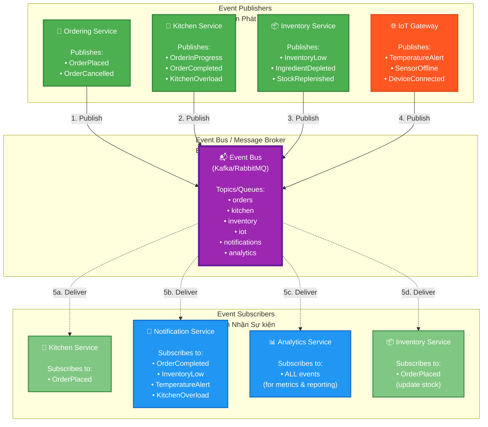

# IRMS Event-Driven Architecture
## Kiến trúc Hướng Sự kiện IRMS

## Purpose / Mục đích
Demonstrates the event-driven communication patterns in IRMS, showing how services communicate asynchronously through the Event Bus to achieve loose coupling, scalability, and fault tolerance.

Minh họa các mô hình giao tiếp hướng sự kiện trong IRMS, thể hiện cách các dịch vụ giao tiếp bất đồng bộ qua Event Bus để đạt được tính linh hoạt, khả năng mở rộng và chịu lỗi.

## Architecture Decision / Quyết định Kiến trúc
**ADR-002: Event-Driven Architecture** - Chosen for:
- **Real-time Responsiveness**: Immediate event propagation (NFR2)
- **Loose Coupling**: Publishers don't know subscribers
- **Scalability**: Easy to add new event consumers
- **Fault Tolerance**: Events buffered when services unavailable
- **Audit Trail**: Event log provides system history

---



---

## Event Catalog / Danh mục Sự kiện

### 1. OrderPlaced
**Publisher**: Ordering Service
**Subscribers**: Kitchen Service, Inventory Service, Analytics Service

**Payload**:
```json
{
  "eventId": "uuid",
  "eventType": "OrderPlaced",
  "timestamp": "2026-02-21T10:30:45Z",
  "data": {
    "orderId": "1234",
    "tableId": "5",
    "items": [
      {
        "itemId": "menu-001",
        "name": "Phở Bò",
        "quantity": 2,
        "category": "main-dish",
        "specialInstructions": "Extra noodles"
      }
    ],
    "totalAmount": 150000,
    "customerId": "optional"
  }
}
```

**Use Cases**:
- Kitchen Service adds order to queue
- Inventory Service deducts ingredients
- Analytics Service tracks order metrics

---

### 2. OrderInProgress
**Publisher**: Kitchen Service
**Subscribers**: Notification Service, Analytics Service

**Payload**:
```json
{
  "eventId": "uuid",
  "eventType": "OrderInProgress",
  "timestamp": "2026-02-21T10:32:15Z",
  "data": {
    "orderId": "1234",
    "chefId": "chef-007",
    "stationId": "main-kitchen",
    "startTime": "2026-02-21T10:32:00Z",
    "estimatedCompletionTime": "2026-02-21T10:45:00Z"
  }
}
```

**Use Cases**:
- Notification Service updates customer via tablet
- Analytics Service tracks cooking duration
- Dashboard updates real-time kitchen status

---

### 3. OrderCompleted
**Publisher**: Kitchen Service
**Subscribers**: Notification Service, Analytics Service

**Payload**:
```json
{
  "eventId": "uuid",
  "eventType": "OrderCompleted",
  "timestamp": "2026-02-21T10:43:30Z",
  "data": {
    "orderId": "1234",
    "completionTime": "2026-02-21T10:43:30Z",
    "actualDuration": "11m 30s",
    "chefId": "chef-007",
    "qualityRating": "A"
  }
}
```

**Use Cases**:
- Notification Service alerts waiter to serve
- Notification Service notifies customer
- Analytics Service calculates performance metrics

---

### 4. InventoryLow
**Publisher**: Inventory Service
**Subscribers**: Notification Service, Analytics Service

**Payload**:
```json
{
  "eventId": "uuid",
  "eventType": "InventoryLow",
  "timestamp": "2026-02-21T10:50:00Z",
  "data": {
    "ingredientId": "ing-beef",
    "ingredientName": "Thịt bò",
    "currentLevel": 5.2,
    "unit": "kg",
    "threshold": 10.0,
    "severity": "warning",
    "sensorId": "sensor-warehouse-01"
  }
}
```

**Use Cases**:
- Notification Service alerts manager immediately
- Notification Service sends email to supplier
- Analytics Service predicts restock timing

---

### 5. TemperatureAlert
**Publisher**: IoT Gateway Service
**Subscribers**: Notification Service

**Payload**:
```json
{
  "eventId": "uuid",
  "eventType": "TemperatureAlert",
  "timestamp": "2026-02-21T11:05:00Z",
  "data": {
    "sensorId": "temp-fridge-02",
    "location": "Walk-in Cooler #2",
    "currentTemp": 8.5,
    "unit": "celsius",
    "threshold": 4.0,
    "severity": "critical",
    "trend": "rising"
  }
}
```

**Use Cases**:
- Notification Service sends urgent alert to manager
- Notification Service notifies maintenance team
- System logs equipment malfunction

---

### 6. KitchenOverload (Supplementary)
**Publisher**: Kitchen Service
**Subscribers**: Notification Service, Analytics Service, Ordering Service

**Payload**:
```json
{
  "eventId": "uuid",
  "eventType": "KitchenOverload",
  "timestamp": "2026-02-21T12:15:00Z",
  "data": {
    "queueLength": 45,
    "threshold": 30,
    "averageWaitTime": "25 minutes",
    "stationsAffected": ["main-kitchen", "grill"],
    "severity": "high"
  }
}
```

**Use Cases**:
- Notification Service alerts manager
- Ordering Service may throttle new orders
- Analytics Service tracks peak hour patterns

---

## Event Flow Scenarios / Kịch bản Luồng Sự kiện

### Scenario 1: Happy Path Order Flow
```
1. Customer places order
2. Ordering Service → OrderPlaced event
3. Kitchen Service receives → adds to queue
4. Kitchen Service → OrderInProgress event
5. Chef completes cooking
6. Kitchen Service → OrderCompleted event
7. Notification Service → alerts waiter
```

**Timeline**: ~13 minutes from order to completion

---

### Scenario 2: Inventory Depletion Flow
```
1. Multiple orders consume beef ingredient
2. Inventory Service detects level < threshold
3. Inventory Service → InventoryLow event
4. Notification Service → alerts manager via dashboard
5. Notification Service → emails supplier
6. Manager orders restock
7. Stock arrives → IngredientReplenished event
```

**Timeline**: Alert within seconds of threshold breach

---

### Scenario 3: Equipment Failure Flow
```
1. Temperature sensor detects rising temp
2. IoT Gateway → TemperatureAlert event
3. Notification Service → URGENT alert to manager
4. Notification Service → SMS to maintenance
5. Maintenance fixes issue
6. System logs incident for analysis
```

**Timeline**: Alert within 30 seconds of threshold breach

---

## Event Bus Technology Comparison

### Option 1: Apache Kafka (Recommended)
**Strengths**:
- ✅ High throughput (millions of events/sec)
- ✅ Persistent event log (replay capability)
- ✅ Horizontal scalability
- ✅ Strong ordering guarantees per partition
- ✅ Ideal for analytics (event sourcing)

**Challenges**:
- ⚠️ Complex setup and operation
- ⚠️ Requires ZooKeeper (or KRaft mode)
- ⚠️ Steeper learning curve

**Best for**: High-volume, analytics-heavy systems like IRMS

---

### Option 2: RabbitMQ
**Strengths**:
- ✅ Easy setup and management
- ✅ Flexible routing (exchanges, bindings)
- ✅ Good for complex workflows
- ✅ Lower operational overhead

**Challenges**:
- ⚠️ Lower throughput than Kafka
- ⚠️ No native event replay
- ⚠️ Vertical scaling limits

**Best for**: Simpler event-driven systems

---

### Recommendation for IRMS
**Apache Kafka** - Because:
1. High throughput during peak hours (NFR1)
2. Event replay for analytics and debugging
3. Horizontal scaling as restaurant grows
4. Industry standard for IoT systems

---

## Event Ordering & Consistency

### Ordering Guarantees

**Per-Order Consistency**:
- All events for same `orderId` processed in order
- Use `orderId` as Kafka partition key
- Ensures correct state transitions

**Example**:
```
OrderPlaced → OrderInProgress → OrderCompleted
(Always in this order for orderId=1234)
```

### Eventual Consistency

**Cross-Service Data**:
- Inventory updated asynchronously after order
- Brief window where order placed but stock not yet deducted
- Acceptable trade-off for performance

**Mitigation**:
- Compensating transactions if order fails
- Idempotent event handlers (handle duplicates)
- Saga pattern for complex workflows

---

## Event Schema Evolution

### Versioning Strategy

**Approach**: Backward-compatible changes only

**Safe Changes**:
- ✅ Add optional fields
- ✅ Add new event types
- ✅ Deprecate fields (don't remove)

**Unsafe Changes**:
- ❌ Remove fields
- ❌ Change field types
- ❌ Rename fields

**Example Evolution**:
```json
// Version 1
{
  "orderId": "1234",
  "items": [...]
}

// Version 2 (backward compatible)
{
  "orderId": "1234",
  "items": [...],
  "loyaltyPoints": 50,  // New optional field
  "schemaVersion": "2.0"
}
```

---

## Error Handling & Retry

### Dead Letter Queue (DLQ)

**When event processing fails**:
1. Retry with exponential backoff (3 attempts)
2. If still fails → send to Dead Letter Queue
3. Alert operations team
4. Manual investigation and reprocessing

**Common Failure Scenarios**:
- Database unavailable
- Invalid event payload
- Business logic error
- Service timeout

---

### Idempotency

**Problem**: Events may be delivered multiple times

**Solution**: Idempotent event handlers
```
if (eventAlreadyProcessed(eventId)) {
  return; // Skip duplicate
}

processEvent(event);
markAsProcessed(eventId);
```

**Implementation**:
- Store processed `eventId` in database
- Check before processing
- Atomic operation (process + mark)

---

## Event Monitoring & Observability

### Key Metrics to Track

| Metric | Description | Alert Threshold |
|--------|-------------|----------------|
| **Event Lag** | Time between publish and consumption | > 5 seconds |
| **Queue Depth** | Backlog of unprocessed events | > 1000 events |
| **Error Rate** | % of failed event processing | > 5% |
| **Throughput** | Events processed per second | < 50 eps (low) |
| **DLQ Size** | Events in dead letter queue | > 10 events |

### Distributed Tracing

**Propagate Trace Context**:
```json
{
  "eventId": "uuid",
  "traceId": "distributed-trace-id",  // For tracing
  "spanId": "current-span-id",
  "parentSpanId": "parent-span-id",
  ...
}
```

**Benefits**:
- Track event across all services
- Identify bottlenecks
- Debug complex flows

---

## Security Considerations

### Event Authentication
- Services authenticate to Event Bus (TLS certificates)
- Only authorized services can publish/subscribe
- Role-based access per topic

### Event Encryption
- Sensitive data encrypted in payload
- End-to-end encryption for PII
- Key rotation policies

### Event Audit
- All events logged immutably
- Audit trail for compliance
- Tamper-proof event log (Kafka retention)

---

## Advantages of Event-Driven Architecture

### For IRMS Specifically

✅ **Real-Time Updates**
- Kitchen sees orders immediately (NFR2)
- Dashboard updates in real-time
- Customers track order status live

✅ **Scalability**
- Add subscribers without changing publishers
- Scale consumers independently
- Handle peak hour traffic bursts

✅ **Fault Tolerance**
- Events buffered during service downtime
- No lost orders even if Kitchen Service crashes
- Automatic retry on recovery

✅ **Loose Coupling**
- Services don't know about each other
- Easy to add new features (e.g., loyalty service)
- Change one service without affecting others

✅ **Audit Trail**
- Complete event log of all system activities
- Debug production issues by replaying events
- Compliance and reporting

---

## Challenges & Mitigation

### Challenge 1: Debugging Complexity
**Problem**: Hard to trace issues across services
**Mitigation**: Distributed tracing (Jaeger), correlation IDs

### Challenge 2: Eventual Consistency
**Problem**: Data not immediately consistent
**Mitigation**: Design for eventual consistency, use sagas for critical workflows

### Challenge 3: Event Ordering
**Problem**: Events may arrive out of order
**Mitigation**: Partition by key (orderId), version events, idempotent handlers

### Challenge 4: Operational Overhead
**Problem**: More infrastructure to manage
**Mitigation**: Use managed services (AWS MSK, Confluent Cloud)

---

## Related Diagrams / Sơ đồ Liên quan

- [**Microservices Overview**](microservices-overview.md) - Service architecture
- [**Order Placement Sequence**](../sequences/order-placement-flow.md) - Detailed event flow
- [**Kitchen Overload Scenario**](../sequences/kitchen-overload-scenario.md) - Event handling under load
- [**Inventory Alert Flow**](../sequences/inventory-alert-flow.md) - IoT event processing

---

## Implementation Checklist

- [ ] Set up Kafka cluster (3+ brokers for HA)
- [ ] Define event schema registry (Avro/JSON Schema)
- [ ] Implement event base classes with common fields
- [ ] Configure topics with appropriate partitions
- [ ] Set up monitoring (Kafka Manager, Prometheus)
- [ ] Implement Dead Letter Queue handling
- [ ] Add distributed tracing headers
- [ ] Create event versioning strategy
- [ ] Document all event types in schema registry
- [ ] Test event replay and recovery scenarios

---

**Last Updated**: 2026-02-21
**Status**: Design Complete, Ready for Implementation
