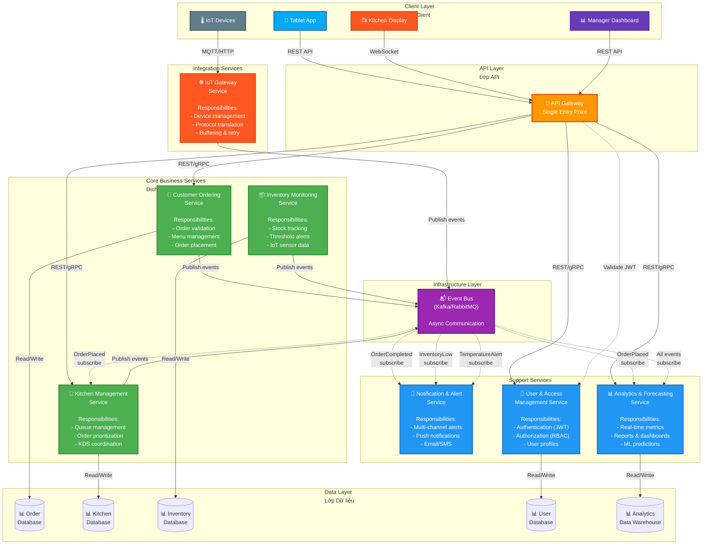

# IRMS Microservices Architecture Overview
## Tổng quan Kiến trúc Microservices IRMS

## Purpose / Mục đích
Illustrates the decomposition of IRMS into 7 microservices, showing service boundaries, communication patterns, and infrastructure components.

Minh họa việc phân tách IRMS thành 7 microservices, thể hiện ranh giới service, mô hình giao tiếp và các thành phần hạ tầng.

## Architecture Decision / Quyết định Kiến trúc
**ADR-001: Microservices Architecture** - Chosen for:
- **Scalability**: Independent scaling per service (NFR6)
- **Fault Isolation**: Failures don't cascade (NFR4)
- **Independent Deployment**: Deploy services separately
- **Technology Flexibility**: Different tech stacks per service
- **Team Autonomy**: Teams own specific services

## Key Architectural Patterns / Các mẫu Kiến trúc

1. **Microservices Pattern** - Service decomposition
2. **API Gateway Pattern** - Single entry point for clients
3. **Database per Service** - Data autonomy and isolation
4. **Event-Driven Architecture** - Asynchronous communication
5. **Service Discovery** - Dynamic service location

---



---

## Service Catalog / Danh mục Dịch vụ

### Core Business Services (Green)

| Service | Primary Responsibility | Database | Scale Priority |
|---------|----------------------|----------|----------------|
| **Customer Ordering** | Order validation, placement, menu | Order DB | HIGH - Peak hours |
| **Kitchen Management** | Queue management, prioritization | Kitchen DB | HIGH - Peak hours |
| **Inventory Monitoring** | Stock tracking, threshold alerts | Inventory DB | MEDIUM |

### Support Services (Blue)

| Service | Primary Responsibility | Database | Scale Priority |
|---------|----------------------|----------|----------------|
| **Notification & Alert** | Multi-channel notifications | - (Stateless) | MEDIUM |
| **Analytics & Forecasting** | Reporting, ML predictions | Analytics DW | LOW |
| **User & Access Management** | Authentication, RBAC | User DB | MEDIUM |

### Integration Services (Red)

| Service | Primary Responsibility | Database | Scale Priority |
|---------|----------------------|----------|----------------|
| **IoT Gateway** | Device management, protocol translation | - (Buffering) | MEDIUM |

---

## Communication Patterns / Mô hình Giao tiếp

### 1. Synchronous Communication (REST/gRPC)
**Use case**: Client queries, commands requiring immediate response

```
Client → API Gateway → Service → Response
```

**Examples**:
- `GET /api/menu` - Fetch menu items
- `POST /api/orders` - Create new order
- `GET /api/orders/{id}` - Query order status

**Advantages**:
- Simple request-response model
- Immediate feedback to user
- Easy error handling

**Disadvantages**:
- Tight coupling (client waits for response)
- Cascading failures if service down

### 2. Asynchronous Communication (Event Bus)
**Use case**: State changes, notifications, cross-service data sync

```
Service → Event Bus → Subscribed Service(s)
```

**Examples**:
- `OrderPlaced` event: Ordering → Kitchen, Analytics
- `InventoryLow` event: Inventory → Notification
- `OrderCompleted` event: Kitchen → Notification, Analytics

**Advantages**:
- Loose coupling (publisher doesn't know subscribers)
- Scalability (add subscribers without changing publisher)
- Fault tolerance (buffered messages)

**Disadvantages**:
- Eventual consistency
- Complex debugging
- Message ordering challenges

---

## Key Events / Sự kiện Chính

| Event Name | Publisher | Subscribers | Payload | Purpose |
|------------|-----------|-------------|---------|---------|
| **OrderPlaced** | Ordering Service | Kitchen, Analytics | `{orderId, tableId, items[], timestamp}` | New order notification |
| **OrderInProgress** | Kitchen Service | Analytics, Notification | `{orderId, chefId, startTime}` | Cooking started |
| **OrderCompleted** | Kitchen Service | Notification, Analytics | `{orderId, completionTime, duration}` | Dish ready |
| **InventoryLow** | Inventory Service | Notification, Analytics | `{ingredientId, currentLevel, threshold}` | Stock alert |
| **TemperatureAlert** | IoT Gateway | Notification | `{sensorId, temperature, threshold, location}` | Equipment issue |

---

## Database per Service Pattern / Mẫu Database mỗi Service

### Why Database per Service?

✅ **Data Autonomy**: Each service owns its data schema
✅ **Independent Scaling**: Scale database per service needs
✅ **Fault Isolation**: Database failure doesn't affect other services
✅ **Technology Flexibility**: Use best database type per service (SQL, NoSQL, etc.)
✅ **Loose Coupling**: No shared database dependencies

⚠️ **Challenges**:
- Data duplication across services
- No ACID transactions across services
- Complex queries across service boundaries
- Eventual consistency

### Service Database Mapping

| Service | Database Type | Justification |
|---------|---------------|---------------|
| **Ordering** | Relational (PostgreSQL) | ACID for order integrity |
| **Kitchen** | Relational (PostgreSQL) | Queue ordering, consistency |
| **Inventory** | Time-series DB (InfluxDB) | IoT sensor data, metrics |
| **User & Access** | Relational (PostgreSQL) | User profiles, permissions |
| **Analytics** | Data Warehouse (Redshift/BigQuery) | OLAP queries, aggregations |

---

## API Gateway Responsibilities / Trách nhiệm API Gateway

The API Gateway serves as the single entry point for all client requests:

### 1. **Routing**
- Route requests to appropriate microservices
- Load balancing across service instances

### 2. **Authentication & Authorization**
- Validate JWT tokens with Auth Service
- Enforce role-based access control (RBAC)
- Block unauthorized requests

### 3. **Request Transformation**
- Protocol translation (REST → gRPC)
- Request/response format conversion
- API versioning support

### 4. **Cross-Cutting Concerns**
- Rate limiting per client
- Request logging and tracing
- Circuit breaking for failing services
- Response caching

### 5. **Aggregation** (Optional)
- Combine multiple service calls
- Return unified response to client
- Reduce client-side complexity

---

## Scalability Strategy / Chiến lược Mở rộng

### Horizontal Scaling

Each service can scale independently based on load:

```
Peak Hours Scaling:
- Ordering Service: 5 instances (HIGH traffic)
- Kitchen Service: 3 instances (HIGH traffic)
- Inventory Service: 2 instances (MEDIUM traffic)
- Other services: 1-2 instances (LOW traffic)
```

### Auto-scaling Triggers

| Service | Metric | Threshold | Action |
|---------|--------|-----------|--------|
| Ordering | Request rate | > 100 req/s | Scale up +1 instance |
| Kitchen | Queue length | > 50 orders | Scale up +1 instance |
| IoT Gateway | Connection count | > 200 devices | Scale up +1 instance |

---

## Fault Tolerance / Khả năng Chịu lỗi

### Service Failures

**Scenario**: Kitchen Service crashes during peak hours

**Mitigation**:
1. API Gateway detects failure via health checks
2. Circuit breaker opens (stop sending requests)
3. Event Bus buffers `OrderPlaced` events
4. When Kitchen Service recovers, processes buffered events
5. No orders lost (events persisted)

### Event Bus Failures

**Scenario**: Kafka cluster unavailable

**Mitigation**:
1. Services buffer events locally (disk/memory)
2. Retry sending events with exponential backoff
3. Circuit breaker prevents cascade failures
4. Critical operations (order placement) still work synchronously

### Database Failures

**Scenario**: Ordering Database crashes

**Mitigation**:
1. Read replicas serve read queries
2. Primary database fails over to standby
3. Other services unaffected (isolated databases)
4. Recovery time < 5 minutes

---

## Security Architecture / Kiến trúc Bảo mật

### 1. Authentication (Xác thực)
- **JWT tokens** issued by Auth Service
- Token includes: userId, role, expiration
- API Gateway validates on every request

### 2. Authorization (Phân quyền)
- **RBAC model**: Customer, Staff, Chef, Manager roles
- Each service enforces its own authorization rules
- Fine-grained permissions per endpoint

### 3. Service-to-Service Authentication
- **mTLS** (mutual TLS) between services
- Service mesh (Istio/Linkerd) for encryption
- Service accounts with limited permissions

### 4. IoT Device Security
- Device registration and whitelisting
- Unique device certificates
- Regular credential rotation

---

## Observability / Khả năng Quan sát

### 1. Distributed Tracing
- Trace requests across all services
- Correlation IDs in all logs
- Tools: Jaeger, Zipkin

### 2. Centralized Logging
- All service logs aggregated
- Structured logging (JSON format)
- Tools: ELK Stack, Splunk

### 3. Metrics & Monitoring
- Service health metrics (CPU, memory, latency)
- Business metrics (orders/min, revenue/hour)
- Tools: Prometheus, Grafana

### 4. Alerting
- Real-time alerts for critical issues
- Escalation policies
- Tools: PagerDuty, Opsgenie

---

## Related Diagrams / Sơ đồ Liên quan

To understand specific aspects of this architecture:

- [**Event-Driven Architecture**](event-driven-architecture.md) - Detailed event flows
- [**Order Placement Sequence**](../sequences/order-placement-flow.md) - Runtime behavior
- [**Kubernetes Deployment**](../deployment/kubernetes-deployment.md) - Infrastructure deployment
- [**Component Diagrams**](../components/) - Internal structure of each service

---

## Architecture Trade-offs / Đánh đổi Kiến trúc

### Advantages / Ưu điểm

✅ **Scalability**: Scale each service independently
✅ **Fault Isolation**: Failures contained to single service
✅ **Technology Flexibility**: Different tech per service
✅ **Team Autonomy**: Teams own end-to-end services
✅ **Faster Deployment**: Deploy services independently
✅ **Easier Maintenance**: Smaller, focused codebases

### Challenges / Thách thức

⚠️ **Distributed System Complexity**: Network latency, partial failures
⚠️ **Data Consistency**: No distributed transactions, eventual consistency
⚠️ **Testing Complexity**: Integration testing across services
⚠️ **Operational Overhead**: More services to deploy and monitor
⚠️ **Service Discovery**: Dynamic service location
⚠️ **Network Chattiness**: More inter-service calls

---

## Implementation Priorities / Ưu tiên Triển khai

### Phase 1: Core Services (MVP)
1. **Auth Service** - Foundation for all others
2. **Ordering Service** - Core business value
3. **Kitchen Service** - Complete order flow
4. **Event Bus** - Enable async communication

### Phase 2: IoT Integration
5. **IoT Gateway Service** - Device connectivity
6. **Inventory Service** - Stock monitoring

### Phase 3: Advanced Features
7. **Notification Service** - Alerts and notifications
8. **Analytics Service** - Insights and forecasting

---

## Notes / Ghi chú

- This diagram shows logical architecture, not physical deployment (see deployment diagrams)
- Solid lines = synchronous communication (REST/gRPC)
- Dotted lines = asynchronous communication (events)
- Each service should have 2+ instances in production for high availability
- Event Bus is critical infrastructure - deploy in cluster mode with replication
- API Gateway is single point of failure - requires load balancing and redundancy

---

**Last Updated**: 2026-02-21
**Status**: Design Complete, Implementation Pending
