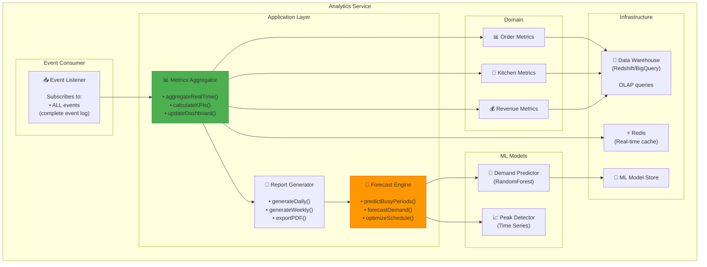

# Analytics Service Component Diagram
## Sơ đồ Thành phần Dịch vụ Phân tích



---

## Key Metrics

### Real-Time (Updated every 10s)
- Orders per minute
- Current revenue
- Kitchen queue length
- Table occupancy

### Aggregated (Calculated hourly)
- Average order value
- Peak hours
- Table turnover rate
- Popular menu items

### Predictions (Updated daily)
- Tomorrow's expected orders
- Busy periods forecast
- Staffing recommendations

---

## ML Prediction Example

```python
from sklearn.ensemble import RandomForestRegressor

class DemandPredictor:
    def predict_orders(self, date, time_slot):
        features = [
            date.weekday(),           # 0-6 (Mon-Sun)
            time_slot,                # 0-23 (hour)
            is_holiday(date),         # 0 or 1
            weather_forecast(date),   # temperature
            recent_trend()            # 7-day average
        ]
        
        prediction = self.model.predict([features])
        return int(prediction[0])  # Expected orders
```

---

**Last Updated**: 2026-02-21
