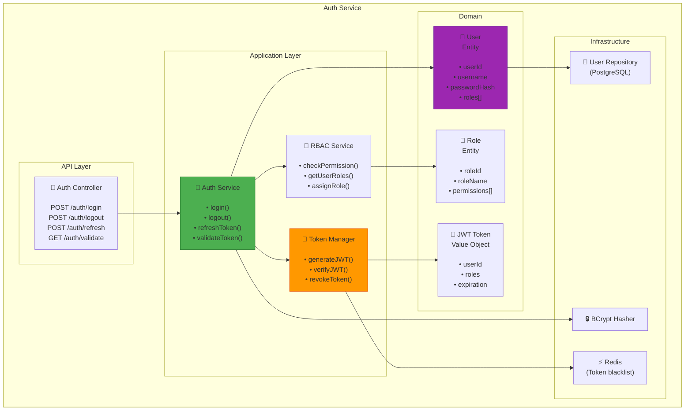

# Auth Service Component Diagram
## Sơ đồ Thành phần Dịch vụ Xác thực



---

## JWT Structure

```json
{
  "header": {
    "alg": "HS256",
    "typ": "JWT"
  },
  "payload": {
    "userId": "uuid-123",
    "username": "manager@irms.com",
    "roles": ["MANAGER", "STAFF"],
    "iat": 1708502400,
    "exp": 1708506000
  },
  "signature": "..."
}
```

## RBAC Matrix

| Role | Orders | Kitchen | Inventory | Analytics | Config |
|------|--------|---------|-----------|-----------|--------|
| **Customer** | Create own | - | - | - | - |
| **Waiter** | View all | View | - | View | - |
| **Chef** | View | Update | - | - | - |
| **Manager** | All | All | All | All | All |

---

## Password Security

```java
@Service
public class PasswordService {
    private final BCryptPasswordEncoder encoder = 
        new BCryptPasswordEncoder(12);  // Cost factor: 12
    
    public String hash(String password) {
        return encoder.encode(password);
    }
    
    public boolean verify(String password, String hash) {
        return encoder.matches(password, hash);
    }
}
```

---

**Last Updated**: 2026-02-21
