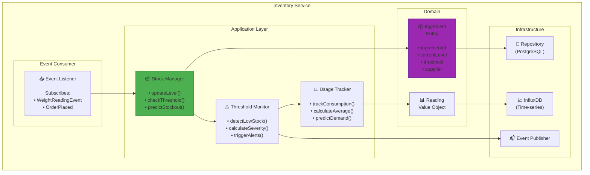

# Inventory Service Component Diagram
## Sơ đồ Thành phần Dịch vụ Tồn kho



---

## Key Algorithms

### Threshold Detection
```java
public AlertSeverity detectLowStock(Ingredient ingredient) {
    double percentage = ingredient.getCurrentLevel() / ingredient.getMaxCapacity();
    
    if (percentage < 0.20) return AlertSeverity.CRITICAL;
    if (percentage < 0.30) return AlertSeverity.WARNING;
    return AlertSeverity.NORMAL;
}
```

### Stockout Prediction
```java
public int predictStockoutDays(String ingredientId) {
    double currentLevel = getCurrentLevel(ingredientId);
    double avgDailyUsage = calculateAverageDailyUsage(ingredientId, 7);  // 7 days
    double threshold = getThreshold(ingredientId);
    
    return (int) ((currentLevel - threshold) / avgDailyUsage);
}
```

---

**Last Updated**: 2026-02-21
