```mermaid
graph TB
    subgraph "IoT Devices / Edge<br/>Thiết bị IoT / Biên"
        Tablets["📱 Tablets<br/>(HTTP)"]
        LoadSensors["⚖️ Load-Cell Sensors<br/>(MQTT)<br/><br/>Weight sensors<br/>for ingredients"]
        TempSensors["🌡️ Temperature Sensors<br/>(MQTT)<br/><br/>Fridge/freezer<br/>monitoring"]
        KDS["📺 Kitchen Displays<br/>(WebSocket)"]
    end

    subgraph "IoT Gateway Service<br/>Dịch vụ Cổng IoT"

        subgraph "Protocol Layer<br/>Lớp Giao thức"
            MQTTBroker["📡 MQTT Broker<br/>(Mosquitto)<br/><br/>Port: 8883 (TLS)<br/>Topics:<br/>• sensors/+/temperature<br/>• sensors/+/weight<br/>• devices/+/status"]

            HTTPEndpoint["🌐 HTTP Endpoint<br/><br/>POST /api/iot/data<br/>POST /api/iot/register<br/>GET /api/iot/health"]

            WebSocketServer["🔌 WebSocket Server<br/><br/>/ws/devices<br/>Bidirectional<br/>communication"]
        end

        subgraph "Device Management Layer<br/>Lớp Quản lý Thiết bị"
            DeviceRegistry["📋 Device Registry<br/><br/>Methods:<br/>• registerDevice()<br/>• authenticateDevice()<br/>• revokeDevice()<br/>• getDeviceStatus()<br/><br/>Storage:<br/>• Device ID<br/>• Certificate<br/>• Last seen<br/>• Status"]

            DeviceAuthenticator["🔐 Device Authenticator<br/><br/>Methods:<br/>• validateCertificate()<br/>• checkWhitelist()<br/>• generateToken()<br/><br/>Auth Methods:<br/>• X.509 certificates<br/>• Pre-shared keys<br/>• JWT tokens"]

            ConnectionManager["🔗 Connection Manager<br/><br/>Methods:<br/>• trackConnection()<br/>• handleDisconnect()<br/>• sendHeartbeat()<br/>• detectOffline()<br/><br/>Tracks:<br/>• Active connections<br/>• Connection quality<br/>• Last activity"]
        end

        subgraph "Data Processing Layer<br/>Lớp Xử lý Dữ liệu"
            DataValidator["✅ Data Validator<br/><br/>Methods:<br/>• validateSchema()<br/>• checkRange()<br/>• detectAnomalies()<br/><br/>Rules:<br/>• Temp: -20°C to 50°C<br/>• Weight: 0-1000kg<br/>• Timestamp valid"]

            ProtocolTranslator["🔄 Protocol Translator<br/><br/>Methods:<br/>• mqttToEvent()<br/>• httpToEvent()<br/>• translatePayload()<br/><br/>Converts:<br/>MQTT/HTTP → Domain Events"]

            DataAggregator["📊 Data Aggregator<br/><br/>Methods:<br/>• aggregateByWindow()<br/>• calculateAverage()<br/>• detectTrends()<br/><br/>Windows:<br/>• 1 minute<br/>• 5 minutes<br/>• 1 hour"]
        end

        subgraph "Business Logic Layer<br/>Lớp Logic Nghiệp vụ"
            InventoryDataProcessor["📦 Inventory Data Processor<br/><br/>Methods:<br/>• processWeightReading()<br/>• calculateStockLevel()<br/>• detectLowStock()<br/><br/>Logic:<br/>• Convert weight → quantity<br/>• Compare with threshold<br/>• Trigger alerts"]

            TemperatureMonitor["🌡️ Temperature Monitor<br/><br/>Methods:<br/>• processTemperature()<br/>• checkThresholds()<br/>• detectSpikes()<br/><br/>Thresholds:<br/>• Fridge: 0-4°C<br/>• Freezer: -18 to -20°C<br/>• Alert if exceeded"]

            AlertGenerator["🚨 Alert Generator<br/><br/>Methods:<br/>• createAlert()<br/>• setPriority()<br/>• publishAlert()<br/><br/>Alert Types:<br/>• TemperatureAlert<br/>• InventoryLow<br/>• DeviceOffline"]
        end

        subgraph "Edge Intelligence<br/>Trí tuệ Biên"
            EdgeBuffering["💾 Edge Buffer<br/>(Local Storage)<br/><br/>When cloud unavailable:<br/>• Buffer to disk<br/>• Retry with backoff<br/>• Persist important data<br/><br/>Capacity: 10GB<br/>Retention: 7 days"]

            CircuitBreaker["⚡ Circuit Breaker<br/><br/>States:<br/>• CLOSED (normal)<br/>• OPEN (cloud down)<br/>• HALF_OPEN (testing)<br/><br/>Thresholds:<br/>• Failure rate > 50%<br/>• Timeout > 5s"]

            RetryMechanism["🔁 Retry Logic<br/><br/>Strategy:<br/>• Exponential backoff<br/>• Max retries: 5<br/>• Jitter: ±20%<br/><br/>Initial: 1s<br/>Max: 60s"]
        end

        subgraph "Infrastructure Layer<br/>Lớp Hạ tầng"
            EventPublisher["📬 Event Publisher<br/>(Kafka Producer)<br/><br/>Publishes:<br/>• InventoryLow<br/>• TemperatureAlert<br/>• DeviceOffline<br/>• DeviceConnected<br/><br/>Config:<br/>• acks=1<br/>• retries=3"]

            LocalDatabase["💾 Local Database<br/>(SQLite/LevelDB)<br/><br/>Stores:<br/>• Device registry<br/>• Buffered events<br/>• Historical data<br/>• Configuration"]

            MetricsCollector["📈 Metrics Collector<br/><br/>Metrics:<br/>• Messages received<br/>• Processing latency<br/>• Device count<br/>• Error rate<br/>• Buffer size"]
        end

        subgraph "Cross-Cutting<br/>Xuyên suốt"
            Logger["📝 Logger<br/><br/>Logs:<br/>• Device events<br/>• Errors<br/>• Performance"]

            HealthCheck["💚 Health Check<br/><br/>Checks:<br/>• MQTT broker<br/>• Kafka connection<br/>• Buffer capacity<br/>• Device count"]
        end
    end

    subgraph "Cloud Services<br/>Dịch vụ Đám mây"
        Kafka["📬 Kafka Event Bus<br/><br/>Topics:<br/>• iot.inventory<br/>• iot.temperature<br/>• iot.alerts"]

        CloudDB[("☁️ Cloud Database<br/>(Optional)<br/><br/>Device registry<br/>backup")]
    end

    %% Device connections
    LoadSensors -->|"MQTT Publish<br/>sensors/123/weight"| MQTTBroker
    TempSensors -->|"MQTT Publish<br/>sensors/456/temperature"| MQTTBroker
    Tablets -->|"HTTP POST<br/>/api/iot/data"| HTTPEndpoint
    KDS -->|"WebSocket"| WebSocketServer

    %% Protocol to Device Management
    MQTTBroker --> DeviceRegistry
    HTTPEndpoint --> DeviceRegistry
    DeviceRegistry --> DeviceAuthenticator
    DeviceRegistry --> ConnectionManager

    %% Data processing flow
    MQTTBroker --> DataValidator
    HTTPEndpoint --> DataValidator
    DataValidator --> ProtocolTranslator
    ProtocolTranslator --> DataAggregator

    %% Business logic
    DataAggregator --> InventoryDataProcessor
    DataAggregator --> TemperatureMonitor

    InventoryDataProcessor --> AlertGenerator
    TemperatureMonitor --> AlertGenerator

    %% Edge intelligence
    ProtocolTranslator --> CircuitBreaker
    CircuitBreaker -->|"Cloud available"| EventPublisher
    CircuitBreaker -->|"Cloud down"| EdgeBuffering
    EdgeBuffering --> RetryMechanism
    RetryMechanism --> EventPublisher

    %% Event publishing
    AlertGenerator --> EventPublisher
    EventPublisher --> Kafka

    %% Local storage
    DeviceRegistry --> LocalDatabase
    EdgeBuffering --> LocalDatabase

    %% Cloud sync
    EventPublisher -.->|"Backup"| CloudDB

    %% Monitoring
    ConnectionManager --> MetricsCollector
    EventPublisher --> MetricsCollector
    MetricsCollector --> Logger

    %% Health
    DeviceRegistry -.-> HealthCheck
    EventPublisher -.-> HealthCheck
    EdgeBuffering -.-> HealthCheck

    %% Styling
    style MQTTBroker fill:#FF9800,stroke:#E65100,stroke-width:3px,color:#fff
    style HTTPEndpoint fill:#FF9800,stroke:#E65100,stroke-width:2px,color:#fff

    style DeviceRegistry fill:#4CAF50,stroke:#2E7D32,stroke-width:2px,color:#fff
    style DeviceAuthenticator fill:#4CAF50,stroke:#2E7D32,stroke-width:2px,color:#fff
    style ConnectionManager fill:#4CAF50,stroke:#2E7D32,stroke-width:2px,color:#fff

    style DataValidator fill:#2196F3,stroke:#1565C0,stroke-width:2px,color:#fff
    style ProtocolTranslator fill:#2196F3,stroke:#1565C0,stroke-width:2px,color:#fff

    style InventoryDataProcessor fill:#9C27B0,stroke:#6A1B9A,stroke-width:2px,color:#fff
    style TemperatureMonitor fill:#9C27B0,stroke:#6A1B9A,stroke-width:2px,color:#fff
    style AlertGenerator fill:#FF5722,stroke:#D84315,stroke-width:2px,color:#fff

    style EdgeBuffering fill:#795548,stroke:#4E342E,stroke-width:2px,color:#fff
    style CircuitBreaker fill:#795548,stroke:#4E342E,stroke-width:2px,color:#fff

    style EventPublisher fill:#9C27B0,stroke:#6A1B9A,stroke-width:3px,color:#fff
    style LocalDatabase fill:#607D8B,stroke:#37474F,stroke-width:2px,color:#fff

    style Kafka fill:#231F20,stroke:#000,stroke-width:3px,color:#fff

    style LoadSensors fill:#4CAF50,stroke:#2E7D32,stroke-width:2px,color:#fff
    style TempSensors fill:#FF9800,stroke:#E65100,stroke-width:2px,color:#fff
```

# IoT Gateway Service Component Diagram
## Sơ đồ Thành phần Dịch vụ Cổng IoT

## Purpose / Mục đích
Illustrates the internal architecture of the IoT Gateway Service, focusing on device management, protocol translation, edge buffering, and fault tolerance for IoT devices.

Minh họa kiến trúc nội bộ của Dịch vụ Cổng IoT, tập trung vào quản lý thiết bị, chuyển đổi giao thức, bộ nhớ đệm biên và khả năng chịu lỗi cho thiết bị IoT.

## Responsibilities / Trách nhiệm chính

1. **Device Management**: Register, authenticate, and manage IoT devices
2. **Protocol Translation**: Handle MQTT, HTTP, CoAP from diverse devices
3. **Data Validation**: Validate sensor readings and filter anomalies
4. **Edge Buffering**: Buffer data when cloud is unavailable
5. **Event Publishing**: Translate device data to domain events
6. **Health Monitoring**: Track device health and connectivity

---



---

## Key Features / Tính năng Chính

### 1. Multi-Protocol Support
**Supported Protocols**:
- **MQTT** (Primary): For sensors (low bandwidth, reliable)
- **HTTP/HTTPS**: For tablets and REST-based devices
- **WebSocket**: For bidirectional communication (KDS)
- **CoAP** (Future): Lightweight protocol for constrained devices

### 2. Device Authentication & Security
**Authentication Methods**:
1. **X.509 Certificates**: Most secure, for production devices
2. **Pre-shared Keys (PSK)**: Simpler, for development
3. **JWT Tokens**: For HTTP-based devices

**Security Features**:
- TLS 1.3 encryption for all connections
- Device whitelist (only registered devices allowed)
- Certificate revocation list (CRL)
- Rate limiting per device (prevent DDoS)

### 3. Edge Buffering & Fault Tolerance
**Why Edge Buffering?**
- Restaurant internet may be unreliable
- Prevent data loss during cloud outages
- Continue operations when offline

**How it Works**:
```
1. Device sends data → IoT Gateway
2. Gateway attempts to send to cloud (Kafka)
3. If cloud unavailable:
   - Store data to local disk (SQLite)
   - Retry with exponential backoff
   - When cloud returns, replay buffered data
4. If cloud available:
   - Send immediately
   - Clear buffer
```

**Capacity**:
- Buffer size: 10GB
- Retention: 7 days
- Compression: gzip (save space)

### 4. Data Validation & Anomaly Detection
**Validation Rules**:
```java
public class DataValidator {
    public void validateTemperature(double temp, String location) {
        // Range check
        if (temp < -30 || temp > 60) {
            throw new ValidationException("Temperature out of range");
        }

        // Location-specific thresholds
        if (location.equals("fridge") && (temp < 0 || temp > 4)) {
            alertGenerator.createAlert(TemperatureAlert.builder()
                .severity("HIGH")
                .message("Fridge temperature out of safe range")
                .build());
        }

        // Sudden spike detection
        double prevTemp = getLastTemperature(location);
        if (Math.abs(temp - prevTemp) > 10) {
            log.warn("Temperature spike detected: {} to {}", prevTemp, temp);
        }
    }

    public void validateWeight(double weight, String itemId) {
        if (weight < 0 || weight > 1000) {
            throw new ValidationException("Weight out of range");
        }

        // Check if weight decreases (ingredient used)
        double prevWeight = getLastWeight(itemId);
        if (weight < prevWeight) {
            double used = prevWeight - weight;
            log.info("Ingredient {} used: {} kg", itemId, used);
        }
    }
}
```

### 5. Circuit Breaker Pattern
**States**:
```
CLOSED (Normal) → OPEN (Cloud Down) → HALF_OPEN (Testing) → CLOSED
```

**Implementation**:
```java
@Component
public class CloudCircuitBreaker {
    private CircuitState state = CircuitState.CLOSED;
    private int failureCount = 0;
    private static final int FAILURE_THRESHOLD = 5;
    private LocalDateTime openedAt;

    public void callCloud(Runnable action) {
        if (state == CircuitState.OPEN) {
            // Check if should try again
            if (Duration.between(openedAt, LocalDateTime.now()).getSeconds() > 60) {
                state = CircuitState.HALF_OPEN;
                log.info("Circuit breaker entering HALF_OPEN");
            } else {
                // Still open, use buffer
                edgeBuffer.buffer(action);
                return;
            }
        }

        try {
            action.run();
            // Success
            if (state == CircuitState.HALF_OPEN) {
                state = CircuitState.CLOSED;
                failureCount = 0;
                log.info("Circuit breaker CLOSED (cloud recovered)");
            }
        } catch (Exception e) {
            failureCount++;
            log.error("Cloud call failed ({}/{})", failureCount, FAILURE_THRESHOLD);

            if (failureCount >= FAILURE_THRESHOLD) {
                state = CircuitState.OPEN;
                openedAt = LocalDateTime.now();
                log.error("Circuit breaker OPEN (cloud unavailable)");
            }

            edgeBuffer.buffer(action);
        }
    }
}
```

---

## Component Details / Chi tiết Thành phần

### Device Registry
**Stores**:
```java
@Entity
public class IoTDevice {
    @Id
    private String deviceId;  // Unique identifier

    private String deviceType;  // "load-sensor", "temp-sensor", "tablet"

    private String location;  // "fridge-1", "warehouse", "table-5"

    private String certificateFingerprint;

    private DeviceStatus status;  // ACTIVE, INACTIVE, REVOKED

    private LocalDateTime lastSeen;

    private LocalDateTime registeredAt;

    private Map<String, String> metadata;  // Custom properties
}
```

**Methods**:
```java
public interface DeviceRegistry {
    void registerDevice(IoTDevice device);

    void authenticateDevice(String deviceId, X509Certificate cert);

    void revokeDevice(String deviceId, String reason);

    IoTDevice getDevice(String deviceId);

    List<IoTDevice> getActiveDevices();

    void updateLastSeen(String deviceId);
}
```

---

### Protocol Translator
**MQTT to Domain Event**:
```java
public class ProtocolTranslator {
    public DomainEvent translateMQTT(String topic, byte[] payload) {
        // Parse topic: sensors/{deviceId}/{type}
        String[] parts = topic.split("/");
        String deviceId = parts[1];
        String sensorType = parts[2];

        // Parse JSON payload
        SensorReading reading = objectMapper.readValue(payload, SensorReading.class);

        // Route based on sensor type
        return switch (sensorType) {
            case "temperature" -> TemperatureReadingEvent.builder()
                .sensorId(deviceId)
                .temperature(reading.getValue())
                .unit("celsius")
                .timestamp(reading.getTimestamp())
                .location(getDeviceLocation(deviceId))
                .build();

            case "weight" -> WeightReadingEvent.builder()
                .sensorId(deviceId)
                .weight(reading.getValue())
                .unit("kg")
                .timestamp(reading.getTimestamp())
                .ingredientId(getIngredientId(deviceId))
                .build();

            default -> throw new UnsupportedSensorException(sensorType);
        };
    }
}
```

---

### Temperature Monitor
**Business Logic**:
```java
@Service
public class TemperatureMonitor {
    private static final Map<String, TemperatureRange> THRESHOLDS = Map.of(
        "fridge", new TemperatureRange(0, 4),
        "freezer", new TemperatureRange(-20, -18),
        "ambient", new TemperatureRange(15, 25)
    );

    public void processTemperature(TemperatureReadingEvent event) {
        String location = event.getLocation();
        double temp = event.getTemperature();

        // Get threshold for location
        TemperatureRange range = THRESHOLDS.get(location);
        if (range == null) {
            log.warn("Unknown location: {}", location);
            return;
        }

        // Check if out of range
        if (temp < range.getMin() || temp > range.getMax()) {
            Severity severity = calculateSeverity(temp, range);

            alertGenerator.createAlert(TemperatureAlert.builder()
                .sensorId(event.getSensorId())
                .location(location)
                .currentTemp(temp)
                .threshold(range)
                .severity(severity)
                .timestamp(LocalDateTime.now())
                .build());

            log.warn("Temperature alert: {} at {} is {} (expected {}-{})",
                location, event.getSensorId(), temp, range.getMin(), range.getMax());
        }

        // Store historical data
        temperatureHistory.add(event);

        // Detect trends
        List<Double> recent = getRecentTemperatures(location, Duration.ofMinutes(15));
        if (isRisingTrend(recent) && temp > range.getMax() - 1) {
            log.warn("Temperature rising trend detected in {}", location);
        }
    }

    private Severity calculateSeverity(double temp, TemperatureRange range) {
        double deviation = Math.max(
            range.getMin() - temp,
            temp - range.getMax()
        );

        if (deviation > 10) return Severity.CRITICAL;
        if (deviation > 5) return Severity.HIGH;
        if (deviation > 2) return Severity.MEDIUM;
        return Severity.LOW;
    }
}
```

---

### Inventory Data Processor
**Convert Weight to Quantity**:
```java
@Service
public class InventoryDataProcessor {
    public void processWeightReading(WeightReadingEvent event) {
        String ingredientId = event.getIngredientId();
        double weight = event.getWeight();  // in kg

        // Get ingredient metadata
        Ingredient ingredient = ingredientRepo.findById(ingredientId)
            .orElseThrow(() -> new IngredientNotFoundException(ingredientId));

        // Calculate quantity based on unit
        double quantity = switch (ingredient.getUnit()) {
            case "kg" -> weight;
            case "g" -> weight * 1000;
            case "portions" -> weight / ingredient.getPortionWeight();
            default -> weight;
        };

        // Check if below threshold
        if (quantity < ingredient.getLowThreshold()) {
            double percentRemaining = (quantity / ingredient.getMaxCapacity()) * 100;

            eventPublisher.publish(InventoryLowEvent.builder()
                .ingredientId(ingredientId)
                .ingredientName(ingredient.getName())
                .currentLevel(quantity)
                .unit(ingredient.getUnit())
                .threshold(ingredient.getLowThreshold())
                .percentRemaining(percentRemaining)
                .severity(percentRemaining < 10 ? "CRITICAL" : "WARNING")
                .sensorId(event.getSensorId())
                .timestamp(LocalDateTime.now())
                .build());

            log.warn("Low inventory: {} ({} {}, {}% remaining)",
                ingredient.getName(), quantity, ingredient.getUnit(), percentRemaining);
        }

        // Update current inventory level
        inventoryService.updateLevel(ingredientId, quantity);
    }
}
```

---

## Design Patterns / Mẫu Thiết kế

### 1. **Gateway Pattern**
- Single entry point for all IoT devices
- Protocol translation in one place
- Consistent security and monitoring

### 2. **Circuit Breaker Pattern**
- Prevent cascade failures when cloud unavailable
- Automatic recovery when cloud returns

### 3. **Retry Pattern with Exponential Backoff**
```
Attempt 1: 1 second
Attempt 2: 2 seconds
Attempt 3: 4 seconds
Attempt 4: 8 seconds
Attempt 5: 16 seconds
Max: 60 seconds
```

### 4. **Buffer & Replay Pattern**
- Store events locally when cloud unavailable
- Replay in order when cloud returns
- Ensure eventual consistency

### 5. **Observer Pattern**
- Devices publish data
- Gateway subscribes and processes
- Multiple subscribers for same data (inventory, analytics, alerts)

---

## Performance Considerations / Cân nhắc Hiệu năng

### 1. MQTT Broker Performance
**Configuration**:
```properties
# Max concurrent connections
max_connections = 1000

# Message queue size
max_queued_messages = 10000

# Persistence (for reliability)
persistence = true
autosave_interval = 60
```

**Expected Load**:
- 100 devices per restaurant
- 1 message/minute per device (temperature, weight)
- Peak: 100 messages/minute = 1.67 messages/second

**Capacity**: Mosquitto can handle 10,000+ messages/second

### 2. Edge Buffering Performance
**Storage**:
- SQLite for simplicity (single file, no server)
- Write-ahead logging (WAL) for performance
- 10GB capacity = ~10 million events

**Write Performance**:
- Batch inserts (100 events/transaction)
- Async writes (non-blocking)
- Auto-vacuum to reclaim space

### 3. Memory Usage
**Estimation**:
- Device registry: 100 devices × 1KB = 100KB
- In-flight messages: 1000 × 10KB = 10MB
- Buffer cache: 100MB
- **Total**: ~150MB RAM (lightweight)

---

## Deployment / Triển khai

### Option 1: Edge Deployment (Recommended)
**Deploy at restaurant location** (Raspberry Pi, Intel NUC):

**Advantages**:
- ✅ Low latency to devices (< 10ms)
- ✅ Works offline (edge buffering)
- ✅ No internet dependency for local operations

**Disadvantages**:
- ⚠️ Hardware at each location
- ⚠️ Remote management needed

### Option 2: Cloud Deployment
**Deploy in Kubernetes cluster**:

**Advantages**:
- ✅ Centralized management
- ✅ Easy scaling

**Disadvantages**:
- ❌ Depends on internet
- ❌ Higher latency (50-200ms)
- ❌ No offline capability

**Recommendation**: **Hybrid** - Edge gateway for buffering, cloud for processing

---

## Monitoring & Alerting / Giám sát & Cảnh báo

### Key Metrics
```java
@Service
public class MetricsCollector {
    private final MeterRegistry registry;

    public MetricsCollector(MeterRegistry registry) {
        // Device metrics
        this.activeDevices = registry.gauge("iot_active_devices", Tags.empty(), 0);
        this.messagesReceived = registry.counter("iot_messages_received");
        this.messagesFailed = registry.counter("iot_messages_failed");

        // Performance metrics
        this.processingLatency = registry.timer("iot_processing_latency");
        this.bufferSize = registry.gauge("iot_buffer_size", Tags.empty(), 0);

        // Alert metrics
        this.alertsGenerated = registry.counter("iot_alerts_generated",
            "type", "temperature");
    }
}
```

### Alerts
| Alert | Condition | Action |
|-------|-----------|--------|
| **DeviceOffline** | Device not seen > 5 min | Notify manager |
| **HighBufferSize** | Buffer > 5GB | Check cloud connection |
| **HighErrorRate** | Error rate > 10% | Investigate data quality |
| **CriticalTemperature** | Temp out of range > 10°C | URGENT alert |

---

## Related Diagrams / Sơ đồ Liên quan

- [**Microservices Overview**](../architecture/microservices-overview.md) - Service architecture
- [**Inventory Alert Sequence**](../sequences/inventory-alert-flow.md) - IoT data flow
- [**Sensor Failure Handling**](../sequences/sensor-failure-handling.md) - Fault tolerance
- [**Domain Model**](../data/domain-model.md) - IoT entities

---

**Last Updated**: 2026-02-21
**Status**: Design Complete, Ready for Implementation
