```mermaid
graph TB
    subgraph "External Systems<br/>Hệ thống Bên ngoài"
        Kafka["📬 Kafka Event Bus<br/><br/>Topics:<br/>• orders.placed<br/>• kitchen.updates"]
        KDSUI["📺 Kitchen Display<br/>System (KDS UI)<br/><br/>WebSocket Client"]
        APIGateway["🚪 API Gateway<br/>(For queries)"]
    end

    subgraph "Kitchen Service<br/>Dịch vụ Quản lý Bếp"

        subgraph "Event Consumer Layer<br/>Lớp Tiêu thụ Sự kiện"
            EventListener["📥 Event Listener<br/>(Kafka Consumer)<br/><br/>Subscribes to:<br/>• orders.placed<br/>• orders.cancelled<br/><br/>Consumer Group:<br/>kitchen-service-group"]

            EventHandler["⚙️ Event Handler<br/><br/>Methods:<br/>• handleOrderPlaced()<br/>• handleOrderCancelled()<br/>• validateEvent()<br/>• retryOnFailure()"]
        end

        subgraph "API Layer<br/>Lớp API"
            RestController["📡 REST Controller<br/><br/>Endpoints:<br/>• GET /api/kitchen/queue<br/>• GET /api/kitchen/orders/:id<br/>• PUT /api/kitchen/orders/:id/status<br/>• GET /api/kitchen/load"]

            WebSocketController["🔌 WebSocket Controller<br/><br/>Endpoints:<br/>• /ws/kds<br/>• /ws/kitchen-updates<br/><br/>Sends:<br/>• New orders<br/>• Status changes<br/>• Priority updates"]
        end

        subgraph "Application Layer<br/>Lớp Ứng dụng"

            subgraph "Core Services"
                QueueService["🍳 Queue Management Service<br/><br/>Methods:<br/>• addToQueue(order)<br/>• getNextOrder()<br/>• removeFromQueue(id)<br/>• getQueueLength()<br/>• getQueueByStation()"]

                PriorityService["⭐ Priority Calculation Service<br/><br/>Methods:<br/>• calculatePriority(order)<br/>• updatePriority(order)<br/>• rebalanceQueue()<br/><br/>Factors:<br/>• Dish complexity<br/>• Wait time<br/>• Kitchen load<br/>• Customer type (VIP)"]

                KitchenLoadService["📊 Kitchen Load Monitor<br/><br/>Methods:<br/>• getCurrentLoad()<br/>• predictLoad(timeWindow)<br/>• detectOverload()<br/>• getStationLoad(station)<br/><br/>Thresholds:<br/>• Normal: < 20 orders<br/>• Busy: 20-30<br/>• Overload: > 30"]

                OrderStatusService["📋 Order Status Service<br/><br/>Methods:<br/>• startCooking(orderId)<br/>• completeCooking(orderId)<br/>• updateProgress(orderId)<br/>• getOrderStatus(orderId)"]
            end

            subgraph "Supporting Services"
                StationRoutingService["🎯 Station Routing Service<br/><br/>Methods:<br/>• routeToStation(items)<br/>• getAvailableStations()<br/><br/>Stations:<br/>• Main Kitchen<br/>• Grill Station<br/>• Beverage Station<br/>• Dessert Station"]

                NotificationDispatcher["🔔 Notification Dispatcher<br/><br/>Methods:<br/>• alertKitchenOverload()<br/>• notifyChefAssignment()<br/>• alertOrderUrgent()"]

                MetricsCollector["📈 Metrics Collector<br/><br/>Metrics:<br/>• Avg cooking time<br/>• Queue length<br/>• Order throughput<br/>• Station utilization"]
            end
        end

        subgraph "Domain Layer<br/>Lớp Miền"

            KitchenOrder["📦 KitchenOrder Aggregate<br/>(Domain Model)<br/><br/>Properties:<br/>• kitchenOrderId<br/>• originalOrderId<br/>• tableId<br/>• items[]<br/>• station<br/>• priority<br/>• status<br/>• queuePosition<br/>• assignedChef<br/>• startTime<br/>• estimatedCompletion<br/><br/>Methods:<br/>• assignToChef()<br/>• startCooking()<br/>• complete()<br/>• updatePriority()"]

            OrderQueue["🔢 OrderQueue<br/>(Priority Queue)<br/><br/>Data Structure:<br/>• Min-Heap by priority<br/>• FIFO for same priority<br/><br/>Operations:<br/>• insert(order, priority)<br/>• extractMax()<br/>• updatePriority(order)<br/>• peek()"]

            KitchenStation["🏭 KitchenStation Entity<br/><br/>Properties:<br/>• stationId<br/>• name<br/>• capacity<br/>• currentLoad<br/>• status<br/><br/>Methods:<br/>• canAcceptOrder()<br/>• incrementLoad()<br/>• decrementLoad()"]

            CookingStatus["📊 CookingStatus Enum<br/><br/>Values:<br/>• QUEUED<br/>• IN_PROGRESS<br/>• READY<br/>• SERVED"]

            Priority["⭐ Priority Value Object<br/><br/>Properties:<br/>• score (0-100)<br/>• complexity (1-10)<br/>• waitTime (seconds)<br/>• customerType<br/><br/>Methods:<br/>• calculate()<br/>• compareTo()"]
        end

        subgraph "Infrastructure Layer<br/>Lớp Hạ tầng"

            subgraph "Persistence"
                KitchenRepository["💾 Kitchen Order Repository<br/>(Interface)<br/><br/>Methods:<br/>• save(order)<br/>• findById(id)<br/>• findByStatus(status)<br/>• findByStation(station)"]

                KitchenRepoImpl["🔌 Kitchen Repository Impl<br/>(PostgreSQL)<br/><br/>Table: kitchen_orders"]

                QueueStateRepository["💾 Queue State Repository<br/>(Interface)<br/><br/>Methods:<br/>• saveQueue(queue)<br/>• loadQueue()<br/>• persist()"]

                RedisQueueImpl["🔌 Redis Queue Impl<br/><br/>Redis Data Structures:<br/>• Sorted Set (priority)<br/>• Hash (order details)<br/>• List (FIFO backup)"]
            end

            subgraph "Real-Time Communication"
                WebSocketManager["🔌 WebSocket Manager<br/><br/>Methods:<br/>• broadcast(message)<br/>• sendToKDS(order)<br/>• sendToChef(chefId, msg)<br/><br/>Connections:<br/>• Active KDS clients<br/>• Chef mobile apps"]

                EventPublisher["📬 Event Publisher<br/>(Kafka Producer)<br/><br/>Publishes:<br/>• OrderInProgress<br/>• OrderCompleted<br/>• KitchenOverload"]
            end

            subgraph "Caching & Background Jobs"
                CacheService["⚡ Cache Service<br/>(Redis)<br/><br/>Caches:<br/>• Current queue state<br/>• Station availability<br/>• Priority scores<br/><br/>TTL: 30 seconds"]

                ScheduledTasks["⏰ Scheduled Tasks<br/><br/>Jobs:<br/>• Priority rebalancing (1 min)<br/>• Overload detection (30 sec)<br/>• Stale order alerts (5 min)<br/>• Metrics aggregation (1 min)"]
            end
        end

        subgraph "Cross-Cutting Concerns<br/>Mối quan tâm Xuyên suốt"
            ExceptionHandler["⚠️ Exception Handler<br/><br/>Handles:<br/>• EventProcessingException<br/>• QueueFullException<br/>• WebSocketException"]

            Logger["📝 Logging Service<br/><br/>Logs:<br/>• Queue operations<br/>• Priority changes<br/>• Status updates"]

            Tracing["🔗 Distributed Tracing<br/>(Jaeger)<br/><br/>Traces:<br/>• Order queue flow<br/>• Priority calculation<br/>• KDS push latency"]
        end
    end

    subgraph "Data Stores<br/>Kho Dữ liệu"
        PostgreSQL[("📊 Kitchen Database<br/>(PostgreSQL)<br/><br/>Tables:<br/>• kitchen_orders<br/>• kitchen_stations<br/>• chef_assignments<br/>• cooking_history")]

        Redis[("⚡ Redis<br/><br/>Data:<br/>• Active queue (Sorted Set)<br/>• Order cache<br/>• Station status<br/>• Real-time metrics")]
    end

    %% Event flow
    Kafka -->|"OrderPlaced event"| EventListener
    EventListener --> EventHandler

    %% Order processing flow
    EventHandler --> QueueService
    QueueService --> PriorityService
    PriorityService --> Priority
    PriorityService --> KitchenLoadService

    QueueService --> OrderQueue
    QueueService --> StationRoutingService
    StationRoutingService --> KitchenStation

    QueueService --> KitchenOrder
    KitchenOrder --> CookingStatus

    %% Persistence
    QueueService --> KitchenRepository
    KitchenRepository --> KitchenRepoImpl
    KitchenRepoImpl --> PostgreSQL

    QueueService --> QueueStateRepository
    QueueStateRepository --> RedisQueueImpl
    RedisQueueImpl --> Redis

    %% Real-time updates
    QueueService --> WebSocketManager
    WebSocketManager --> KDSUI

    OrderStatusService --> EventPublisher
    EventPublisher --> Kafka

    %% API queries
    APIGateway --> RestController
    RestController --> QueueService
    RestController --> KitchenLoadService
    RestController --> OrderStatusService

    %% Notifications
    KitchenLoadService -->|"Overload detected"| NotificationDispatcher
    NotificationDispatcher --> EventPublisher

    %% Background jobs
    ScheduledTasks --> PriorityService
    ScheduledTasks --> KitchenLoadService
    ScheduledTasks --> MetricsCollector

    %% Caching
    QueueService --> CacheService
    CacheService --> Redis

    %% Cross-cutting
    EventHandler -.-> Logger
    QueueService -.-> Tracing
    WebSocketManager -.-> Logger
    EventHandler -.-> ExceptionHandler

    %% Styling
    style EventListener fill:#9C27B0,stroke:#6A1B9A,stroke-width:3px,color:#fff
    style QueueService fill:#4CAF50,stroke:#2E7D32,stroke-width:2px,color:#fff
    style PriorityService fill:#4CAF50,stroke:#2E7D32,stroke-width:2px,color:#fff
    style KitchenLoadService fill:#2196F3,stroke:#1565C0,stroke-width:2px,color:#fff
    style OrderStatusService fill:#2196F3,stroke:#1565C0,stroke-width:2px,color:#fff

    style KitchenOrder fill:#9C27B0,stroke:#6A1B9A,stroke-width:2px,color:#fff
    style OrderQueue fill:#FF9800,stroke:#E65100,stroke-width:2px,color:#fff

    style WebSocketManager fill:#FF5722,stroke:#D84315,stroke-width:2px,color:#fff
    style EventPublisher fill:#9C27B0,stroke:#6A1B9A,stroke-width:2px,color:#fff

    style PostgreSQL fill:#336791,stroke:#1A3A52,stroke-width:3px,color:#fff
    style Redis fill:#DC382D,stroke:#8B231D,stroke-width:3px,color:#fff
    style Kafka fill:#231F20,stroke:#000,stroke-width:3px,color:#fff
```

# Kitchen Service Component Diagram
## Sơ đồ Thành phần Dịch vụ Quản lý Bếp

## Purpose / Mục đích
Illustrates the internal architecture of the Kitchen Management Service, focusing on order queue management, prioritization algorithms, and Kitchen Display System coordination.

Minh họa kiến trúc nội bộ của Dịch vụ Quản lý Bếp, tập trung vào quản lý hàng đợi đơn hàng, thuật toán ưu tiên và điều phối Hệ thống Hiển thị Bếp.

## Responsibilities / Trách nhiệm chính

1. **Event Consumption**: Subscribe to OrderPlaced events
2. **Queue Management**: Maintain priority queue of orders
3. **Order Prioritization**: Calculate priority based on multiple factors
4. **KDS Coordination**: Push orders to Kitchen Display System
5. **Status Updates**: Track cooking progress and update status
6. **Load Monitoring**: Detect kitchen overload and alert

---

---

*See full documentation with code examples, algorithms, and testing strategy in the complete version*

---

**Last Updated**: 2026-02-21
**Status**: Design Complete, Ready for Implementation
