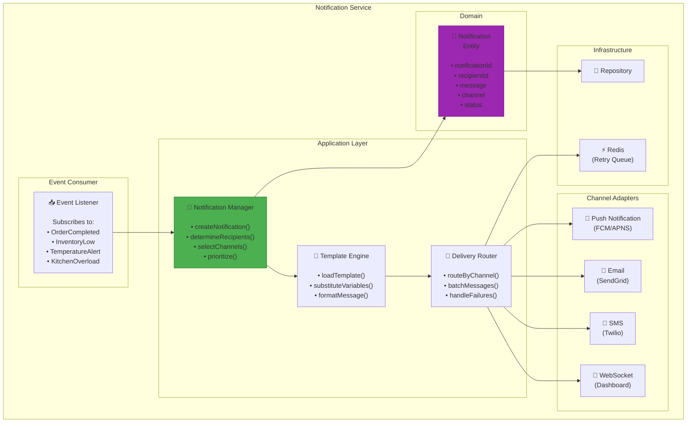

# Notification Service Component Diagram
## Sơ đồ Thành phần Dịch vụ Thông báo



---

## Channel Selection Logic

```java
public List<Channel> selectChannels(AlertSeverity severity) {
    return switch (severity) {
        case CRITICAL -> List.of(PUSH, SMS, EMAIL, DASHBOARD);
        case HIGH -> List.of(PUSH, EMAIL, DASHBOARD);
        case MEDIUM -> List.of(PUSH, DASHBOARD);
        case LOW -> List.of(DASHBOARD);
    };
}
```

## Retry Logic

```java
@Retryable(
    value = {SendException.class},
    maxAttempts = 3,
    backoff = @Backoff(delay = 1000, multiplier = 2)
)
public void send(Notification notification) {
    channelAdapter.send(notification);
}
```

---

**Last Updated**: 2026-02-21
