```mermaid
graph TB
    subgraph "External Clients<br/>Khách hàng Bên ngoài"
        APIGateway["🚪 API Gateway<br/>HTTP Requests"]
    end

    subgraph "Ordering Service<br/>Dịch vụ Đặt món"

        subgraph "Presentation Layer / API Layer<br/>Lớp Trình bày"
            RestController["📡 REST Controller<br/>(OrderController, MenuController)<br/><br/>Endpoints:<br/>• POST /api/orders<br/>• GET /api/orders/:id<br/>• GET /api/menu<br/>• GET /api/menu/items/:id"]

            DTOs["📋 DTOs<br/>(Data Transfer Objects)<br/><br/>• CreateOrderRequest<br/>• OrderResponse<br/>• MenuItemDTO"]
        end

        subgraph "Application Layer / Service Layer<br/>Lớp Ứng dụng"
            OrderService["📝 Order Service<br/>(Business Logic)<br/><br/>Methods:<br/>• createOrder()<br/>• getOrderById()<br/>• cancelOrder()<br/>• validateOrder()"]

            MenuService["📋 Menu Service<br/>(Business Logic)<br/><br/>Methods:<br/>• getMenu()<br/>• getMenuItem()<br/>• updateMenuItem()<br/>• checkAvailability()"]

            ValidationService["✅ Validation Service<br/><br/>Methods:<br/>• validateOrderItems()<br/>• validateTableId()<br/>• checkItemAvailability()<br/>• validatePayload()"]

            PricingService["💰 Pricing Service<br/><br/>Methods:<br/>• calculateTotal()<br/>• applyDiscounts()<br/>• getTaxAmount()"]

            CategorizationService["🏷️ Categorization Service<br/><br/>Methods:<br/>• categorizeItems()<br/>• routeToKitchen()<br/>• getPriority()"]
        end

        subgraph "Domain Layer<br/>Lớp Miền"
            OrderAggregate["📦 Order Aggregate<br/>(Domain Model)<br/><br/>Properties:<br/>• orderId<br/>• tableId<br/>• items[]<br/>• totalAmount<br/>• status<br/>• timestamp<br/><br/>Methods:<br/>• addItem()<br/>• removeItem()<br/>• calculateTotal()<br/>• validate()"]

            MenuItem["🍽️ MenuItem Entity<br/><br/>Properties:<br/>• itemId<br/>• name<br/>• description<br/>• price<br/>• category<br/>• available<br/>• imageUrl"]

            OrderItem["📋 OrderItem Value Object<br/><br/>Properties:<br/>• itemId<br/>• quantity<br/>• price<br/>• specialInstructions"]

            OrderStatus["📊 OrderStatus Enum<br/><br/>Values:<br/>• PLACED<br/>• VALIDATED<br/>• CONFIRMED<br/>• CANCELLED"]
        end

        subgraph "Infrastructure Layer<br/>Lớp Hạ tầng"

            subgraph "Repository Layer"
                OrderRepository["💾 Order Repository<br/>(Interface)<br/><br/>Methods:<br/>• save(order)<br/>• findById(id)<br/>• findByTableId(tableId)<br/>• update(order)"]

                MenuRepository["💾 Menu Repository<br/>(Interface)<br/><br/>Methods:<br/>• findAll()<br/>• findById(id)<br/>• findByCategory(cat)<br/>• update(item)"]

                OrderRepoImpl["🔌 Order Repository Impl<br/>(PostgreSQL)<br/><br/>Uses JPA/Hibernate"]

                MenuRepoImpl["🔌 Menu Repository Impl<br/>(PostgreSQL)<br/><br/>Uses JPA/Hibernate"]
            end

            subgraph "Event Publishing"
                EventPublisher["📬 Event Publisher<br/>(Interface)<br/><br/>Methods:<br/>• publishOrderPlaced()<br/>• publishOrderCancelled()"]

                KafkaPublisher["🔌 Kafka Publisher Impl<br/><br/>Topics:<br/>• orders.placed<br/>• orders.cancelled<br/><br/>Config:<br/>• acks=1<br/>• retries=3"]
            end

            subgraph "Caching Layer"
                CacheService["⚡ Cache Service<br/>(Redis)<br/><br/>Methods:<br/>• getMenu()<br/>• setMenu()<br/>• invalidateMenu()<br/><br/>TTL: 5 minutes"]
            end

            subgraph "External Integrations"
                HttpClient["🌐 HTTP Client<br/>(For external APIs)"]
            end
        end

        subgraph "Cross-Cutting Concerns<br/>Mối quan tâm Xuyên suốt"
            ExceptionHandler["⚠️ Exception Handler<br/><br/>Handles:<br/>• ValidationException<br/>• NotFoundException<br/>• DatabaseException<br/>• KafkaException"]

            Logger["📝 Logging Service<br/>(Structured Logging)<br/><br/>Logs:<br/>• Request/Response<br/>• Business events<br/>• Errors"]

            Metrics["📊 Metrics Service<br/>(Prometheus)<br/><br/>Metrics:<br/>• orders_total<br/>• order_latency<br/>• menu_cache_hit_rate"]

            Tracing["🔗 Tracing Service<br/>(Jaeger)<br/><br/>Traces:<br/>• Order placement flow<br/>• Database queries<br/>• Kafka publishes"]
        end
    end

    subgraph "External Systems<br/>Hệ thống Bên ngoài"
        PostgreSQL[("📊 PostgreSQL<br/>Order Database<br/><br/>Tables:<br/>• orders<br/>• order_items<br/>• menu_items")]

        Redis[("⚡ Redis Cache<br/><br/>Keys:<br/>• menu:all<br/>• menu:item:{id}<br/>• order:{id}")]

        Kafka["📬 Kafka Event Bus<br/><br/>Topics:<br/>• orders.placed<br/>• orders.cancelled"]
    end

    %% Request flow
    APIGateway -->|"HTTP POST /api/orders"| RestController
    RestController --> DTOs
    DTOs --> OrderService

    %% Order creation flow
    OrderService --> ValidationService
    ValidationService --> CategorizationService
    CategorizationService --> PricingService
    PricingService --> OrderAggregate

    OrderAggregate --> OrderItem
    OrderAggregate --> OrderStatus

    OrderService --> OrderRepository
    OrderRepository --> OrderRepoImpl
    OrderRepoImpl -->|"SQL INSERT"| PostgreSQL

    OrderService --> EventPublisher
    EventPublisher --> KafkaPublisher
    KafkaPublisher -->|"Publish event"| Kafka

    %% Menu flow
    APIGateway -->|"HTTP GET /api/menu"| RestController
    RestController --> MenuService
    MenuService -->|"Check cache first"| CacheService
    CacheService -->|"Cache miss"| Redis
    MenuService -->|"Cache miss"| MenuRepository
    MenuRepository --> MenuRepoImpl
    MenuRepoImpl -->|"SQL SELECT"| PostgreSQL
    MenuService -->|"Cache result"| CacheService
    MenuService --> MenuItem

    %% Cross-cutting
    RestController -.->|"Log requests"| Logger
    OrderService -.->|"Record metrics"| Metrics
    OrderService -.->|"Trace calls"| Tracing
    RestController -.->|"Handle errors"| ExceptionHandler

    %% Styling
    style RestController fill:#FF9800,stroke:#E65100,stroke-width:2px,color:#fff
    style OrderService fill:#4CAF50,stroke:#2E7D32,stroke-width:2px,color:#fff
    style MenuService fill:#4CAF50,stroke:#2E7D32,stroke-width:2px,color:#fff
    style ValidationService fill:#2196F3,stroke:#1565C0,stroke-width:2px,color:#fff
    style PricingService fill:#2196F3,stroke:#1565C0,stroke-width:2px,color:#fff
    style CategorizationService fill:#2196F3,stroke:#1565C0,stroke-width:2px,color:#fff

    style OrderAggregate fill:#9C27B0,stroke:#6A1B9A,stroke-width:2px,color:#fff
    style MenuItem fill:#9C27B0,stroke:#6A1B9A,stroke-width:2px,color:#fff

    style OrderRepository fill:#607D8B,stroke:#37474F,stroke-width:2px,color:#fff
    style MenuRepository fill:#607D8B,stroke:#37474F,stroke-width:2px,color:#fff
    style EventPublisher fill:#607D8B,stroke:#37474F,stroke-width:2px,color:#fff

    style KafkaPublisher fill:#9C27B0,stroke:#6A1B9A,stroke-width:2px,color:#fff
    style CacheService fill:#FF5722,stroke:#D84315,stroke-width:2px,color:#fff

    style PostgreSQL fill:#336791,stroke:#1A3A52,stroke-width:3px,color:#fff
    style Redis fill:#DC382D,stroke:#8B231D,stroke-width:3px,color:#fff
    style Kafka fill:#231F20,stroke:#000,stroke-width:3px,color:#fff
```

# Ordering Service Component Diagram
## Sơ đồ Thành phần Dịch vụ Đặt món

## Purpose / Mục đích
Illustrates the internal architecture of the Customer Ordering Service, showing how it handles order placement, menu management, and event publishing using clean architecture principles.

Minh họa kiến trúc nội bộ của Dịch vụ Đặt món Khách hàng, thể hiện cách nó xử lý đặt món, quản lý menu và phát sự kiện theo nguyên tắc kiến trúc sạch.

## Responsibilities / Trách nhiệm chính

1. **Order Management**: Validate and process customer orders
2. **Menu Management**: Serve menu data to clients
3. **Event Publishing**: Notify other services via events
4. **Validation**: Ensure order integrity before persistence
5. **Caching**: Optimize menu queries with Redis

---



---

## Component Descriptions / Mô tả Thành phần

### Presentation Layer (API Layer)

#### REST Controller
**Technology**: Spring Boot `@RestController` or Express.js routes

**Endpoints**:
```java
@RestController
@RequestMapping("/api")
public class OrderController {

    @PostMapping("/orders")
    public ResponseEntity<OrderResponse> createOrder(
        @Valid @RequestBody CreateOrderRequest request,
        @RequestHeader("Authorization") String token
    ) {
        // Delegate to OrderService
    }

    @GetMapping("/orders/{orderId}")
    public ResponseEntity<OrderResponse> getOrder(
        @PathVariable String orderId
    ) {
        // Fetch order by ID
    }

    @DeleteMapping("/orders/{orderId}")
    public ResponseEntity<Void> cancelOrder(
        @PathVariable String orderId
    ) {
        // Cancel order
    }
}

@RestController
@RequestMapping("/api/menu")
public class MenuController {

    @GetMapping
    public ResponseEntity<List<MenuItemDTO>> getMenu() {
        // Return full menu
    }

    @GetMapping("/items/{itemId}")
    public ResponseEntity<MenuItemDTO> getMenuItem(
        @PathVariable String itemId
    ) {
        // Return specific item
    }
}
```

#### DTOs (Data Transfer Objects)
**Purpose**: Decouple external API from internal domain model

```java
// Request DTO
public class CreateOrderRequest {
    @NotNull
    private String tableId;

    @NotEmpty
    @Size(min = 1, max = 50)
    private List<OrderItemRequest> items;

    @Size(max = 500)
    private String specialInstructions;
}

// Response DTO
public class OrderResponse {
    private String orderId;
    private String tableId;
    private List<OrderItemDTO> items;
    private BigDecimal totalAmount;
    private String status;
    private LocalDateTime createdAt;
}
```

---

### Application Layer (Service Layer)

#### Order Service
**Responsibility**: Orchestrate order creation and management

```java
@Service
public class OrderService {
    private final OrderRepository orderRepository;
    private final ValidationService validationService;
    private final PricingService pricingService;
    private final EventPublisher eventPublisher;

    @Transactional
    public OrderResponse createOrder(CreateOrderRequest request) {
        // 1. Validate order
        validationService.validateOrderItems(request.getItems());
        validationService.validateTableId(request.getTableId());

        // 2. Categorize items
        Map<String, List<OrderItem>> categorized =
            categorizationService.categorizeItems(request.getItems());

        // 3. Calculate pricing
        BigDecimal total = pricingService.calculateTotal(request.getItems());

        // 4. Create domain aggregate
        Order order = Order.builder()
            .tableId(request.getTableId())
            .items(request.getItems())
            .totalAmount(total)
            .status(OrderStatus.PLACED)
            .timestamp(LocalDateTime.now())
            .build();

        // 5. Validate domain rules
        order.validate();

        // 6. Persist to database
        Order savedOrder = orderRepository.save(order);

        // 7. Publish event (async)
        eventPublisher.publishOrderPlaced(savedOrder);

        // 8. Return response
        return OrderMapper.toResponse(savedOrder);
    }

    public OrderResponse getOrderById(String orderId) {
        Order order = orderRepository.findById(orderId)
            .orElseThrow(() -> new NotFoundException("Order not found"));
        return OrderMapper.toResponse(order);
    }
}
```

#### Menu Service
**Responsibility**: Manage menu data with caching

```java
@Service
public class MenuService {
    private final MenuRepository menuRepository;
    private final CacheService cacheService;

    public List<MenuItemDTO> getMenu() {
        // Check cache first
        List<MenuItem> cachedMenu = cacheService.getMenu();
        if (cachedMenu != null) {
            return MenuMapper.toDTOList(cachedMenu);
        }

        // Cache miss - query database
        List<MenuItem> menu = menuRepository.findAll();

        // Cache result (TTL: 5 minutes)
        cacheService.setMenu(menu);

        return MenuMapper.toDTOList(menu);
    }

    public MenuItemDTO getMenuItem(String itemId) {
        // Check cache
        MenuItem cachedItem = cacheService.getMenuItem(itemId);
        if (cachedItem != null) {
            return MenuMapper.toDTO(cachedItem);
        }

        // Query database
        MenuItem item = menuRepository.findById(itemId)
            .orElseThrow(() -> new NotFoundException("Menu item not found"));

        // Cache
        cacheService.setMenuItem(item);

        return MenuMapper.toDTO(item);
    }
}
```

#### Validation Service
**Responsibility**: Validate business rules

```java
@Service
public class ValidationService {
    private final MenuRepository menuRepository;

    public void validateOrderItems(List<OrderItemRequest> items) {
        if (items == null || items.isEmpty()) {
            throw new ValidationException("Order must contain at least one item");
        }

        for (OrderItemRequest item : items) {
            // Check if item exists in menu
            MenuItem menuItem = menuRepository.findById(item.getItemId())
                .orElseThrow(() -> new ValidationException("Invalid item ID"));

            // Check availability
            if (!menuItem.isAvailable()) {
                throw new ValidationException(
                    "Item not available: " + menuItem.getName()
                );
            }

            // Validate quantity
            if (item.getQuantity() < 1 || item.getQuantity() > 99) {
                throw new ValidationException("Invalid quantity");
            }
        }
    }

    public void validateTableId(String tableId) {
        // Validate format: "1" to "100"
        if (tableId == null || !tableId.matches("^[1-9][0-9]?$|^100$")) {
            throw new ValidationException("Invalid table ID");
        }
    }
}
```

---

### Domain Layer

#### Order Aggregate
**Pattern**: Domain-Driven Design (DDD) Aggregate Root

```java
@Entity
@Table(name = "orders")
public class Order {
    @Id
    @GeneratedValue(strategy = GenerationType.UUID)
    private UUID orderId;

    @Column(nullable = false)
    private String tableId;

    @OneToMany(mappedBy = "order", cascade = CascadeType.ALL)
    private List<OrderItem> items = new ArrayList<>();

    @Column(nullable = false)
    private BigDecimal totalAmount;

    @Enumerated(EnumType.STRING)
    @Column(nullable = false)
    private OrderStatus status;

    @Column(nullable = false)
    private LocalDateTime timestamp;

    @Version
    private Long version;  // Optimistic locking

    // Business methods
    public void addItem(OrderItem item) {
        items.add(item);
        item.setOrder(this);
        recalculateTotal();
    }

    public void removeItem(OrderItem item) {
        items.remove(item);
        item.setOrder(null);
        recalculateTotal();
    }

    private void recalculateTotal() {
        this.totalAmount = items.stream()
            .map(OrderItem::getTotalPrice)
            .reduce(BigDecimal.ZERO, BigDecimal::add);
    }

    public void validate() {
        if (items.isEmpty()) {
            throw new DomainException("Order must have at least one item");
        }
        if (totalAmount.compareTo(BigDecimal.ZERO) <= 0) {
            throw new DomainException("Total amount must be positive");
        }
    }

    public void cancel() {
        if (this.status != OrderStatus.PLACED) {
            throw new DomainException("Can only cancel orders in PLACED status");
        }
        this.status = OrderStatus.CANCELLED;
    }
}
```

#### OrderItem Value Object

```java
@Entity
@Table(name = "order_items")
public class OrderItem {
    @Id
    @GeneratedValue(strategy = GenerationType.UUID)
    private UUID id;

    @ManyToOne(fetch = FetchType.LAZY)
    @JoinColumn(name = "order_id")
    private Order order;

    @Column(nullable = false)
    private String itemId;  // Reference to MenuItem

    @Column(nullable = false)
    private String itemName;

    @Column(nullable = false)
    private Integer quantity;

    @Column(nullable = false)
    private BigDecimal unitPrice;

    @Column(length = 500)
    private String specialInstructions;

    @Transient
    public BigDecimal getTotalPrice() {
        return unitPrice.multiply(BigDecimal.valueOf(quantity));
    }
}
```

---

### Infrastructure Layer

#### Order Repository (JPA)

```java
public interface OrderRepository extends JpaRepository<Order, UUID> {
    List<Order> findByTableIdOrderByTimestampDesc(String tableId);

    List<Order> findByStatusAndTimestampAfter(
        OrderStatus status,
        LocalDateTime after
    );

    @Query("SELECT o FROM Order o JOIN FETCH o.items WHERE o.orderId = :id")
    Optional<Order> findByIdWithItems(@Param("id") UUID id);
}
```

#### Kafka Event Publisher

```java
@Service
public class KafkaEventPublisher implements EventPublisher {
    private final KafkaTemplate<String, OrderEvent> kafkaTemplate;
    private final ObjectMapper objectMapper;

    @Override
    public void publishOrderPlaced(Order order) {
        OrderPlacedEvent event = OrderPlacedEvent.builder()
            .eventId(UUID.randomUUID().toString())
            .eventType("OrderPlaced")
            .timestamp(Instant.now())
            .orderId(order.getOrderId().toString())
            .tableId(order.getTableId())
            .items(mapItems(order.getItems()))
            .totalAmount(order.getTotalAmount())
            .build();

        kafkaTemplate.send("orders.placed", order.getOrderId().toString(), event);
    }

    @Override
    public void publishOrderCancelled(Order order) {
        OrderCancelledEvent event = OrderCancelledEvent.builder()
            .eventId(UUID.randomUUID().toString())
            .eventType("OrderCancelled")
            .timestamp(Instant.now())
            .orderId(order.getOrderId().toString())
            .reason("Customer requested cancellation")
            .build();

        kafkaTemplate.send("orders.cancelled", order.getOrderId().toString(), event);
    }
}
```

#### Redis Cache Service

```java
@Service
public class RedisCacheService implements CacheService {
    private final RedisTemplate<String, Object> redisTemplate;
    private static final int MENU_TTL_MINUTES = 5;

    @Override
    public List<MenuItem> getMenu() {
        return (List<MenuItem>) redisTemplate.opsForValue().get("menu:all");
    }

    @Override
    public void setMenu(List<MenuItem> menu) {
        redisTemplate.opsForValue().set(
            "menu:all",
            menu,
            Duration.ofMinutes(MENU_TTL_MINUTES)
        );
    }

    @Override
    public void invalidateMenu() {
        redisTemplate.delete("menu:all");
    }
}
```

---

### Cross-Cutting Concerns

#### Exception Handler

```java
@RestControllerAdvice
public class GlobalExceptionHandler {

    @ExceptionHandler(ValidationException.class)
    public ResponseEntity<ErrorResponse> handleValidationException(
        ValidationException ex
    ) {
        return ResponseEntity
            .status(HttpStatus.BAD_REQUEST)
            .body(new ErrorResponse("VALIDATION_ERROR", ex.getMessage()));
    }

    @ExceptionHandler(NotFoundException.class)
    public ResponseEntity<ErrorResponse> handleNotFoundException(
        NotFoundException ex
    ) {
        return ResponseEntity
            .status(HttpStatus.NOT_FOUND)
            .body(new ErrorResponse("NOT_FOUND", ex.getMessage()));
    }

    @ExceptionHandler(Exception.class)
    public ResponseEntity<ErrorResponse> handleGenericException(
        Exception ex
    ) {
        log.error("Unexpected error", ex);
        return ResponseEntity
            .status(HttpStatus.INTERNAL_SERVER_ERROR)
            .body(new ErrorResponse("INTERNAL_ERROR", "An error occurred"));
    }
}
```

#### Metrics (Prometheus)

```java
@Aspect
@Component
public class MetricsAspect {
    private final Counter ordersTotal;
    private final Histogram orderLatency;

    public MetricsAspect(MeterRegistry registry) {
        this.ordersTotal = Counter.builder("orders_total")
            .description("Total orders created")
            .tag("service", "ordering")
            .register(registry);

        this.orderLatency = Histogram.builder("order_latency_seconds")
            .description("Order creation latency")
            .tag("service", "ordering")
            .register(registry);
    }

    @Around("@annotation(Timed)")
    public Object recordLatency(ProceedingJoinPoint pjp) throws Throwable {
        long startTime = System.nanoTime();
        try {
            Object result = pjp.proceed();
            return result;
        } finally {
            long endTime = System.nanoTime();
            double latency = (endTime - startTime) / 1_000_000_000.0;
            orderLatency.record(latency);
        }
    }
}
```

---

## Design Patterns Applied / Mẫu Thiết kế Áp dụng

### 1. **Layered Architecture (Clean Architecture)**
- Clear separation: Presentation → Application → Domain → Infrastructure
- Dependency rule: Inner layers don't depend on outer layers

### 2. **Repository Pattern**
- Abstract data access behind interfaces
- Swap implementations (PostgreSQL → MongoDB) without changing business logic

### 3. **Domain-Driven Design (DDD)**
- **Aggregate**: Order as aggregate root
- **Value Objects**: OrderItem, Money
- **Entities**: Order, MenuItem

### 4. **Dependency Injection**
- Constructor injection for all dependencies
- Spring Framework or similar DI container

### 5. **Factory Pattern**
- OrderFactory to create Order aggregates
- EventFactory to create domain events

### 6. **Mapper Pattern**
- Separate DTOs from domain models
- OrderMapper, MenuMapper for conversions

### 7. **Saga Pattern (Future)**
- Distributed transactions across services
- Compensating transactions for rollback

---

## SOLID Principles / Nguyên tắc SOLID

### Single Responsibility Principle (SRP)
✅ Each class has one reason to change:
- `OrderService`: Order business logic only
- `ValidationService`: Validation only
- `KafkaPublisher`: Event publishing only

### Open/Closed Principle (OCP)
✅ Open for extension, closed for modification:
- New event types can be added without changing `EventPublisher` interface
- New validation rules via `ValidationService` extension

### Liskov Substitution Principle (LSP)
✅ Implementations can replace interfaces:
- `KafkaPublisher` can replace `RabbitMQPublisher`
- Both implement `EventPublisher` interface

### Interface Segregation Principle (ISP)
✅ Clients don't depend on unused methods:
- Separate interfaces: `OrderRepository`, `MenuRepository`
- Not one giant `DataRepository` interface

### Dependency Inversion Principle (DIP)
✅ Depend on abstractions, not concretions:
- `OrderService` depends on `EventPublisher` interface, not `KafkaPublisher`
- Allows swapping implementations

---

## Testing Strategy / Chiến lược Kiểm thử

### Unit Tests
```java
@Test
void createOrder_ValidRequest_Success() {
    // Given
    CreateOrderRequest request = buildValidRequest();
    when(validationService.validateOrderItems(any())).thenReturn(true);
    when(orderRepository.save(any())).thenReturn(mockOrder);

    // When
    OrderResponse response = orderService.createOrder(request);

    // Then
    assertNotNull(response.getOrderId());
    assertEquals(OrderStatus.PLACED, response.getStatus());
    verify(eventPublisher).publishOrderPlaced(any());
}
```

### Integration Tests
```java
@SpringBootTest
@Testcontainers
class OrderServiceIntegrationTest {
    @Container
    static PostgreSQLContainer<?> postgres = new PostgreSQLContainer<>("postgres:15");

    @Test
    void createOrder_EndToEnd_Success() {
        // Test with real database, Kafka testcontainers
    }
}
```

---

## Performance Considerations / Cân nhắc Hiệu năng

1. **Database Optimization**:
   - Index on `tableId`, `status`, `timestamp`
   - Use batch inserts for `order_items`
   - Connection pooling (HikariCP)

2. **Caching Strategy**:
   - Cache menu data (5 min TTL)
   - Invalidate on menu updates
   - Cache hit rate target: > 90%

3. **Async Event Publishing**:
   - Don't block HTTP response on Kafka
   - Use `@Async` or reactive programming

4. **Pagination**:
   - Paginate menu items if > 100 items
   - Use cursor-based pagination for scalability

---

## Related Diagrams / Sơ đồ Liên quan

- [**Kitchen Service Component**](kitchen-service.md) - Order processing counterpart
- [**IoT Gateway Component**](iot-gateway.md) - Device management
- [**Order Placement Sequence**](../sequences/order-placement-flow.md) - Runtime interaction
- [**Domain Model**](../data/domain-model.md) - Entity relationships

---

**Last Updated**: 2026-02-21
**Status**: Design Complete, Ready for Implementation
