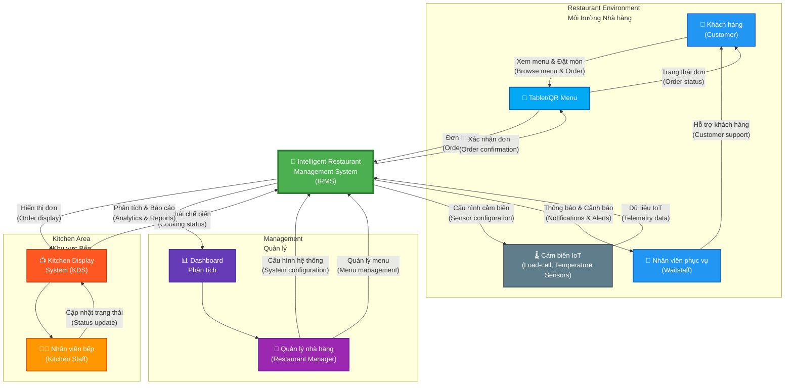

# IRMS System Context Diagram
## Sơ đồ Ngữ cảnh Hệ thống IRMS

## Purpose / Mục đích
Provides a high-level view of the Intelligent Restaurant Management System (IRMS) and its interactions with external actors and systems.

Cung cấp cái nhìn tổng quan về hệ thống Quản lý Nhà hàng Thông minh (IRMS) và các tương tác với các actors và hệ thống bên ngoài.

## Scope / Phạm vi
- **Included**: All major actors, primary system boundary, key data flows
- **Excluded**: Internal system components (see architecture diagrams)

## Key Elements / Các thành phần chính
- **IRMS System**: The complete restaurant management platform
- **5 Actors**: Customers, Waitstaff, Kitchen Staff, Managers, IoT Devices
- **Data Flows**: Order submission, status updates, alerts, analytics

## Related Requirements / Yêu cầu liên quan
- All functional requirements (FR1-FR14)
- Performance (NFR1-NFR2)
- Security (NFR5)
- Availability (NFR3)

---



---

## Actor Descriptions / Mô tả Actors

### 👤 Khách hàng (Customer)
**Role**: Primary user of the ordering system
**Interactions**:
- Browse menu on tablet/QR menu
- Place orders directly without staff intervention
- Track order status in real-time
- Request additional items during meal

**Requirements**: FR1, FR2, FR3

### 👔 Nhân viên phục vụ (Waitstaff)
**Role**: Support customers and coordinate with system
**Interactions**:
- Assist customers with ordering difficulties
- Receive notifications for special requests
- Monitor table status and order progress
- Handle customer inquiries

**Requirements**: FR8, FR5

### 👨‍🍳 Nhân viên bếp (Kitchen Staff/Chef)
**Role**: Process orders and update cooking status
**Interactions**:
- View orders on Kitchen Display System (KDS)
- Update dish preparation status
- Coordinate priority order handling during peak hours
- Report ingredient shortages

**Requirements**: FR5, FR6, FR7

### 👔 Quản lý nhà hàng (Restaurant Manager)
**Role**: Monitor operations and make strategic decisions
**Interactions**:
- Monitor real-time order flow and kitchen load
- Receive alerts for inventory or equipment issues
- View analytics reports on revenue, table turnover
- Use predictive data to optimize staffing and menu
- Configure system settings and menu

**Requirements**: FR8, FR12, FR13, FR14

### 🌡️ Cảm biến IoT (IoT Devices & Sensors)
**Role**: Provide continuous data input to the system
**Types**:
- **Tablets/QR menu**: Support customer ordering
- **Load-cell sensors**: Track ingredient inventory levels
- **Temperature sensors**: Monitor refrigerator/freezer temperatures

**Requirements**: FR6, FR9, FR11

---

## Key Data Flows / Luồng dữ liệu chính

### 1. Order Flow (Luồng đặt món)
```
Customer → Tablet → IRMS → KDS → Kitchen Staff → IRMS → Customer
```
- Customer places order via tablet (FR1)
- Order processed in < 1 second (NFR2)
- Kitchen receives order immediately (FR4)
- Status updates flow back to customer

### 2. Inventory Monitoring Flow (Luồng giám sát tồn kho)
```
IoT Sensors → IRMS → Manager Dashboard
```
- Load-cell sensors track ingredient levels (FR9)
- System detects low inventory (FR10)
- Alert sent to manager dashboard (FR8)

### 3. Analytics Flow (Luồng phân tích)
```
All System Events → IRMS → Dashboard → Manager
```
- System collects operational data (FR13)
- Analytics service processes insights (FR14)
- Manager views reports and forecasts

### 4. Kitchen Management Flow (Luồng quản lý bếp)
```
IRMS → Kitchen Service → KDS → Chef → IRMS
```
- Orders prioritized by complexity and wait time (FR7)
- Kitchen load monitored in real-time (FR8)
- Chef updates status as dishes are prepared (FR6)

---

## System Boundary / Ranh giới Hệ thống

**Inside IRMS Boundary** (Trong hệ thống):
- 7 Microservices (Ordering, Kitchen, Inventory, Notification, Analytics, Auth, IoT Gateway)
- API Gateway
- Event Bus (Message Broker)
- Service Databases
- Observability Stack

**Outside IRMS Boundary** (Ngoài hệ thống):
- Customer-facing devices (Tablets, QR menus)
- Kitchen Display System (KDS)
- Manager Dashboard
- IoT Sensors (Load-cell, Temperature)
- Human actors (Customers, Staff, Chefs, Managers)

---

## Communication Patterns / Mô hình giao tiếp

| Source | Target | Protocol | Pattern | Latency |
|--------|--------|----------|---------|---------|
| Tablet → IRMS | Ordering Service | REST/HTTP | Synchronous | < 500ms |
| IoT Sensors → IRMS | IoT Gateway | MQTT/HTTP | Asynchronous | Variable |
| IRMS → KDS | Kitchen Service | WebSocket | Real-time push | < 200ms |
| IRMS → Dashboard | Analytics Service | REST/WebSocket | Hybrid | < 1s |

---

## Non-Functional Requirements Mapping / Ánh xạ NFR

| NFR | Impact on Context Diagram |
|-----|---------------------------|
| **NFR1** - Scalability | Support hundreds of concurrent orders during peak hours |
| **NFR2** - Performance | Order from Tablet to KDS in < 1 second |
| **NFR3** - Availability | IRMS must be operational during all business hours |
| **NFR4** - Fault Tolerance | System continues if IoT sensors disconnect |
| **NFR5** - Security | Secure communication between actors and IRMS |

---

## Notes / Ghi chú

- All interactions shown are bidirectional in practice, diagram emphasizes primary data flows
- IoT Devices include both input sensors and output devices (tablets, KDS)
- KDS is a specialized interface for kitchen staff, optimized for fast order viewing
- Dashboard provides both real-time monitoring and historical analytics
- System supports multiple restaurants (multi-tenancy potential for future)

---

## Next Steps / Bước tiếp theo

To understand the internal structure of IRMS, see:
- [Microservices Overview Diagram](../architecture/microservices-overview.md) - Internal service decomposition
- [Event-Driven Architecture](../architecture/event-driven-architecture.md) - Communication patterns
- [Order Placement Flow](../sequences/order-placement-flow.md) - Detailed scenario walkthrough
