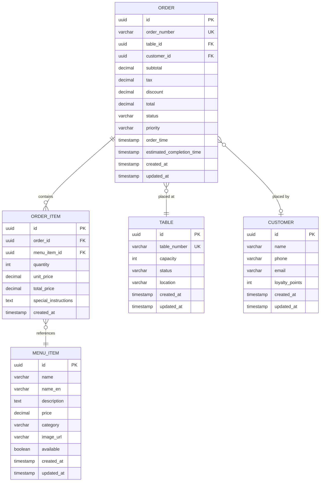
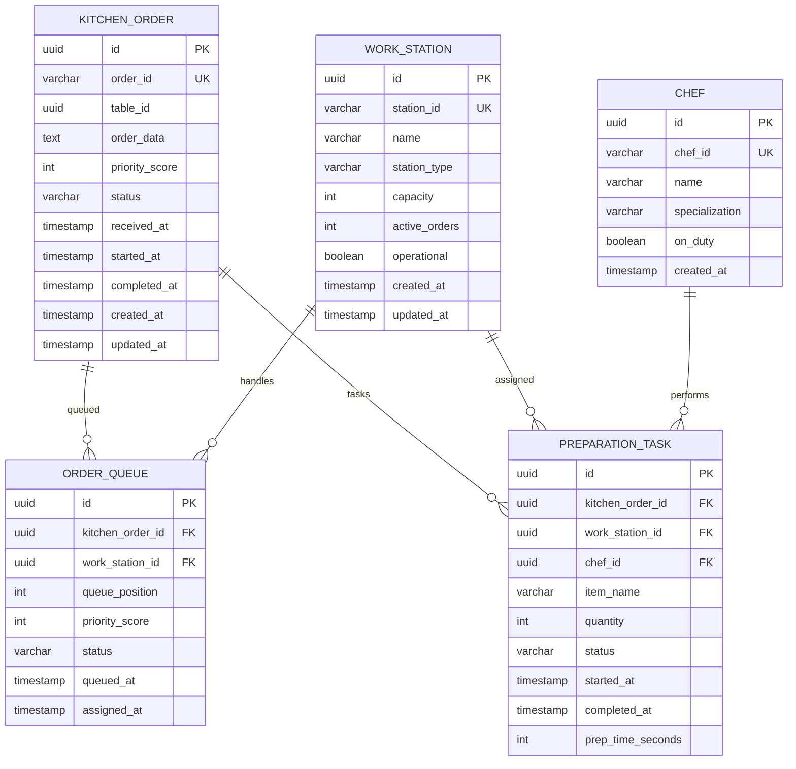
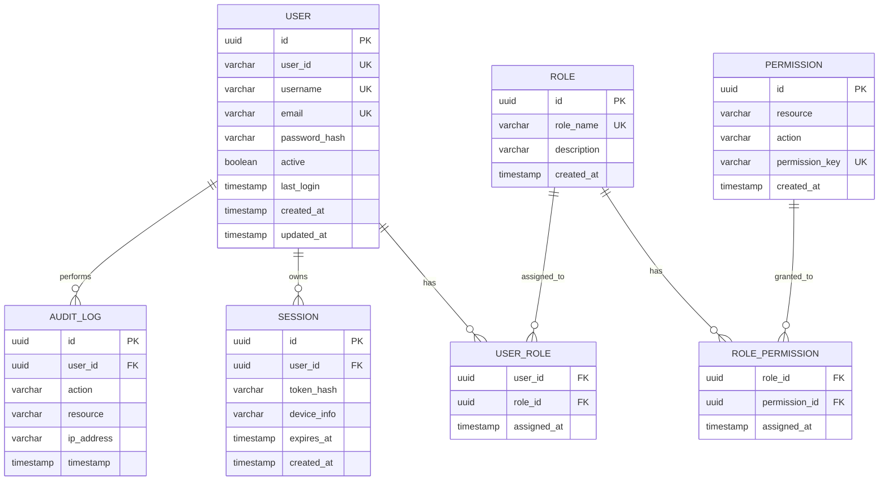
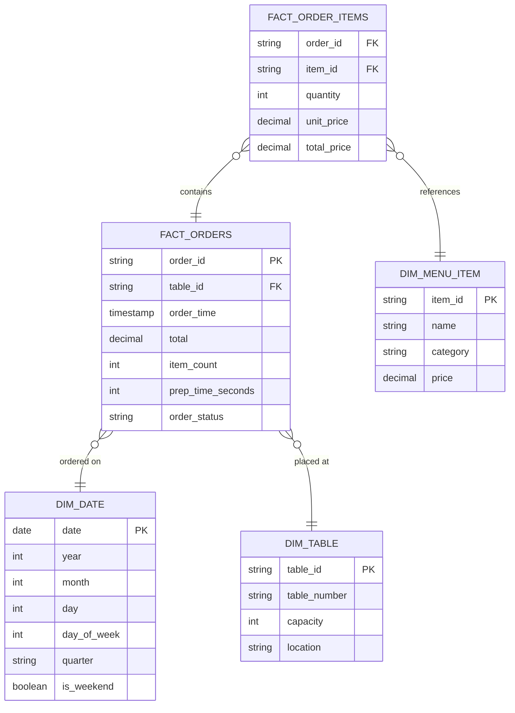

# Database Schemas per Service
# Cấu trúc Cơ sở Dữ liệu theo Dịch vụ

**Project**: IRMS - Intelligent Restaurant Management System
**Last Updated**: 2026-02-21
**Status**: Design Complete

---

## Table of Contents / Mục lục

1. [Introduction](#introduction)
2. [Database-per-Service Pattern](#database-per-service-pattern)
3. [Service Database Mapping](#service-database-mapping)
4. [Ordering Service Database](#ordering-service-database)
5. [Kitchen Service Database](#kitchen-service-database)
6. [Inventory Service Database](#inventory-service-database)
7. [Auth Service Database](#auth-service-database)
8. [Analytics Service Data Warehouse](#analytics-service-data-warehouse)
9. [IoT Gateway Storage](#iot-gateway-storage)
10. [Data Consistency Patterns](#data-consistency-patterns)

---

## Introduction
## Giới thiệu

### Purpose / Mục đích

This document defines the database schemas for all IRMS microservices following the **Database-per-Service** pattern. Each service owns its data and schema, enabling:

Tài liệu này định nghĩa schema database cho tất cả microservices của IRMS theo mô hình **Database-per-Service**. Mỗi service sở hữu dữ liệu và schema của riêng nó, cho phép:

- **Data Autonomy**: Services control their schema evolution
- **Independent Scaling**: Scale databases per service needs
- **Fault Isolation**: Database failure contained to one service
- **Technology Choice**: Use SQL for some, NoSQL for others

---

## Database-per-Service Pattern
## Mô hình Database-per-Service

### Principle / Nguyên tắc

**NO shared databases.** Each microservice has exclusive access to its own database.

**Không chia sẻ database.** Mỗi microservice có quyền truy cập độc quyền vào database của riêng nó.

### Benefits / Lợi ích

- ✅ **Loose Coupling**: Services don't share database tables
- ✅ **Independent Deployment**: Change schema without affecting other services
- ✅ **Technology Flexibility**: PostgreSQL for some, InfluxDB for others
- ✅ **Fault Isolation**: Database crash affects only one service

### Tradeoffs / Đánh đổi

- ❌ **No ACID Transactions**: Can't use database transactions across services
- ❌ **Data Duplication**: Same data (e.g., order ID) exists in multiple databases
- ❌ **Complex Queries**: Joins across services require application-level logic

### Mitigation Strategies / Chiến lược Giảm thiểu

- **Eventual Consistency**: Use events for cross-service data sync
- **SAGA Pattern**: Distributed transactions via compensating events
- **API Composition**: Aggregate data from multiple services at API Gateway
- **CQRS**: Separate read/write models, replicate read-optimized views

---

## Service Database Mapping
## Ánh xạ Database theo Service

| Service | Database Type | Schema | Size Estimate | Backup Frequency | Justification |
|---------|---------------|--------|---------------|------------------|---------------|
| **Ordering Service** | PostgreSQL 15 | orders, order_items, menu_items, tables | 500 GB | Hourly | Relational data, ACID transactions for orders |
| **Kitchen Service** | PostgreSQL 15 | kitchen_orders, order_queue, work_stations | 200 GB | Hourly | Order queue state, relational queries |
| **Inventory Service** | InfluxDB 2.x | sensor_readings (time-series), stock_levels | 300 GB | Daily | IoT sensor data, time-series optimized |
| **Auth Service** | PostgreSQL 15 | users, roles, permissions, sessions | 100 GB | Daily | User credentials, ACID for security |
| **Analytics Service** | BigQuery / Redshift | order_metrics, dish_performance, forecasts | 1 TB | Weekly | OLAP queries, data warehouse |
| **Notification Service** | None (stateless) | - | - | - | Stateless, no persistent storage |
| **IoT Gateway** | SQLite 3 (edge) | buffered_events, devices | 10 GB | Daily | Lightweight, edge buffering |

**Total Storage**: ~2.1 TB

---

## Ordering Service Database
## Database Ordering Service

### Database Technology / Công nghệ Database

**Type**: PostgreSQL 15
**Hosting**: AWS RDS Multi-AZ
**Connection Pool**: HikariCP (max 20 connections)

### Schema Diagram / Sơ đồ Schema



### Table Definitions / Định nghĩa Bảng

#### Table: menu_items

```sql
CREATE TABLE menu_items (
    id UUID PRIMARY KEY DEFAULT gen_random_uuid(),
    name VARCHAR(255) NOT NULL,
    name_en VARCHAR(255) NOT NULL,
    description TEXT,
    price DECIMAL(10,2) NOT NULL CHECK (price >= 0),
    category VARCHAR(50) NOT NULL,
    image_url VARCHAR(500),
    available BOOLEAN DEFAULT true,
    created_at TIMESTAMP DEFAULT NOW(),
    updated_at TIMESTAMP DEFAULT NOW()
);

CREATE INDEX idx_menu_category ON menu_items(category);
CREATE INDEX idx_menu_available ON menu_items(available);
CREATE INDEX idx_menu_price ON menu_items(price);

-- Sample data
INSERT INTO menu_items (name, name_en, description, price, category, available) VALUES
('Phở Bò', 'Beef Pho', 'Vietnamese beef noodle soup', 75000, 'main-dish', true),
('Bánh Mì', 'Vietnamese Sandwich', 'Baguette with grilled pork', 35000, 'appetizer', true),
('Cà Phê Sữa Đá', 'Iced Coffee with Milk', 'Traditional Vietnamese coffee', 25000, 'beverage', true);
```

---

#### Table: orders

```sql
CREATE TABLE orders (
    id UUID PRIMARY KEY DEFAULT gen_random_uuid(),
    order_number VARCHAR(20) UNIQUE NOT NULL,
    table_id UUID NOT NULL REFERENCES tables(id),
    customer_id UUID REFERENCES customers(id),
    subtotal DECIMAL(12,2) NOT NULL CHECK (subtotal >= 0),
    tax DECIMAL(12,2) NOT NULL DEFAULT 0,
    discount DECIMAL(12,2) NOT NULL DEFAULT 0,
    total DECIMAL(12,2) NOT NULL CHECK (total >= 0),
    status VARCHAR(20) NOT NULL DEFAULT 'PLACED',
    priority VARCHAR(10) NOT NULL DEFAULT 'NORMAL',
    order_time TIMESTAMP NOT NULL DEFAULT NOW(),
    estimated_completion_time TIMESTAMP,
    created_at TIMESTAMP DEFAULT NOW(),
    updated_at TIMESTAMP DEFAULT NOW(),

    CONSTRAINT chk_total CHECK (total = subtotal + tax - discount),
    CONSTRAINT chk_status CHECK (status IN ('PLACED', 'IN_PROGRESS', 'COMPLETED', 'CANCELLED')),
    CONSTRAINT chk_priority CHECK (priority IN ('LOW', 'NORMAL', 'HIGH', 'VIP'))
);

CREATE INDEX idx_order_status ON orders(status);
CREATE INDEX idx_order_table ON orders(table_id);
CREATE INDEX idx_order_time ON orders(order_time DESC);
CREATE INDEX idx_order_number ON orders(order_number);
```

---

#### Table: order_items

```sql
CREATE TABLE order_items (
    id UUID PRIMARY KEY DEFAULT gen_random_uuid(),
    order_id UUID NOT NULL REFERENCES orders(id) ON DELETE CASCADE,
    menu_item_id UUID NOT NULL REFERENCES menu_items(id),
    quantity INT NOT NULL CHECK (quantity > 0),
    unit_price DECIMAL(10,2) NOT NULL CHECK (unit_price >= 0),
    total_price DECIMAL(10,2) NOT NULL CHECK (total_price >= 0),
    special_instructions TEXT,
    created_at TIMESTAMP DEFAULT NOW(),

    CONSTRAINT chk_item_total CHECK (total_price = unit_price * quantity)
);

CREATE INDEX idx_order_item_order ON order_items(order_id);
CREATE INDEX idx_order_item_menu ON order_items(menu_item_id);
```

---

#### Table: tables

```sql
CREATE TABLE tables (
    id UUID PRIMARY KEY DEFAULT gen_random_uuid(),
    table_number VARCHAR(10) UNIQUE NOT NULL,
    capacity INT NOT NULL CHECK (capacity > 0),
    status VARCHAR(20) NOT NULL DEFAULT 'AVAILABLE',
    location VARCHAR(50),
    created_at TIMESTAMP DEFAULT NOW(),
    updated_at TIMESTAMP DEFAULT NOW(),

    CONSTRAINT chk_table_status CHECK (status IN ('AVAILABLE', 'OCCUPIED', 'RESERVED', 'CLEANING'))
);

CREATE INDEX idx_table_status ON tables(status);
CREATE INDEX idx_table_number ON tables(table_number);
```

---

## Kitchen Service Database
## Database Kitchen Service

### Database Technology / Công nghệ Database

**Type**: PostgreSQL 15
**Hosting**: AWS RDS Multi-AZ
**Connection Pool**: HikariCP (max 15 connections)

### Schema Diagram / Sơ đồ Schema



### Table Definitions / Định nghĩa Bảng

#### Table: kitchen_orders

```sql
CREATE TABLE kitchen_orders (
    id UUID PRIMARY KEY DEFAULT gen_random_uuid(),
    order_id VARCHAR(30) UNIQUE NOT NULL,
    table_id UUID NOT NULL,
    order_data JSONB NOT NULL,  -- Store full order details from OrderPlaced event
    priority_score INT NOT NULL DEFAULT 100,
    status VARCHAR(20) NOT NULL DEFAULT 'PENDING',
    received_at TIMESTAMP NOT NULL DEFAULT NOW(),
    started_at TIMESTAMP,
    completed_at TIMESTAMP,
    created_at TIMESTAMP DEFAULT NOW(),
    updated_at TIMESTAMP DEFAULT NOW(),

    CONSTRAINT chk_kitchen_status CHECK (status IN ('PENDING', 'IN_PROGRESS', 'COMPLETED', 'CANCELLED'))
);

CREATE INDEX idx_kitchen_order_status ON kitchen_orders(status);
CREATE INDEX idx_kitchen_order_priority ON kitchen_orders(priority_score DESC);
CREATE INDEX idx_kitchen_order_received ON kitchen_orders(received_at);
```

---

#### Table: work_stations

```sql
CREATE TABLE work_stations (
    id UUID PRIMARY KEY DEFAULT gen_random_uuid(),
    station_id VARCHAR(30) UNIQUE NOT NULL,
    name VARCHAR(100) NOT NULL,
    station_type VARCHAR(50) NOT NULL,
    capacity INT NOT NULL CHECK (capacity > 0),
    active_orders INT NOT NULL DEFAULT 0,
    operational BOOLEAN DEFAULT true,
    created_at TIMESTAMP DEFAULT NOW(),
    updated_at TIMESTAMP DEFAULT NOW(),

    CONSTRAINT chk_active_orders CHECK (active_orders >= 0 AND active_orders <= capacity)
);

CREATE INDEX idx_station_type ON work_stations(station_type);
CREATE INDEX idx_station_operational ON work_stations(operational);

-- Sample data
INSERT INTO work_stations (station_id, name, station_type, capacity) VALUES
('STATION-WOK', 'Wok Station', 'STIR_FRY', 5),
('STATION-GRILL', 'Grill Station', 'GRILLING', 5),
('STATION-PREP', 'Prep Station', 'PREPARATION', 10),
('STATION-BEVERAGE', 'Beverage Station', 'DRINKS', 8);
```

---

## Inventory Service Database
## Database Inventory Service

### Database Technology / Công nghệ Database

**Type**: InfluxDB 2.x (Time-Series Database)
**Hosting**: Self-hosted in Kubernetes (StatefulSet)
**Retention**: 90 days (hot), 1 year (warm)

### Data Model / Mô hình Dữ liệu

InfluxDB uses **measurements** (similar to tables), **tags** (indexed metadata), and **fields** (actual values).

#### Measurement: sensor_readings

```
Measurement: sensor_readings
Tags:
  - sensor_id (indexed)
  - ingredient_id (indexed)
  - sensor_type (indexed)
  - location (indexed)

Fields:
  - value (float)
  - unit (string)
  - battery_level (float, optional)

Timestamp: nanosecond precision
```

**InfluxQL Query Examples**:

```influxql
-- Get latest temperature for fridge-01
SELECT last(value) AS temperature
FROM sensor_readings
WHERE sensor_id = 'SENSOR-TEMP-FRIDGE-01'
  AND sensor_type = 'TEMPERATURE'

-- Get average stock level for rice (last 24 hours)
SELECT mean(value) AS avg_stock
FROM sensor_readings
WHERE ingredient_id = 'ING-RICE-001'
  AND sensor_type = 'LOAD_CELL'
  AND time > now() - 24h
GROUP BY time(1h)

-- Detect low inventory (current level < 20 kg)
SELECT last(value) AS current_level
FROM sensor_readings
WHERE sensor_type = 'LOAD_CELL'
GROUP BY ingredient_id
HAVING last(value) < 20
```

---

#### Measurement: stock_levels (Aggregated)

```
Measurement: stock_levels
Tags:
  - ingredient_id (indexed)
  - location (indexed)

Fields:
  - current_level (float)
  - max_capacity (float)
  - safety_threshold (float)
  - percentage (float)
  - unit (string)

Timestamp: Updated every 5 minutes
```

---

### Relational Data (PostgreSQL for Metadata)

For ingredient metadata (not time-series), use PostgreSQL:

```sql
CREATE TABLE ingredients (
    id UUID PRIMARY KEY DEFAULT gen_random_uuid(),
    ingredient_id VARCHAR(30) UNIQUE NOT NULL,
    name VARCHAR(255) NOT NULL,
    name_en VARCHAR(255) NOT NULL,
    unit VARCHAR(20) NOT NULL,
    max_capacity DECIMAL(10,2) NOT NULL,
    safety_threshold DECIMAL(10,2) NOT NULL,
    current_level DECIMAL(10,2) NOT NULL DEFAULT 0,
    location VARCHAR(50),
    created_at TIMESTAMP DEFAULT NOW(),
    updated_at TIMESTAMP DEFAULT NOW()
);

CREATE INDEX idx_ingredient_id ON ingredients(ingredient_id);
CREATE INDEX idx_ingredient_location ON ingredients(location);
```

---

## Auth Service Database
## Database Auth Service

### Database Technology / Công nghệ Database

**Type**: PostgreSQL 15
**Hosting**: AWS RDS Multi-AZ
**Encryption**: AES-256 for passwords (bcrypt hashing)

### Schema Diagram / Sơ đồ Schema



### Table Definitions / Định nghĩa Bảng

#### Table: users

```sql
CREATE TABLE users (
    id UUID PRIMARY KEY DEFAULT gen_random_uuid(),
    user_id VARCHAR(30) UNIQUE NOT NULL,
    username VARCHAR(100) UNIQUE NOT NULL,
    email VARCHAR(255) UNIQUE NOT NULL,
    password_hash VARCHAR(255) NOT NULL,  -- bcrypt hash
    active BOOLEAN DEFAULT true,
    last_login TIMESTAMP,
    created_at TIMESTAMP DEFAULT NOW(),
    updated_at TIMESTAMP DEFAULT NOW()
);

CREATE INDEX idx_user_username ON users(username);
CREATE INDEX idx_user_email ON users(email);
CREATE INDEX idx_user_active ON users(active);
```

---

#### Table: roles

```sql
CREATE TABLE roles (
    id UUID PRIMARY KEY DEFAULT gen_random_uuid(),
    role_name VARCHAR(50) UNIQUE NOT NULL,
    description TEXT,
    created_at TIMESTAMP DEFAULT NOW()
);

-- Sample data
INSERT INTO roles (role_name, description) VALUES
('CUSTOMER', 'Restaurant customer'),
('WAITER', 'Restaurant waitstaff'),
('CHEF', 'Kitchen chef'),
('MANAGER', 'Restaurant manager'),
('ADMIN', 'System administrator');
```

---

#### Table: permissions

```sql
CREATE TABLE permissions (
    id UUID PRIMARY KEY DEFAULT gen_random_uuid(),
    resource VARCHAR(100) NOT NULL,
    action VARCHAR(50) NOT NULL,
    permission_key VARCHAR(150) UNIQUE NOT NULL,  -- Format: resource:action
    created_at TIMESTAMP DEFAULT NOW()
);

-- Sample data
INSERT INTO permissions (resource, action, permission_key) VALUES
('orders', 'create', 'orders:create'),
('orders', 'view', 'orders:view'),
('orders', 'cancel', 'orders:cancel'),
('menu', 'view', 'menu:view'),
('menu', 'edit', 'menu:edit'),
('analytics', 'view', 'analytics:view');
```

---

## Analytics Service Data Warehouse
## Data Warehouse Analytics Service

### Database Technology / Công nghệ Database

**Type**: Google BigQuery (or AWS Redshift)
**Data Model**: Star schema (fact tables + dimension tables)
**ETL**: Daily batch jobs + real-time streaming (Kafka → BigQuery)

### Schema Diagram / Sơ đồ Schema



### Table Definitions / Định nghĩa Bảng

#### Table: fact_orders (Fact Table)

```sql
CREATE TABLE fact_orders (
    order_id STRING NOT NULL,
    table_id STRING NOT NULL,
    order_date DATE NOT NULL,
    order_time TIMESTAMP NOT NULL,
    subtotal DECIMAL(12,2) NOT NULL,
    tax DECIMAL(12,2) NOT NULL,
    discount DECIMAL(12,2) NOT NULL,
    total DECIMAL(12,2) NOT NULL,
    item_count INT NOT NULL,
    prep_time_seconds INT,
    order_status STRING NOT NULL,
    priority STRING NOT NULL,
    created_at TIMESTAMP DEFAULT CURRENT_TIMESTAMP()
)
PARTITION BY order_date
CLUSTER BY table_id, order_status;

-- Aggregated metrics (materialized view)
CREATE MATERIALIZED VIEW mv_daily_metrics AS
SELECT
    order_date,
    COUNT(*) AS total_orders,
    SUM(total) AS total_revenue,
    AVG(total) AS avg_order_value,
    AVG(prep_time_seconds) AS avg_prep_time
FROM fact_orders
GROUP BY order_date;
```

---

## IoT Gateway Storage
## Lưu trữ IoT Gateway

### Database Technology / Công nghệ Database

**Type**: SQLite 3 (embedded, edge deployment)
**Location**: Raspberry Pi (on-premise at restaurant)
**Purpose**: Temporary buffering when cloud unavailable

### Schema / Sơ đồ

```sql
CREATE TABLE buffered_events (
    id INTEGER PRIMARY KEY AUTOINCREMENT,
    event_id TEXT UNIQUE NOT NULL,
    sensor_id TEXT NOT NULL,
    event_type TEXT NOT NULL,
    payload TEXT NOT NULL,  -- JSON string
    timestamp INTEGER NOT NULL,  -- Unix timestamp
    retry_count INTEGER DEFAULT 0,
    status TEXT DEFAULT 'PENDING',  -- PENDING, SENT, FAILED
    created_at INTEGER DEFAULT (strftime('%s', 'now'))
);

CREATE INDEX idx_buffered_status ON buffered_events(status);
CREATE INDEX idx_buffered_timestamp ON buffered_events(timestamp);

-- Devices table (metadata)
CREATE TABLE devices (
    id INTEGER PRIMARY KEY AUTOINCREMENT,
    device_id TEXT UNIQUE NOT NULL,
    sensor_type TEXT NOT NULL,
    location TEXT NOT NULL,
    last_seen INTEGER NOT NULL,
    status TEXT DEFAULT 'ONLINE',  -- ONLINE, OFFLINE
    created_at INTEGER DEFAULT (strftime('%s', 'now'))
);

CREATE INDEX idx_device_status ON devices(status);
```

**Cleanup Job**: Delete buffered events older than 24 hours (after successful transmission)

---

## Data Consistency Patterns
## Mô hình Nhất quán Dữ liệu

### Pattern 1: Event-Carried State Transfer

**Problem**: Kitchen Service needs order details, but Ordering Service owns orders table.

**Solution**: Include all necessary data in `OrderPlaced` event.

```json
{
  "eventType": "OrderPlaced",
  "data": {
    "orderId": "ORD-001",
    "items": [
      {
        "itemId": "MENU-001",
        "name": "Phở Bò",  // Denormalized data
        "price": 75000      // Snapshot of price at order time
      }
    ]
  }
}
```

**Result**: Kitchen Service doesn't query Ordering Service database.

---

### Pattern 2: SAGA for Distributed Transactions

**Problem**: Order placement requires updating multiple databases (Ordering, Inventory, Kitchen).

**Solution**: SAGA pattern with compensating transactions.

**Flow**:
1. Ordering Service: Create order (local transaction)
2. Publish `OrderPlaced` event
3. Inventory Service: Deduct stock (eventual consistency)
4. Kitchen Service: Add to queue (eventual consistency)

**Rollback**: If inventory deduction fails, publish `OrderCancelled` → Ordering Service compensates (mark order as cancelled)

---

### Pattern 3: Read Replicas for Analytics

**Problem**: Analytics Service needs to query order data, but direct DB access violates database-per-service.

**Solution**: Event-based data replication.

**Flow**:
1. Ordering Service publishes `OrderPlaced`, `OrderCompleted` events
2. Analytics Service subscribes and stores in own data warehouse (BigQuery)
3. Analytics queries its own denormalized copy of data

**Benefit**: No direct coupling to Ordering Service database

---

## Conclusion / Kết luận

The Database-per-Service pattern enables:

- ✅ **Data Autonomy**: Each service owns its schema
- ✅ **Independent Scaling**: PostgreSQL for some, InfluxDB for others, BigQuery for analytics
- ✅ **Fault Isolation**: Database failure affects only one service
- ✅ **Technology Flexibility**: Use best database per use case

**Total Storage**: ~2.1 TB across all services
**Database Types**: 4 (PostgreSQL, InfluxDB, BigQuery, SQLite)
**Pattern**: Event-driven eventual consistency

See related documentation:
- [Event Schema](event-schema.md) - Event structures
- [Module View](../../architecture/03-module-view.md) - Service decomposition
- [Deployment View](../../architecture/05-deployment-view.md) - Database hosting

---

**Document Version**: 1.0
**Last Updated**: 2026-02-21
**Authors**: IRMS Architecture Team
**Status**: ✅ Complete
