```mermaid
erDiagram
    %% ============================================
    %% ORDERING SERVICE DOMAIN
    %% ============================================

    Order ||--o{ OrderItem : contains
    Order ||--|| OrderStatus : has
    Order }o--|| Table : "placed at"
    Order }o--|| Customer : "placed by"
    Order ||--|| PaymentInfo : "has (future)"

    Order {
        UUID orderId PK
        UUID customerId FK
        string tableId
        decimal totalAmount
        enum status
        timestamp createdAt
        timestamp updatedAt
        int version
    }

    OrderItem {
        UUID orderItemId PK
        UUID orderId FK
        string itemId
        string itemName
        int quantity
        decimal unitPrice
        string category
        string specialInstructions
    }

    OrderStatus {
        string statusCode PK
        string displayName
        string description
    }

    Table {
        string tableId PK
        int capacity
        string zone
        enum status
        UUID currentOrderId FK
    }

    Customer {
        UUID customerId PK
        string name
        string phoneNumber
        string email
        enum customerType
        int loyaltyPoints
        timestamp registeredAt
    }

    PaymentInfo {
        UUID paymentId PK
        UUID orderId FK
        decimal amount
        enum paymentMethod
        enum paymentStatus
        timestamp paidAt
    }

    %% ============================================
    %% MENU SERVICE DOMAIN (Part of Ordering)
    %% ============================================

    MenuItem ||--o{ OrderItem : "ordered as"
    MenuItem }o--|| MenuCategory : "belongs to"
    MenuItem ||--o{ MenuItemIngredient : "requires"
    MenuItem ||--|| NutritionalInfo : "has (optional)"

    MenuItem {
        string itemId PK
        string name
        string description
        decimal price
        string categoryId FK
        boolean available
        string imageUrl
        int prepTimeMinutes
        int complexity
        timestamp createdAt
        timestamp updatedAt
    }

    MenuCategory {
        string categoryId PK
        string name
        string description
        int displayOrder
    }

    MenuItemIngredient {
        UUID id PK
        string menuItemId FK
        string ingredientId FK
        decimal quantityRequired
        string unit
    }

    NutritionalInfo {
        UUID id PK
        string menuItemId FK
        int calories
        decimal protein
        decimal carbs
        decimal fat
        string allergens
    }

    %% ============================================
    %% KITCHEN SERVICE DOMAIN
    %% ============================================

    KitchenOrder ||--o{ KitchenOrderItem : contains
    KitchenOrder }o--|| KitchenStation : "assigned to"
    KitchenOrder }o--|| Chef : "assigned to"
    KitchenOrder ||--|| Priority : has
    KitchenOrder ||--|| CookingStatus : has
    KitchenOrder }o--|| Order : "corresponds to"

    KitchenOrder {
        UUID kitchenOrderId PK
        UUID originalOrderId
        string tableId
        string stationId FK
        string chefId FK
        int priorityScore
        enum status
        int queuePosition
        timestamp receivedAt
        timestamp startTime
        timestamp completionTime
        duration estimatedTime
        int version
    }

    KitchenOrderItem {
        UUID id PK
        UUID kitchenOrderId FK
        string itemName
        int quantity
        string specialInstructions
        enum itemStatus
    }

    KitchenStation {
        string stationId PK
        string name
        int capacity
        int currentLoad
        enum status
        string equipment
    }

    Chef {
        string chefId PK
        string name
        enum skillLevel
        string preferredStation
        enum availability
        int activeOrders
    }

    Priority {
        UUID id PK
        int score
        int complexity
        int waitTimeSeconds
        enum customerType
        timestamp calculatedAt
    }

    CookingStatus {
        string statusCode PK
        string displayName
        int sequenceOrder
    }

    %% ============================================
    %% INVENTORY SERVICE DOMAIN
    %% ============================================

    Ingredient ||--o{ InventoryReading : "tracked by"
    Ingredient ||--o{ MenuItemIngredient : "used in"
    Ingredient }o--|| Supplier : "supplied by"
    Ingredient }o--|| StorageLocation : "stored in"

    InventoryReading ||--|| IoTSensor : "measured by"

    Ingredient {
        string ingredientId PK
        string name
        string unit
        decimal currentLevel
        decimal lowThreshold
        decimal maxCapacity
        decimal portionWeight
        string supplierId FK
        string storageLocationId FK
        timestamp lastUpdated
    }

    InventoryReading {
        UUID readingId PK
        string ingredientId FK
        string sensorId FK
        decimal value
        string unit
        timestamp measuredAt
        boolean anomaly
    }

    Supplier {
        string supplierId PK
        string name
        string contactEmail
        string phoneNumber
        int leadTimeDays
        enum status
    }

    StorageLocation {
        string locationId PK
        string name
        enum type
        decimal temperatureMin
        decimal temperatureMax
        int capacity
    }

    %% ============================================
    %% IOT GATEWAY DOMAIN
    %% ============================================

    IoTDevice ||--o{ InventoryReading : generates
    IoTDevice ||--o{ TemperatureReading : generates
    IoTDevice ||--|| DeviceCertificate : "authenticated by"
    IoTDevice }o--|| StorageLocation : "monitors"

    IoTSensor ||--|| IoTDevice : "is a"

    IoTDevice {
        string deviceId PK
        string deviceType
        string locationId FK
        enum status
        string ipAddress
        timestamp lastSeen
        timestamp registeredAt
        string firmwareVersion
        json metadata
    }

    IoTSensor {
        string sensorId PK
        string deviceId FK
        string sensorType
        string unit
        decimal calibrationOffset
        int readingIntervalSeconds
    }

    DeviceCertificate {
        UUID certId PK
        string deviceId FK
        string fingerprint
        timestamp issuedAt
        timestamp expiresAt
        boolean revoked
    }

    TemperatureReading {
        UUID readingId PK
        string sensorId FK
        decimal temperature
        string unit
        string location
        timestamp measuredAt
        boolean alert
    }

    %% ============================================
    %% USER & ACCESS SERVICE DOMAIN
    %% ============================================

    User ||--o{ UserRole : has
    User ||--o{ LoginHistory : tracks
    UserRole }o--|| Role : references
    Role ||--o{ RolePermission : has
    RolePermission }o--|| Permission : grants

    User {
        UUID userId PK
        string username
        string passwordHash
        string email
        string fullName
        enum status
        timestamp createdAt
        timestamp lastLogin
    }

    UserRole {
        UUID id PK
        UUID userId FK
        string roleId FK
        timestamp assignedAt
    }

    Role {
        string roleId PK
        string roleName
        string description
    }

    RolePermission {
        UUID id PK
        string roleId FK
        string permissionId FK
    }

    Permission {
        string permissionId PK
        string permissionName
        string resource
        string action
    }

    LoginHistory {
        UUID id PK
        UUID userId FK
        timestamp loginAt
        string ipAddress
        string userAgent
        boolean successful
    }

    %% ============================================
    %% NOTIFICATION SERVICE DOMAIN
    %% ============================================

    Notification ||--|| NotificationTemplate : "uses"
    Notification }o--|| User : "sent to"
    Notification ||--o{ NotificationDelivery : "delivered via"

    Notification {
        UUID notificationId PK
        UUID userId FK
        string templateId FK
        string subject
        string content
        enum priority
        enum status
        timestamp createdAt
        timestamp sentAt
    }

    NotificationTemplate {
        string templateId PK
        string name
        string subject
        string bodyTemplate
        enum channel
    }

    NotificationDelivery {
        UUID deliveryId PK
        UUID notificationId FK
        enum channel
        string recipient
        enum status
        timestamp deliveredAt
        string errorMessage
    }

    %% ============================================
    %% ANALYTICS SERVICE DOMAIN
    %% ============================================

    OrderMetrics ||--|| Order : "aggregates"
    KitchenMetrics ||--|| KitchenOrder : "aggregates"
    RevenueMetrics ||--|| Order : "aggregates"

    OrderMetrics {
        UUID metricId PK
        date metricDate
        int totalOrders
        decimal avgOrderValue
        decimal totalRevenue
        decimal avgWaitTime
        int peakHourOrders
    }

    KitchenMetrics {
        UUID metricId PK
        date metricDate
        decimal avgCookingTime
        int ordersCompleted
        int peakQueueLength
        string busiestStation
        decimal utilizationRate
    }

    RevenueMetrics {
        UUID metricId PK
        date metricDate
        decimal totalRevenue
        int transactionCount
        decimal avgTransactionValue
        string topMenuItem
    }

    %% ============================================
    %% CROSS-SERVICE RELATIONSHIPS (Via Events)
    %% ============================================

    Order }|..|| KitchenOrder : "OrderPlaced event"
    KitchenOrder }|..|| Notification : "OrderCompleted event"
    InventoryReading }|..|| Notification : "InventoryLow event"
    TemperatureReading }|..|| Notification : "TemperatureAlert event"
```

# IRMS Domain Model
## Mô hình Miền IRMS (Sơ đồ Quan hệ Thực thể)

## Purpose / Mục đích
Illustrates the complete domain model of IRMS, showing all entities, value objects, aggregates, and their relationships using Domain-Driven Design principles.

Minh họa mô hình miền hoàn chỉnh của IRMS, thể hiện tất cả thực thể, đối tượng giá trị, tập hợp và mối quan hệ của chúng theo nguyên tắc Thiết kế Hướng miền.

## Design Approach / Tiếp cận Thiết kế

- **Domain-Driven Design (DDD)**: Aggregates, Entities, Value Objects
- **Database per Service**: Each service owns its domain entities
- **Eventual Consistency**: Cross-service relationships via events
- **No Foreign Keys Across Services**: Use IDs to reference

---



---

## Domain Boundaries / Ranh giới Miền

### 1. Ordering Service Domain
**Aggregate Roots**:
- `Order` (Aggregate Root)
- `MenuItem`

**Entities**:
- `Order`, `OrderItem`, `Table`, `Customer`, `MenuItem`

**Value Objects**:
- `OrderStatus`, `PaymentInfo`, `NutritionalInfo`

**Relationships**:
- Order contains multiple OrderItems (composition)
- Order placed at a Table (association)
- Order placed by a Customer (association)
- OrderItem references MenuItem (reference by ID)

---

### 2. Kitchen Service Domain
**Aggregate Roots**:
- `KitchenOrder` (Aggregate Root)
- `KitchenStation`

**Entities**:
- `KitchenOrder`, `KitchenOrderItem`, `Chef`, `KitchenStation`

**Value Objects**:
- `Priority`, `CookingStatus`

**Relationships**:
- KitchenOrder assigned to KitchenStation (association)
- KitchenOrder assigned to Chef (association)
- KitchenOrder has Priority (composition)

**Cross-Service Reference**:
- `originalOrderId` references Order in Ordering Service (by ID, not FK)

---

### 3. Inventory Service Domain
**Aggregate Roots**:
- `Ingredient` (Aggregate Root)

**Entities**:
- `Ingredient`, `Supplier`, `StorageLocation`, `IoTSensor`

**Value Objects**:
- `InventoryReading`, `TemperatureReading`

**Relationships**:
- Ingredient supplied by Supplier (association)
- Ingredient stored in StorageLocation (association)
- InventoryReading generated by IoTSensor (association)

---

### 4. IoT Gateway Service Domain
**Aggregate Roots**:
- `IoTDevice` (Aggregate Root)

**Entities**:
- `IoTDevice`, `IoTSensor`, `DeviceCertificate`

**Value Objects**:
- `TemperatureReading`, `InventoryReading`

**Relationships**:
- IoTDevice authenticated by DeviceCertificate (composition)
- IoTDevice monitors StorageLocation (cross-service reference)

---

### 5. User & Access Service Domain
**Aggregate Roots**:
- `User` (Aggregate Root)
- `Role` (Aggregate Root)

**Entities**:
- `User`, `Role`, `Permission`

**Value Objects**:
- `UserRole`, `RolePermission`, `LoginHistory`

**Relationships**:
- User has multiple Roles (many-to-many via UserRole)
- Role has multiple Permissions (many-to-many via RolePermission)

---

## Database Schema Design / Thiết kế Lược đồ Cơ sở dữ liệu

### Ordering Service Database (PostgreSQL)

```sql
CREATE TABLE orders (
    order_id UUID PRIMARY KEY DEFAULT gen_random_uuid(),
    customer_id UUID,
    table_id VARCHAR(10) NOT NULL,
    total_amount DECIMAL(10, 2) NOT NULL,
    status VARCHAR(20) NOT NULL DEFAULT 'PLACED',
    created_at TIMESTAMP NOT NULL DEFAULT CURRENT_TIMESTAMP,
    updated_at TIMESTAMP NOT NULL DEFAULT CURRENT_TIMESTAMP,
    version INT NOT NULL DEFAULT 1,  -- Optimistic locking
    CONSTRAINT chk_total_positive CHECK (total_amount > 0)
);

CREATE INDEX idx_orders_table_id ON orders(table_id);
CREATE INDEX idx_orders_status ON orders(status);
CREATE INDEX idx_orders_created_at ON orders(created_at DESC);

CREATE TABLE order_items (
    order_item_id UUID PRIMARY KEY DEFAULT gen_random_uuid(),
    order_id UUID NOT NULL REFERENCES orders(order_id) ON DELETE CASCADE,
    item_id VARCHAR(50) NOT NULL,
    item_name VARCHAR(255) NOT NULL,
    quantity INT NOT NULL CHECK (quantity > 0),
    unit_price DECIMAL(10, 2) NOT NULL CHECK (unit_price >= 0),
    category VARCHAR(50),
    special_instructions TEXT
);

CREATE INDEX idx_order_items_order_id ON order_items(order_id);

CREATE TABLE menu_items (
    item_id VARCHAR(50) PRIMARY KEY,
    name VARCHAR(255) NOT NULL,
    description TEXT,
    price DECIMAL(10, 2) NOT NULL CHECK (price >= 0),
    category_id VARCHAR(50) NOT NULL,
    available BOOLEAN NOT NULL DEFAULT TRUE,
    image_url VARCHAR(500),
    prep_time_minutes INT NOT NULL DEFAULT 15,
    complexity INT CHECK (complexity BETWEEN 1 AND 10),
    created_at TIMESTAMP NOT NULL DEFAULT CURRENT_TIMESTAMP,
    updated_at TIMESTAMP NOT NULL DEFAULT CURRENT_TIMESTAMP
);

CREATE INDEX idx_menu_items_category ON menu_items(category_id);
CREATE INDEX idx_menu_items_available ON menu_items(available) WHERE available = TRUE;
```

---

### Kitchen Service Database (PostgreSQL)

```sql
CREATE TABLE kitchen_orders (
    kitchen_order_id UUID PRIMARY KEY DEFAULT gen_random_uuid(),
    original_order_id UUID NOT NULL,  -- Reference to Ordering Service (no FK)
    table_id VARCHAR(10) NOT NULL,
    station_id VARCHAR(50),
    chef_id VARCHAR(50),
    priority_score INT NOT NULL DEFAULT 50 CHECK (priority_score BETWEEN 0 AND 100),
    status VARCHAR(20) NOT NULL DEFAULT 'QUEUED',
    queue_position INT,
    received_at TIMESTAMP NOT NULL DEFAULT CURRENT_TIMESTAMP,
    start_time TIMESTAMP,
    completion_time TIMESTAMP,
    estimated_time_seconds INT,
    version INT NOT NULL DEFAULT 1
);

CREATE INDEX idx_kitchen_orders_status ON kitchen_orders(status);
CREATE INDEX idx_kitchen_orders_priority ON kitchen_orders(priority_score DESC);
CREATE INDEX idx_kitchen_orders_station ON kitchen_orders(station_id);

CREATE TABLE kitchen_order_items (
    id UUID PRIMARY KEY DEFAULT gen_random_uuid(),
    kitchen_order_id UUID NOT NULL REFERENCES kitchen_orders(kitchen_order_id) ON DELETE CASCADE,
    item_name VARCHAR(255) NOT NULL,
    quantity INT NOT NULL,
    special_instructions TEXT,
    item_status VARCHAR(20) DEFAULT 'PENDING'
);

CREATE TABLE kitchen_stations (
    station_id VARCHAR(50) PRIMARY KEY,
    name VARCHAR(100) NOT NULL,
    capacity INT NOT NULL DEFAULT 5,
    current_load INT NOT NULL DEFAULT 0,
    status VARCHAR(20) NOT NULL DEFAULT 'ACTIVE',
    equipment TEXT
);

CREATE TABLE chefs (
    chef_id VARCHAR(50) PRIMARY KEY,
    name VARCHAR(255) NOT NULL,
    skill_level VARCHAR(20) NOT NULL,
    preferred_station VARCHAR(50),
    availability VARCHAR(20) NOT NULL DEFAULT 'AVAILABLE',
    active_orders INT NOT NULL DEFAULT 0
);
```

---

### Inventory Service Database (PostgreSQL + InfluxDB)

**PostgreSQL** (Master data):
```sql
CREATE TABLE ingredients (
    ingredient_id VARCHAR(50) PRIMARY KEY,
    name VARCHAR(255) NOT NULL,
    unit VARCHAR(20) NOT NULL,
    current_level DECIMAL(10, 2) NOT NULL DEFAULT 0,
    low_threshold DECIMAL(10, 2) NOT NULL,
    max_capacity DECIMAL(10, 2) NOT NULL,
    portion_weight DECIMAL(10, 2),
    supplier_id VARCHAR(50),
    storage_location_id VARCHAR(50),
    last_updated TIMESTAMP NOT NULL DEFAULT CURRENT_TIMESTAMP
);

CREATE INDEX idx_ingredients_low_stock ON ingredients(current_level)
    WHERE current_level < low_threshold;

CREATE TABLE suppliers (
    supplier_id VARCHAR(50) PRIMARY KEY,
    name VARCHAR(255) NOT NULL,
    contact_email VARCHAR(255),
    phone_number VARCHAR(20),
    lead_time_days INT NOT NULL DEFAULT 2,
    status VARCHAR(20) NOT NULL DEFAULT 'ACTIVE'
);

CREATE TABLE storage_locations (
    location_id VARCHAR(50) PRIMARY KEY,
    name VARCHAR(100) NOT NULL,
    type VARCHAR(50) NOT NULL,  -- 'FRIDGE', 'FREEZER', 'WAREHOUSE'
    temperature_min DECIMAL(5, 2),
    temperature_max DECIMAL(5, 2),
    capacity INT
);
```

**InfluxDB** (Time-series data):
```
Measurement: inventory_readings
Tags: ingredient_id, sensor_id
Fields: value, unit, anomaly
Time: timestamp

Measurement: temperature_readings
Tags: sensor_id, location
Fields: temperature, unit, alert
Time: timestamp
```

---

### IoT Gateway Service Database (SQLite - Edge Device)

```sql
CREATE TABLE iot_devices (
    device_id VARCHAR(50) PRIMARY KEY,
    device_type VARCHAR(50) NOT NULL,
    location_id VARCHAR(50),
    status VARCHAR(20) NOT NULL DEFAULT 'ACTIVE',
    ip_address VARCHAR(45),
    last_seen TIMESTAMP,
    registered_at TIMESTAMP NOT NULL DEFAULT CURRENT_TIMESTAMP,
    firmware_version VARCHAR(20),
    metadata JSON
);

CREATE TABLE iot_sensors (
    sensor_id VARCHAR(50) PRIMARY KEY,
    device_id VARCHAR(50) NOT NULL REFERENCES iot_devices(device_id),
    sensor_type VARCHAR(50) NOT NULL,  -- 'temperature', 'weight'
    unit VARCHAR(20),
    calibration_offset DECIMAL(10, 4) DEFAULT 0,
    reading_interval_seconds INT NOT NULL DEFAULT 60
);

CREATE TABLE device_certificates (
    cert_id UUID PRIMARY KEY,
    device_id VARCHAR(50) NOT NULL REFERENCES iot_devices(device_id),
    fingerprint VARCHAR(255) NOT NULL UNIQUE,
    issued_at TIMESTAMP NOT NULL DEFAULT CURRENT_TIMESTAMP,
    expires_at TIMESTAMP NOT NULL,
    revoked BOOLEAN NOT NULL DEFAULT FALSE
);

CREATE INDEX idx_certificates_fingerprint ON device_certificates(fingerprint);
CREATE INDEX idx_certificates_expires ON device_certificates(expires_at) WHERE revoked = FALSE;
```

---

## Cross-Service Communication via Events / Giao tiếp Xuyên dịch vụ qua Sự kiện

### Event Schemas

#### OrderPlaced Event
```json
{
  "eventId": "uuid",
  "eventType": "OrderPlaced",
  "timestamp": "2026-02-21T10:30:00Z",
  "data": {
    "orderId": "uuid",
    "tableId": "5",
    "items": [
      {
        "itemId": "menu-001",
        "itemName": "Phở Bò",
        "quantity": 2,
        "category": "main-dish"
      }
    ],
    "totalAmount": 150000,
    "customerId": "uuid (optional)"
  }
}
```

**Consumers**: Kitchen Service, Inventory Service, Analytics Service

---

#### OrderCompleted Event
```json
{
  "eventId": "uuid",
  "eventType": "OrderCompleted",
  "timestamp": "2026-02-21T10:45:00Z",
  "data": {
    "orderId": "uuid",
    "kitchenOrderId": "uuid",
    "completionTime": "2026-02-21T10:45:00Z",
    "actualDuration": "15m 30s"
  }
}
```

**Consumers**: Notification Service, Analytics Service

---

#### InventoryLow Event
```json
{
  "eventId": "uuid",
  "eventType": "InventoryLow",
  "timestamp": "2026-02-21T11:00:00Z",
  "data": {
    "ingredientId": "ing-beef",
    "ingredientName": "Thịt bò",
    "currentLevel": 5.2,
    "unit": "kg",
    "threshold": 10.0,
    "severity": "warning"
  }
}
```

**Consumers**: Notification Service, Analytics Service

---

## Data Consistency Patterns / Mẫu Nhất quán Dữ liệu

### 1. **Eventual Consistency**
- Services update their own databases immediately
- Propagate changes via events
- Other services update asynchronously

**Example**:
```
1. Order Service creates Order → saves to Order DB
2. Publishes OrderPlaced event
3. Kitchen Service eventually receives event → creates KitchenOrder
4. Both databases consistent (eventually)
```

### 2. **Saga Pattern** (Future Enhancement)
For distributed transactions spanning multiple services:

**Example**: Order Cancellation Saga
```
1. Customer cancels order
2. Order Service marks order as CANCELLED
3. Publishes OrderCancelled event
4. Kitchen Service receives → removes from queue
5. Inventory Service receives → restores ingredients
6. Notification Service receives → notifies staff
```

If any step fails → compensating transactions

---

### 3. **Event Sourcing** (Optional Future)
Store all state changes as events:

**Benefits**:
- Complete audit trail
- Rebuild state from events
- Time travel debugging

**Challenges**:
- More complex
- Higher storage needs

---

## Related Diagrams / Sơ đồ Liên quan

- [**Ordering Service Component**](../components/ordering-service.md) - Order entity details
- [**Kitchen Service Component**](../components/kitchen-service.md) - Kitchen entity details
- [**IoT Gateway Component**](../components/iot-gateway.md) - IoT entity details
- [**Event-Driven Architecture**](../architecture/event-driven-architecture.md) - Event flows

---

## Notes / Ghi chú

1. **No Foreign Keys Across Services**: Each service's database is independent. Cross-service references use IDs without database foreign keys.

2. **Optimistic Locking**: `version` field in aggregates prevents concurrent update conflicts.

3. **Soft Deletes**: Consider adding `deleted_at` timestamp instead of hard deletes for audit trail.

4. **Indexes**: Create indexes on frequently queried fields (status, timestamps, foreign keys).

5. **Partitioning** (Future): Partition large tables (orders, readings) by date for performance.

---

**Last Updated**: 2026-02-21
**Status**: Design Complete
