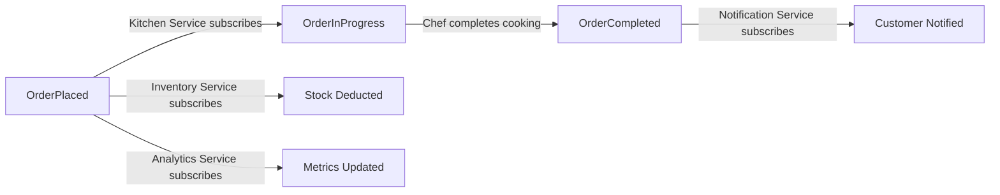
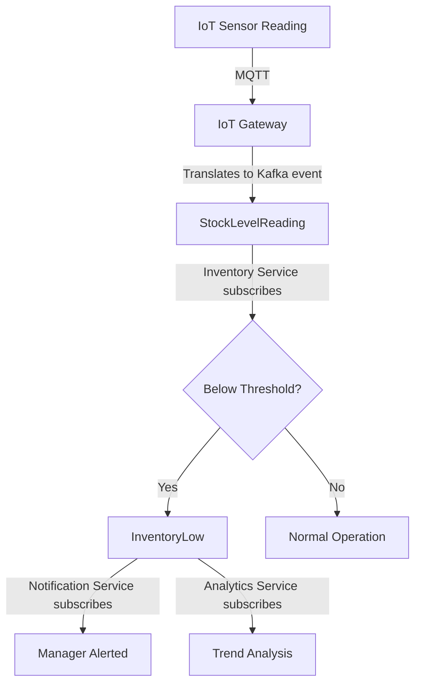
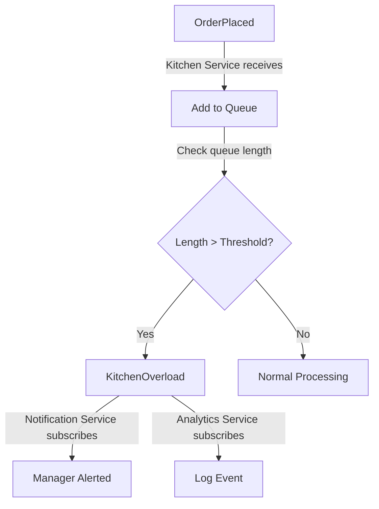

# Event Schema Definitions
# Định nghĩa Cấu trúc Sự kiện

**Project**: IRMS - Intelligent Restaurant Management System
**Last Updated**: 2026-02-21
**Status**: Design Complete

---

## Table of Contents / Mục lục

1. [Introduction](#introduction)
2. [Event Design Principles](#event-design-principles)
3. [Base Event Structure](#base-event-structure)
4. [Event Catalog](#event-catalog)
5. [Event Flow Diagrams](#event-flow-diagrams)
6. [Validation Rules](#validation-rules)
7. [Event Evolution Strategy](#event-evolution-strategy)
8. [Event Versioning](#event-versioning)

---

## Introduction
## Giới thiệu

### Purpose / Mục đích

This document defines the canonical event schemas for the IRMS event-driven architecture. All events published to the Kafka event bus must conform to these schemas.

Tài liệu này định nghĩa các schema sự kiện chuẩn cho kiến trúc hướng sự kiện của IRMS. Tất cả sự kiện được xuất bản lên Kafka event bus phải tuân thủ các schema này.

### Event-Driven Architecture Benefits / Lợi ích Kiến trúc Hướng Sự kiện

- **Loose Coupling**: Services don't directly depend on each other
- **Scalability**: Add new subscribers without changing publishers
- **Auditability**: Event log provides complete audit trail
- **Replay**: Re-process events from any point in time
- **Fault Tolerance**: Events buffered when consumers unavailable

---

## Event Design Principles
## Nguyên tắc Thiết kế Sự kiện

### 1. Event Immutability / Tính Bất biến

**Principle**: Events cannot be changed once published.

**Rationale**: Events represent historical facts ("Order was placed at 10:30 AM"). Modifying history breaks audit trail and event sourcing.

**Implementation**: Event IDs are unique and never reused. Updates published as new events.

---

### 2. Self-Contained Events / Sự kiện Tự chứa

**Principle**: Events contain all necessary data for consumers.

**Example**: `OrderPlaced` event includes full order details (items, prices, customer), not just `orderId`.

**Rationale**: Consumers shouldn't query producer's database. Reduces coupling and improves resilience.

---

### 3. Event Versioning / Quản lý Phiên bản

**Principle**: Events are versioned to support evolution.

**Format**: `eventVersion: "1.0"` in event schema

**Strategy**: Backward compatibility for 1 year (consumers support N and N-1 versions)

---

### 4. Event Timestamps / Dấu thời gian

**Principle**: All events include ISO 8601 timestamps.

**Fields**:
- `timestamp`: When event occurred (producer clock)
- `processedAt` (optional): When event consumed (consumer clock)

**Timezone**: UTC (no local timezones)

---

### 5. Correlation IDs / ID Tương quan

**Principle**: Events include correlation IDs for distributed tracing.

**Fields**:
- `correlationId`: Links related events (e.g., OrderPlaced → OrderCompleted)
- `causationId` (optional): ID of event that caused this event

**Example**: All events for order #123 share same `correlationId`

---

## Base Event Structure
## Cấu trúc Sự kiện Cơ bản

All events inherit this base structure (follows **CloudEvents** v1.0 specification):

```json
{
  "specversion": "1.0",
  "id": "550e8400-e29b-41d4-a716-446655440000",
  "type": "com.irms.ordering.OrderPlaced",
  "source": "ordering-service",
  "time": "2026-02-21T10:30:45.123Z",
  "datacontenttype": "application/json",
  "data": {
    ...
  }
}
```

### Field Definitions / Định nghĩa Trường

| Field | Type | Required | Description |
|-------|------|----------|-------------|
| `specversion` | string | ✅ | CloudEvents version (always "1.0") |
| `id` | string (UUID) | ✅ | Unique event ID (UUIDv4) |
| `type` | string | ✅ | Event type (reverse DNS notation) |
| `source` | string | ✅ | Service that published event |
| `time` | string (ISO 8601) | ✅ | Timestamp (UTC) |
| `datacontenttype` | string | ✅ | Content type (always "application/json") |
| `data` | object | ✅ | Event-specific payload |

**Additional Custom Fields** (IRMS-specific):

```json
{
  ...
  "correlationId": "cor-550e8400-e29b-41d4-a716-446655440000",
  "causationId": "550e8400-e29b-41d4-a716-446655440000",
  "eventVersion": "1.0",
  "metadata": {
    "userId": "USR-123",
    "traceId": "550e8400-e29b-41d4-a716-446655440000"
  }
}
```

---

## Event Catalog
## Danh mục Sự kiện

### Overview / Tổng quan

IRMS defines **8 core events** and **5 supporting events**:

| Event | Publisher | Subscribers | Frequency | Priority |
|-------|-----------|-------------|-----------|----------|
| **OrderPlaced** | Ordering Service | Kitchen, Inventory, Analytics | 100/min peak | P0 |
| **OrderInProgress** | Kitchen Service | Notification, Analytics | 100/min peak | P1 |
| **OrderCompleted** | Kitchen Service | Notification, Analytics | 100/min peak | P1 |
| **InventoryLow** | Inventory Service | Notification, Analytics | 5/hour | P1 |
| **TemperatureAlert** | IoT Gateway | Notification, Inventory | 1/day | P1 |
| **KitchenOverload** | Kitchen Service | Notification, Analytics | 5/day peak | P1 |
| **SensorOffline** | IoT Gateway | Notification, Inventory | 2/week | P2 |
| **SensorOnline** | IoT Gateway | Notification, Inventory | 2/week | P2 |

---

### Event 1: OrderPlaced

**Publisher**: Ordering Service
**Subscribers**: Kitchen Service, Inventory Service, Analytics Service
**Topic**: `orders`
**Partition Key**: `data.orderId`

**Description**: Customer has successfully placed an order.

**Schema**:

```json
{
  "specversion": "1.0",
  "id": "550e8400-e29b-41d4-a716-446655440000",
  "type": "com.irms.ordering.OrderPlaced",
  "source": "ordering-service",
  "time": "2026-02-21T10:30:45.123Z",
  "datacontenttype": "application/json",
  "correlationId": "cor-550e8400",
  "eventVersion": "1.0",
  "data": {
    "orderId": "ORD-2026-001234",
    "orderNumber": "001234",
    "tableId": "TBL-05",
    "tableName": "Table 5",
    "customerId": "optional-customer-id",
    "items": [
      {
        "itemId": "MENU-001",
        "name": "Phở Bò",
        "name_en": "Beef Pho",
        "quantity": 2,
        "unitPrice": 75000,
        "totalPrice": 150000,
        "category": "main-dish",
        "specialInstructions": "No onions, extra chili",
        "estimatedPrepTime": 15
      }
    ],
    "subtotal": 150000,
    "tax": 15000,
    "discount": 0,
    "total": 165000,
    "currency": "VND",
    "orderStatus": "PLACED",
    "priority": "NORMAL",
    "orderTime": "2026-02-21T10:30:45.123Z",
    "estimatedCompletionTime": "2026-02-21T10:45:45.123Z"
  }
}
```

**Validation Rules**:

```javascript
{
  "orderId": {
    "type": "string",
    "pattern": "^ORD-\\d{4}-\\d{6}$",
    "required": true
  },
  "tableId": {
    "type": "string",
    "pattern": "^TBL-\\d{2}$",
    "required": true
  },
  "items": {
    "type": "array",
    "minItems": 1,
    "maxItems": 20
  },
  "total": {
    "type": "number",
    "minimum": 0,
    "maximum": 10000000,
    "validation": "total === subtotal + tax - discount"
  },
  "priority": {
    "enum": ["LOW", "NORMAL", "HIGH", "VIP"]
  }
}
```

**Evolution History**:
- `v1.0` (2026-02-21): Initial version
- Future: `v1.1` may add `customerPreferences`, `loyaltyPoints`

---

### Event 2: OrderInProgress

**Publisher**: Kitchen Service
**Subscribers**: Notification Service, Analytics Service
**Topic**: `kitchen`
**Partition Key**: `data.orderId`

**Description**: Chef has started preparing the order.

**Schema**:

```json
{
  "specversion": "1.0",
  "id": "660e9511-e29b-41d4-a716-446655440001",
  "type": "com.irms.kitchen.OrderInProgress",
  "source": "kitchen-service",
  "time": "2026-02-21T10:32:00.456Z",
  "datacontenttype": "application/json",
  "correlationId": "cor-550e8400",
  "causationId": "550e8400-e29b-41d4-a716-446655440000",
  "eventVersion": "1.0",
  "data": {
    "orderId": "ORD-2026-001234",
    "tableId": "TBL-05",
    "chefId": "CHEF-001",
    "chefName": "Nguyễn Văn A",
    "stationId": "STATION-WOK",
    "stationName": "Wok Station",
    "startTime": "2026-02-21T10:32:00.456Z",
    "estimatedCompletionTime": "2026-02-21T10:47:00.456Z",
    "status": "IN_PROGRESS",
    "itemsInProgress": [
      {
        "itemId": "MENU-001",
        "name": "Phở Bò",
        "quantity": 2,
        "status": "COOKING"
      }
    ]
  }
}
```

**Validation Rules**:

```javascript
{
  "orderId": {
    "type": "string",
    "required": true,
    "validation": "Must match an existing order"
  },
  "chefId": {
    "type": "string",
    "pattern": "^CHEF-\\d{3}$"
  },
  "startTime": {
    "type": "string",
    "format": "date-time",
    "validation": "startTime > orderTime (from OrderPlaced event)"
  }
}
```

---

### Event 3: OrderCompleted

**Publisher**: Kitchen Service
**Subscribers**: Notification Service, Analytics Service
**Topic**: `kitchen`
**Partition Key**: `data.orderId`

**Description**: Order preparation is complete and ready for serving.

**Schema**:

```json
{
  "specversion": "1.0",
  "id": "770e9622-e29b-41d4-a716-446655440002",
  "type": "com.irms.kitchen.OrderCompleted",
  "source": "kitchen-service",
  "time": "2026-02-21T10:47:30.789Z",
  "datacontenttype": "application/json",
  "correlationId": "cor-550e8400",
  "causationId": "660e9511-e29b-41d4-a716-446655440001",
  "eventVersion": "1.0",
  "data": {
    "orderId": "ORD-2026-001234",
    "tableId": "TBL-05",
    "chefId": "CHEF-001",
    "stationId": "STATION-WOK",
    "completionTime": "2026-02-21T10:47:30.789Z",
    "actualPrepTime": 930,
    "estimatedPrepTime": 900,
    "status": "COMPLETED",
    "quality": "EXCELLENT",
    "items": [
      {
        "itemId": "MENU-001",
        "name": "Phở Bò",
        "quantity": 2,
        "status": "COMPLETED",
        "prepTime": 930
      }
    ]
  }
}
```

**Validation Rules**:

```javascript
{
  "completionTime": {
    "type": "string",
    "format": "date-time",
    "validation": "completionTime > startTime (from OrderInProgress event)"
  },
  "actualPrepTime": {
    "type": "number",
    "unit": "seconds",
    "minimum": 60,
    "maximum": 3600,
    "validation": "actualPrepTime = completionTime - startTime"
  },
  "quality": {
    "enum": ["EXCELLENT", "GOOD", "ACCEPTABLE", "POOR"]
  }
}
```

---

### Event 4: InventoryLow

**Publisher**: Inventory Service
**Subscribers**: Notification Service, Analytics Service
**Topic**: `inventory`
**Partition Key**: `data.ingredientId`

**Description**: Ingredient stock level has fallen below safety threshold.

**Schema**:

```json
{
  "specversion": "1.0",
  "id": "880e9733-e29b-41d4-a716-446655440003",
  "type": "com.irms.inventory.InventoryLow",
  "source": "inventory-service",
  "time": "2026-02-21T11:15:22.111Z",
  "datacontenttype": "application/json",
  "correlationId": "cor-inv-rice-001",
  "eventVersion": "1.0",
  "data": {
    "alertId": "ALERT-INV-001",
    "ingredientId": "ING-RICE-001",
    "ingredientName": "Rice",
    "ingredientName_vi": "Gạo",
    "currentLevel": 15,
    "safetyThreshold": 20,
    "maxCapacity": 100,
    "unit": "kg",
    "percentage": 15,
    "severity": "MEDIUM",
    "location": "main-kitchen",
    "lastRestocked": "2026-02-20T08:00:00.000Z",
    "estimatedRunoutTime": "2026-02-21T15:00:00.000Z",
    "consumptionRate": 5,
    "suggestedReorderQuantity": 50
  }
}
```

**Validation Rules**:

```javascript
{
  "currentLevel": {
    "type": "number",
    "minimum": 0,
    "validation": "currentLevel < safetyThreshold"
  },
  "severity": {
    "enum": ["LOW", "MEDIUM", "HIGH", "CRITICAL"],
    "calculation": `
      if (percentage < 5%) return "CRITICAL"
      if (percentage < 10%) return "HIGH"
      if (percentage < 20%) return "MEDIUM"
      return "LOW"
    `
  },
  "percentage": {
    "type": "number",
    "validation": "percentage = (currentLevel / maxCapacity) * 100"
  }
}
```

---

### Event 5: TemperatureAlert

**Publisher**: IoT Gateway Service
**Subscribers**: Notification Service, Inventory Service
**Topic**: `iot-alerts`
**Partition Key**: `data.sensorId`

**Description**: Temperature sensor detected out-of-range temperature in refrigeration equipment.

**Schema**:

```json
{
  "specversion": "1.0",
  "id": "990e9844-e29b-41d4-a716-446655440004",
  "type": "com.irms.iot.TemperatureAlert",
  "source": "iot-gateway-service",
  "time": "2026-02-21T12:05:33.222Z",
  "datacontenttype": "application/json",
  "correlationId": "cor-sensor-temp-01",
  "eventVersion": "1.0",
  "data": {
    "alertId": "ALERT-TEMP-001",
    "sensorId": "SENSOR-TEMP-FRIDGE-01",
    "deviceId": "DEVICE-IOT-001",
    "sensorType": "TEMPERATURE",
    "location": "main-kitchen",
    "equipmentType": "REFRIGERATOR",
    "equipmentId": "FRIDGE-01",
    "currentTemperature": 8.5,
    "minThreshold": 0,
    "maxThreshold": 5,
    "unit": "celsius",
    "severity": "HIGH",
    "duration": 300,
    "alertTime": "2026-02-21T12:05:33.222Z",
    "lastNormalReading": {
      "temperature": 4.2,
      "timestamp": "2026-02-21T12:00:00.000Z"
    }
  }
}
```

**Validation Rules**:

```javascript
{
  "currentTemperature": {
    "type": "number",
    "validation": "currentTemperature < minThreshold OR currentTemperature > maxThreshold"
  },
  "severity": {
    "enum": ["LOW", "MEDIUM", "HIGH", "CRITICAL"],
    "calculation": `
      let deviation = Math.abs(currentTemperature - (maxThreshold + minThreshold) / 2)
      if (deviation > 10) return "CRITICAL"
      if (deviation > 5) return "HIGH"
      if (deviation > 2) return "MEDIUM"
      return "LOW"
    `
  },
  "duration": {
    "type": "number",
    "unit": "seconds",
    "description": "How long temperature has been out of range"
  }
}
```

---

### Event 6: KitchenOverload

**Publisher**: Kitchen Service
**Subscribers**: Notification Service, Analytics Service
**Topic**: `kitchen`
**Partition Key**: `data.kitchenId`

**Description**: Kitchen queue length exceeded threshold, indicating overload.

**Schema**:

```json
{
  "specversion": "1.0",
  "id": "aa0e9955-e29b-41d4-a716-446655440005",
  "type": "com.irms.kitchen.KitchenOverload",
  "source": "kitchen-service",
  "time": "2026-02-21T12:30:15.333Z",
  "datacontenttype": "application/json",
  "correlationId": "cor-kitchen-overload-001",
  "eventVersion": "1.0",
  "data": {
    "alertId": "ALERT-KITCHEN-001",
    "kitchenId": "KITCHEN-MAIN",
    "queueLength": 12,
    "threshold": 10,
    "activeOrders": 25,
    "averageWaitTime": 1200,
    "severity": "HIGH",
    "stations": [
      {
        "stationId": "STATION-WOK",
        "name": "Wok Station",
        "activeOrders": 8,
        "capacity": 5,
        "utilizationPercent": 160
      },
      {
        "stationId": "STATION-GRILL",
        "name": "Grill Station",
        "activeOrders": 4,
        "capacity": 5,
        "utilizationPercent": 80
      }
    ],
    "suggestedActions": [
      "Add additional chef to Wok Station",
      "Throttle new orders temporarily",
      "Increase priority for simple dishes"
    ]
  }
}
```

**Validation Rules**:

```javascript
{
  "queueLength": {
    "type": "number",
    "minimum": 0,
    "validation": "queueLength > threshold"
  },
  "averageWaitTime": {
    "type": "number",
    "unit": "seconds",
    "description": "Average wait time for orders in queue"
  },
  "severity": {
    "enum": ["MEDIUM", "HIGH", "CRITICAL"],
    "calculation": `
      if (queueLength > threshold * 2) return "CRITICAL"
      if (queueLength > threshold * 1.5) return "HIGH"
      return "MEDIUM"
    `
  }
}
```

---

### Event 7: SensorOffline

**Publisher**: IoT Gateway Service
**Subscribers**: Notification Service, Inventory Service
**Topic**: `iot-alerts`
**Partition Key**: `data.sensorId`

**Description**: IoT sensor has not sent heartbeat for specified duration.

**Schema**:

```json
{
  "specversion": "1.0",
  "id": "bb0e0066-e29b-41d4-a716-446655440006",
  "type": "com.irms.iot.SensorOffline",
  "source": "iot-gateway-service",
  "time": "2026-02-21T13:10:45.444Z",
  "datacontenttype": "application/json",
  "correlationId": "cor-sensor-offline-001",
  "eventVersion": "1.0",
  "data": {
    "alertId": "ALERT-SENSOR-OFFLINE-001",
    "sensorId": "SENSOR-TEMP-FRIDGE-01",
    "deviceId": "DEVICE-IOT-001",
    "sensorType": "TEMPERATURE",
    "location": "main-kitchen",
    "lastSeen": "2026-02-21T13:05:45.444Z",
    "offlineDuration": 300,
    "expectedHeartbeatInterval": 30,
    "severity": "MEDIUM",
    "lastReading": {
      "temperature": 4.2,
      "timestamp": "2026-02-21T13:05:45.444Z"
    }
  }
}
```

---

### Event 8: SensorOnline

**Publisher**: IoT Gateway Service
**Subscribers**: Notification Service, Inventory Service
**Topic**: `iot-alerts`
**Partition Key**: `data.sensorId`

**Description**: Previously offline sensor has reconnected.

**Schema**:

```json
{
  "specversion": "1.0",
  "id": "cc0e1177-e29b-41d4-a716-446655440007",
  "type": "com.irms.iot.SensorOnline",
  "source": "iot-gateway-service",
  "time": "2026-02-21T13:20:55.555Z",
  "datacontenttype": "application/json",
  "correlationId": "cor-sensor-offline-001",
  "causationId": "bb0e0066-e29b-41d4-a716-446655440006",
  "eventVersion": "1.0",
  "data": {
    "sensorId": "SENSOR-TEMP-FRIDGE-01",
    "deviceId": "DEVICE-IOT-001",
    "sensorType": "TEMPERATURE",
    "location": "main-kitchen",
    "onlineTime": "2026-02-21T13:20:55.555Z",
    "offlineDuration": 900,
    "bufferedReadingsCount": 15,
    "currentReading": {
      "temperature": 4.5,
      "timestamp": "2026-02-21T13:20:55.555Z"
    }
  }
}
```

---

## Event Flow Diagrams
## Sơ đồ Luồng Sự kiện

### Event Flow 1: Order Lifecycle



**Event Chain**:
1. `OrderPlaced` (Ordering Service)
2. `OrderInProgress` (Kitchen Service)
3. `OrderCompleted` (Kitchen Service)
4. Parallel: Stock updates, analytics, notifications

**Correlation**: All events share same `correlationId`

---

### Event Flow 2: Inventory Monitoring



---

### Event Flow 3: Kitchen Overload



---

## Validation Rules
## Quy tắc Xác thực

### Schema Validation / Xác thực Schema

All events validated using **JSON Schema** at producer (pre-publish) and consumer (post-consume):

```javascript
// Example: OrderPlaced event validation
const Ajv = require('ajv');
const ajv = new Ajv();

const orderPlacedSchema = {
  type: "object",
  properties: {
    orderId: { type: "string", pattern: "^ORD-\\d{4}-\\d{6}$" },
    tableId: { type: "string", pattern: "^TBL-\\d{2}$" },
    items: {
      type: "array",
      minItems: 1,
      items: {
        type: "object",
        required: ["itemId", "quantity", "unitPrice"]
      }
    },
    total: { type: "number", minimum: 0 }
  },
  required: ["orderId", "tableId", "items", "total"]
};

const validate = ajv.compile(orderPlacedSchema);
const valid = validate(event.data);

if (!valid) {
  throw new Error(`Invalid event: ${ajv.errorsText(validate.errors)}`);
}
```

### Business Rules Validation / Xác thực Quy tắc Nghiệp vụ

Beyond schema validation, enforce business rules:

**Example: OrderPlaced**
```javascript
// Business rule: total must equal sum of items + tax
const expectedTotal = event.data.items.reduce(
  (sum, item) => sum + item.totalPrice, 0
) + event.data.tax - event.data.discount;

if (event.data.total !== expectedTotal) {
  throw new Error(`Total mismatch: expected ${expectedTotal}, got ${event.data.total}`);
}
```

---

## Event Evolution Strategy
## Chiến lược Tiến hóa Sự kiện

### Adding New Fields / Thêm Trường Mới

**Strategy**: Add optional fields (backward compatible)

**Example**: `OrderPlaced` v1.1 adds `customerPreferences`

```json
{
  "eventVersion": "1.1",
  "data": {
    "orderId": "ORD-2026-001234",
    ...
    "customerPreferences": {
      "spicyLevel": "MEDIUM",
      "allergens": ["peanuts", "shellfish"]
    }
  }
}
```

**Consumer Handling**:
```javascript
// Consumers check eventVersion and handle accordingly
if (event.eventVersion === "1.1") {
  const preferences = event.data.customerPreferences || {};
  // Use preferences
}
```

---

### Deprecating Fields / Ngừng Sử dụng Trường

**Strategy**: Mark field as deprecated, remove after 1 year

**Example**: `OrderPlaced` deprecates `orderNumber` in favor of `orderId`

```json
{
  "eventVersion": "1.2",
  "data": {
    "orderId": "ORD-2026-001234",
    "orderNumber": "001234"  // @deprecated: Use orderId instead
  }
}
```

**Timeline**:
- **v1.2** (2026-Q1): Add deprecation notice
- **v1.3** (2026-Q2): Remove field (breaking change, major version bump)

---

## Event Versioning
## Quản lý Phiên bản Sự kiện

### Versioning Scheme / Sơ đồ Phiên bản

**Format**: `eventVersion: "MAJOR.MINOR"`

- **MAJOR**: Breaking changes (incompatible with previous version)
- **MINOR**: Backward-compatible additions

**Example Evolution**:
- `1.0`: Initial version
- `1.1`: Add optional field (backward compatible)
- `1.2`: Deprecate field (backward compatible)
- `2.0`: Remove deprecated field (breaking change)

### Version Support Policy / Chính sách Hỗ trợ Phiên bản

**Policy**: Support N and N-1 versions simultaneously

**Example**:
- Current: `v2.0` (2027-Q1)
- Supported: `v2.0`, `v1.3` (previous major version)
- Deprecated: `v1.0`, `v1.1`, `v1.2` (no longer supported)

**Migration Period**: 6 months for consumers to upgrade

---

## Conclusion / Kết luận

The IRMS event schema catalog defines:

- ✅ **8 core events** covering all critical business flows
- ✅ **CloudEvents v1.0** compliance for interoperability
- ✅ **JSON Schema validation** for data quality
- ✅ **Versioning strategy** for schema evolution
- ✅ **Correlation IDs** for distributed tracing

All events are:
- **Immutable**: Represent historical facts
- **Self-Contained**: Include all necessary data
- **Versioned**: Support backward-compatible evolution
- **Traceable**: Include correlation and causation IDs

See related documentation:
- [Event-Driven Architecture Diagram](../architecture/event-driven-architecture.md)
- [Component & Connector View](../../architecture/04-component-connector-view.md)
- [Runtime Scenarios](../../architecture/06-runtime-scenarios.md)

---

**Document Version**: 1.0
**Last Updated**: 2026-02-21
**Authors**: IRMS Architecture Team
**Status**: ✅ Complete
