```mermaid
graph TB
    subgraph "Restaurant Edge Network<br/>Mạng Edge Nhà hàng"
        Devices["🖥️ Edge Devices<br/><br/>• 10x Tablets<br/>• 5x IoT Sensors<br/>• 2x KDS Displays<br/>• 1x Edge Gateway"]
    end

    subgraph "Internet / Cloud Boundary"
        LB["⚖️ Cloud Load Balancer<br/>(AWS ELB / GCP GLB)<br/><br/>• SSL Termination<br/>• DDoS Protection<br/>• Health Checks"]
    end

    subgraph "Kubernetes Cluster (AWS EKS / GCP GKE / Azure AKS)<br/>Cụm Kubernetes"

        subgraph "Ingress Layer<br/>Lớp Ingress"
            Ingress["🚪 Ingress Controller<br/>(NGINX / Traefik)<br/><br/>Replicas: 3<br/>Resources: 1 CPU, 2Gi RAM"]
        end

        subgraph "Application Namespace: irms-app<br/>Namespace Ứng dụng"

            subgraph "API Gateway Deployment"
                APIGw["🚪 API Gateway Pods<br/><br/>Replicas: 3-5 (HPA)<br/>Resources: 2 CPU, 4Gi RAM<br/>Port: 8080"]
            end

            subgraph "Core Services Deployments<br/>Triển khai Dịch vụ Cốt lõi"
                OrderPods["📝 Ordering Service<br/><br/>Replicas: 3-10 (HPA)<br/>Resources: 2 CPU, 4Gi RAM<br/>Port: 8081<br/><br/>Scale Trigger:<br/>CPU > 70%"]

                KitchenPods["🍳 Kitchen Service<br/><br/>Replicas: 2-5 (HPA)<br/>Resources: 2 CPU, 4Gi RAM<br/>Port: 8082<br/><br/>Scale Trigger:<br/>Queue length > 30"]

                InventoryPods["📦 Inventory Service<br/><br/>Replicas: 2-4 (HPA)<br/>Resources: 1 CPU, 2Gi RAM<br/>Port: 8083"]
            end

            subgraph "Support Services Deployments<br/>Dịch vụ Hỗ trợ"
                NotifPods["🔔 Notification Service<br/><br/>Replicas: 2<br/>Resources: 1 CPU, 2Gi RAM<br/>Port: 8084"]

                AnalyticsPods["📊 Analytics Service<br/><br/>Replicas: 2<br/>Resources: 4 CPU, 8Gi RAM<br/>Port: 8085"]

                AuthPods["🔐 Auth Service<br/><br/>Replicas: 2-3 (HPA)<br/>Resources: 1 CPU, 2Gi RAM<br/>Port: 8086"]
            end

            subgraph "Integration Services"
                IoTGwPods["🌐 IoT Gateway Service<br/><br/>Replicas: 2<br/>Resources: 2 CPU, 3Gi RAM<br/>Port: 8883 (MQTT)<br/>Port: 8087 (HTTP)"]
            end
        end

        subgraph "Infrastructure Namespace: irms-infra<br/>Namespace Hạ tầng"

            subgraph "Message Broker"
                KafkaCluster["📬 Kafka Cluster<br/>(StatefulSet)<br/><br/>Brokers: 3<br/>Resources: 4 CPU, 8Gi RAM<br/>Persistent Volume: 100Gi SSD<br/><br/>Partitions:<br/>• orders: 10<br/>• kitchen: 5<br/>• inventory: 5<br/>• notifications: 3"]

                Zookeeper["🐘 ZooKeeper Ensemble<br/>(StatefulSet)<br/><br/>Nodes: 3<br/>Resources: 1 CPU, 2Gi RAM<br/>Persistent Volume: 10Gi"]
            end

            subgraph "Service Mesh (Optional)"
                Istio["🕸️ Istio Control Plane<br/><br/>• mTLS between services<br/>• Traffic management<br/>• Observability"]
            end
        end

        subgraph "Data Namespace: irms-data<br/>Namespace Dữ liệu"

            subgraph "Relational Databases"
                OrderDB["📊 Order Database<br/>(PostgreSQL)<br/><br/>Type: StatefulSet<br/>Primary: 1, Replicas: 2<br/>Resources: 4 CPU, 16Gi RAM<br/>Storage: 500Gi SSD<br/><br/>Backups: Daily + PITR"]

                KitchenDB["📊 Kitchen Database<br/>(PostgreSQL)<br/><br/>Primary: 1, Replicas: 1<br/>Storage: 200Gi SSD"]

                UserDB["📊 User Database<br/>(PostgreSQL)<br/><br/>Primary: 1, Replicas: 1<br/>Storage: 100Gi SSD"]
            end

            subgraph "Time-Series & NoSQL"
                InfluxDB["📈 InfluxDB<br/>(Time-Series)<br/><br/>For: Inventory sensors<br/>Replicas: 2<br/>Storage: 300Gi SSD<br/>Retention: 90 days"]

                Redis["⚡ Redis Cluster<br/>(Cache & Queue)<br/><br/>Nodes: 3 master + 3 replica<br/>Resources: 2 CPU, 8Gi RAM<br/>Persistence: RDB + AOF"]
            end

            subgraph "Analytics Data"
                DataWarehouse["🏢 Data Warehouse<br/>(Managed Service)<br/><br/>AWS Redshift / GCP BigQuery<br/>Storage: 1TB<br/>Query Engine: Presto"]
            end
        end

        subgraph "Observability Namespace: irms-monitoring<br/>Namespace Giám sát"

            subgraph "Metrics & Monitoring"
                Prometheus["📈 Prometheus<br/><br/>Replicas: 2<br/>Storage: 200Gi<br/>Retention: 15 days<br/><br/>Scrape Interval: 15s"]

                Grafana["📊 Grafana<br/><br/>Replicas: 2<br/>Dashboards:<br/>• Service Health<br/>• Order Flow<br/>• Kitchen Load<br/>• Infrastructure"]
            end

            subgraph "Logging"
                Elasticsearch["🔍 Elasticsearch Cluster<br/><br/>Nodes: 3<br/>Storage: 500Gi<br/>Retention: 30 days<br/><br/>Indexes:<br/>• app-logs-*<br/>• system-logs-*<br/>• audit-logs-*"]

                Logstash["📥 Logstash<br/><br/>Replicas: 2<br/>Pipelines:<br/>• Application logs<br/>• System logs<br/>• Kafka logs"]

                Kibana["🖥️ Kibana<br/><br/>Replicas: 2<br/>Dashboards:<br/>• Error Tracking<br/>• Request Logs<br/>• Audit Trail"]
            end

            subgraph "Tracing"
                Jaeger["🔗 Jaeger<br/><br/>Collector: 2 replicas<br/>Query: 1 replica<br/>Storage: Elasticsearch<br/><br/>Trace Retention: 7 days"]
            end

            subgraph "Alerting"
                Alertmanager["🚨 Alertmanager<br/><br/>Replicas: 2<br/>Integrations:<br/>• PagerDuty<br/>• Slack<br/>• Email"]
            end
        end
    end

    %% Client connections
    Devices -->|"HTTPS/MQTT"| LB
    LB -->|"HTTPS"| Ingress

    %% Ingress routing
    Ingress -->|"/api/*"| APIGw
    Ingress -->|"/metrics"| Prometheus
    Ingress -->|"/grafana"| Grafana
    Ingress -->|"/kibana"| Kibana

    %% API Gateway to Services
    APIGw --> OrderPods
    APIGw --> KitchenPods
    APIGw --> AuthPods
    APIGw --> AnalyticsPods

    %% IoT Gateway connections
    Devices -.->|"MQTT 8883"| IoTGwPods

    %% Services to Kafka
    OrderPods --> KafkaCluster
    KitchenPods --> KafkaCluster
    InventoryPods --> KafkaCluster
    IoTGwPods --> KafkaCluster
    NotifPods --> KafkaCluster
    AnalyticsPods --> KafkaCluster

    %% Kafka to Zookeeper
    KafkaCluster --> Zookeeper

    %% Services to Databases
    OrderPods --> OrderDB
    OrderPods --> Redis
    KitchenPods --> KitchenDB
    KitchenPods --> Redis
    InventoryPods --> InfluxDB
    AuthPods --> UserDB
    AuthPods --> Redis
    AnalyticsPods --> DataWarehouse
    AnalyticsPods --> Redis

    %% Service Mesh (if enabled)
    Istio -.->|"Sidecar Injection"| OrderPods
    Istio -.->|"Sidecar Injection"| KitchenPods

    %% Observability connections
    OrderPods -.->|"Metrics"| Prometheus
    KitchenPods -.->|"Metrics"| Prometheus
    InventoryPods -.->|"Metrics"| Prometheus

    OrderPods -.->|"Logs"| Logstash
    KitchenPods -.->|"Logs"| Logstash
    KafkaCluster -.->|"Logs"| Logstash

    OrderPods -.->|"Traces"| Jaeger
    KitchenPods -.->|"Traces"| Jaeger

    Prometheus -->|"Alerts"| Alertmanager

    Logstash --> Elasticsearch
    Kibana --> Elasticsearch
    Grafana --> Prometheus

    %% Styling
    style LB fill:#FF9800,stroke:#E65100,stroke-width:3px,color:#fff
    style Ingress fill:#FF9800,stroke:#E65100,stroke-width:2px,color:#fff
    style APIGw fill:#FF9800,stroke:#E65100,stroke-width:2px,color:#fff

    style OrderPods fill:#4CAF50,stroke:#2E7D32,stroke-width:2px,color:#fff
    style KitchenPods fill:#4CAF50,stroke:#2E7D32,stroke-width:2px,color:#fff
    style InventoryPods fill:#4CAF50,stroke:#2E7D32,stroke-width:2px,color:#fff

    style NotifPods fill:#2196F3,stroke:#1565C0,stroke-width:2px,color:#fff
    style AnalyticsPods fill:#2196F3,stroke:#1565C0,stroke-width:2px,color:#fff
    style AuthPods fill:#2196F3,stroke:#1565C0,stroke-width:2px,color:#fff

    style IoTGwPods fill:#FF5722,stroke:#D84315,stroke-width:2px,color:#fff

    style KafkaCluster fill:#9C27B0,stroke:#6A1B9A,stroke-width:3px,color:#fff
    style Zookeeper fill:#795548,stroke:#4E342E,stroke-width:2px,color:#fff

    style Prometheus fill:#E91E63,stroke:#880E4F,stroke-width:2px,color:#fff
    style Grafana fill:#E91E63,stroke:#880E4F,stroke-width:2px,color:#fff
    style Elasticsearch fill:#00BCD4,stroke:#006064,stroke-width:2px,color:#fff
    style Jaeger fill:#00BCD4,stroke:#006064,stroke-width:2px,color:#fff

    style Devices fill:#607D8B,stroke:#37474F,stroke-width:2px,color:#fff
```

# IRMS Kubernetes Deployment Architecture
## Kiến trúc Triển khai Kubernetes IRMS

## Purpose / Mục đích
Illustrates the production deployment topology of IRMS on Kubernetes, showing how services, infrastructure components, and observability stack are deployed in a cloud-native environment.

Minh họa cấu trúc triển khai production của IRMS trên Kubernetes, thể hiện cách các dịch vụ, thành phần hạ tầng và stack giám sát được triển khai trong môi trường cloud-native.

## Deployment Goals / Mục tiêu Triển khai

1. **High Availability**: No single point of failure (NFR3)
2. **Auto-Scaling**: Scale based on load (NFR6)
3. **Zero-Downtime Deployments**: Rolling updates
4. **Self-Healing**: Auto-restart failed pods
5. **Observability**: Complete monitoring and logging (NFR8)

---



---

## Deployment Specifications / Đặc tả Triển khai

### Cluster Configuration / Cấu hình Cụm

| Parameter | Specification |
|-----------|---------------|
| **Cloud Provider** | AWS EKS / GCP GKE / Azure AKS |
| **Kubernetes Version** | 1.28+ |
| **Node Pools** | 3 pools (app, data, monitoring) |
| **Total Nodes** | 10-20 nodes (auto-scaling) |
| **Node Types** | c5.2xlarge (AWS) / n2-standard-8 (GCP) |
| **Networking** | VPC with private subnets |
| **Availability Zones** | Multi-AZ deployment (3 AZs minimum) |

---

### Application Pods - Resource Allocation

| Service | Min Replicas | Max Replicas | CPU Request | Memory Request | CPU Limit | Memory Limit |
|---------|--------------|--------------|-------------|----------------|-----------|--------------|
| **API Gateway** | 3 | 5 | 1 CPU | 2Gi | 2 CPU | 4Gi |
| **Ordering** | 3 | 10 | 1 CPU | 2Gi | 2 CPU | 4Gi |
| **Kitchen** | 2 | 5 | 1 CPU | 2Gi | 2 CPU | 4Gi |
| **Inventory** | 2 | 4 | 500m | 1Gi | 1 CPU | 2Gi |
| **Notification** | 2 | 3 | 500m | 1Gi | 1 CPU | 2Gi |
| **Analytics** | 2 | 3 | 2 CPU | 4Gi | 4 CPU | 8Gi |
| **Auth** | 2 | 3 | 500m | 1Gi | 1 CPU | 2Gi |
| **IoT Gateway** | 2 | 4 | 1 CPU | 2Gi | 2 CPU | 3Gi |

**Total Resources (Minimum)**:
- **vCPUs**: 20 cores
- **Memory**: 40 GB RAM
- **Storage**: 2 TB (persistent volumes)

**Total Resources (Peak Load)**:
- **vCPUs**: 50+ cores
- **Memory**: 100+ GB RAM

---

### Horizontal Pod Autoscaling (HPA)

#### Ordering Service HPA
```yaml
apiVersion: autoscaling/v2
kind: HorizontalPodAutoscaler
metadata:
  name: ordering-service-hpa
  namespace: irms-app
spec:
  scaleTargetRef:
    apiVersion: apps/v1
    kind: Deployment
    name: ordering-service
  minReplicas: 3
  maxReplicas: 10
  metrics:
  - type: Resource
    resource:
      name: cpu
      target:
        type: Utilization
        averageUtilization: 70
  - type: Resource
    resource:
      name: memory
      target:
        type: Utilization
        averageUtilization: 80
  - type: Pods
    pods:
      metric:
        name: http_requests_per_second
      target:
        type: AverageValue
        averageValue: "1000"
  behavior:
    scaleDown:
      stabilizationWindowSeconds: 300
      policies:
      - type: Percent
        value: 50
        periodSeconds: 60
    scaleUp:
      stabilizationWindowSeconds: 0
      policies:
      - type: Percent
        value: 100
        periodSeconds: 30
      - type: Pods
        value: 2
        periodSeconds: 30
```

#### Kitchen Service HPA (Custom Metric: Queue Length)
```yaml
apiVersion: autoscaling/v2
kind: HorizontalPodAutoscaler
metadata:
  name: kitchen-service-hpa
  namespace: irms-app
spec:
  scaleTargetRef:
    apiVersion: apps/v1
    kind: Deployment
    name: kitchen-service
  minReplicas: 2
  maxReplicas: 5
  metrics:
  - type: Pods
    pods:
      metric:
        name: kitchen_queue_length
      target:
        type: AverageValue
        averageValue: "30"  # Scale up when queue > 30 orders
  - type: Resource
    resource:
      name: cpu
      target:
        type: Utilization
        averageUtilization: 70
```

---

### Database Deployment Details

#### PostgreSQL StatefulSet (Order Database)
```yaml
apiVersion: apps/v1
kind: StatefulSet
metadata:
  name: postgres-order
  namespace: irms-data
spec:
  serviceName: postgres-order
  replicas: 3  # 1 primary + 2 replicas
  selector:
    matchLabels:
      app: postgres-order
  template:
    metadata:
      labels:
        app: postgres-order
    spec:
      containers:
      - name: postgres
        image: postgres:15-alpine
        env:
        - name: POSTGRES_DB
          value: irms_orders
        - name: POSTGRES_USER
          valueFrom:
            secretKeyRef:
              name: postgres-credentials
              key: username
        - name: POSTGRES_PASSWORD
          valueFrom:
            secretKeyRef:
              name: postgres-credentials
              key: password
        - name: PGDATA
          value: /var/lib/postgresql/data/pgdata
        ports:
        - containerPort: 5432
          name: postgres
        volumeMounts:
        - name: postgres-storage
          mountPath: /var/lib/postgresql/data
        resources:
          requests:
            cpu: 2
            memory: 8Gi
          limits:
            cpu: 4
            memory: 16Gi
        livenessProbe:
          exec:
            command:
            - pg_isready
            - -U
            - postgres
          initialDelaySeconds: 30
          periodSeconds: 10
        readinessProbe:
          exec:
            command:
            - pg_isready
            - -U
            - postgres
          initialDelaySeconds: 5
          periodSeconds: 5
  volumeClaimTemplates:
  - metadata:
      name: postgres-storage
    spec:
      accessModes: ["ReadWriteOnce"]
      storageClassName: fast-ssd
      resources:
        requests:
          storage: 500Gi
```

---

### Kafka Cluster Configuration

#### Kafka StatefulSet
```yaml
apiVersion: apps/v1
kind: StatefulSet
metadata:
  name: kafka
  namespace: irms-infra
spec:
  serviceName: kafka-headless
  replicas: 3
  selector:
    matchLabels:
      app: kafka
  template:
    metadata:
      labels:
        app: kafka
    spec:
      containers:
      - name: kafka
        image: confluentinc/cp-kafka:7.5.0
        env:
        - name: KAFKA_BROKER_ID
          valueFrom:
            fieldRef:
              fieldPath: metadata.name
        - name: KAFKA_ZOOKEEPER_CONNECT
          value: "zookeeper-0.zookeeper-headless:2181,zookeeper-1.zookeeper-headless:2181,zookeeper-2.zookeeper-headless:2181"
        - name: KAFKA_ADVERTISED_LISTENERS
          value: "PLAINTEXT://$(POD_NAME).kafka-headless:9092"
        - name: KAFKA_OFFSETS_TOPIC_REPLICATION_FACTOR
          value: "3"
        - name: KAFKA_TRANSACTION_STATE_LOG_REPLICATION_FACTOR
          value: "3"
        - name: KAFKA_TRANSACTION_STATE_LOG_MIN_ISR
          value: "2"
        - name: KAFKA_DEFAULT_REPLICATION_FACTOR
          value: "3"
        - name: KAFKA_MIN_INSYNC_REPLICAS
          value: "2"
        - name: KAFKA_LOG_RETENTION_HOURS
          value: "168"  # 7 days
        - name: KAFKA_LOG_SEGMENT_BYTES
          value: "1073741824"  # 1GB
        - name: KAFKA_AUTO_CREATE_TOPICS_ENABLE
          value: "false"
        ports:
        - containerPort: 9092
          name: kafka
        volumeMounts:
        - name: kafka-storage
          mountPath: /var/lib/kafka/data
        resources:
          requests:
            cpu: 2
            memory: 4Gi
          limits:
            cpu: 4
            memory: 8Gi
  volumeClaimTemplates:
  - metadata:
      name: kafka-storage
    spec:
      accessModes: ["ReadWriteOnce"]
      storageClassName: fast-ssd
      resources:
        requests:
          storage: 100Gi
```

**Kafka Topics Configuration**:
```bash
# orders topic (high throughput)
kafka-topics.sh --create \
  --topic orders \
  --partitions 10 \
  --replication-factor 3 \
  --config retention.ms=604800000 \  # 7 days
  --config min.insync.replicas=2

# kitchen topic
kafka-topics.sh --create \
  --topic kitchen \
  --partitions 5 \
  --replication-factor 3

# inventory topic
kafka-topics.sh --create \
  --topic inventory \
  --partitions 5 \
  --replication-factor 3

# notifications topic
kafka-topics.sh --create \
  --topic notifications \
  --partitions 3 \
  --replication-factor 3
```

---

### Networking & Service Discovery

#### Service Types

| Service | Type | Port | Purpose |
|---------|------|------|---------|
| **Load Balancer** | LoadBalancer | 443 | External HTTPS traffic |
| **Ingress Controller** | ClusterIP | 80, 443 | Internal routing |
| **API Gateway** | ClusterIP | 8080 | Internal service |
| **Ordering Service** | ClusterIP | 8081 | Internal service |
| **Kitchen Service** | ClusterIP | 8082 | Internal service |
| **Kafka** | Headless | 9092 | StatefulSet discovery |
| **PostgreSQL** | Headless | 5432 | StatefulSet discovery |
| **IoT Gateway** | NodePort | 8883 | MQTT from edge devices |

#### Network Policies

**Restrict Ordering Service** (only accessible from API Gateway):
```yaml
apiVersion: networking.k8s.io/v1
kind: NetworkPolicy
metadata:
  name: ordering-service-policy
  namespace: irms-app
spec:
  podSelector:
    matchLabels:
      app: ordering-service
  policyTypes:
  - Ingress
  ingress:
  - from:
    - podSelector:
        matchLabels:
          app: api-gateway
    ports:
    - protocol: TCP
      port: 8081
```

---

### Storage Classes / Lớp Lưu trữ

| Storage Class | Type | Use Case | IOPS | Throughput |
|---------------|------|----------|------|------------|
| **fast-ssd** | SSD (gp3/pd-ssd) | Databases, Kafka | 16,000 | 1000 MB/s |
| **standard** | HDD (st1/pd-standard) | Logs, backups | 500 | 500 MB/s |
| **backup** | Object Storage (S3/GCS) | Long-term backups | N/A | N/A |

#### Persistent Volume Claims

- **Order Database**: 500Gi fast-ssd
- **Kitchen Database**: 200Gi fast-ssd
- **Kafka Broker**: 100Gi per broker (total 300Gi) fast-ssd
- **Elasticsearch**: 500Gi fast-ssd
- **InfluxDB**: 300Gi fast-ssd

**Total Storage**: ~2TB SSD

---

### Deployment Strategy / Chiến lược Triển khai

#### Rolling Update
```yaml
spec:
  strategy:
    type: RollingUpdate
    rollingUpdate:
      maxSurge: 1        # Create 1 extra pod during update
      maxUnavailable: 0  # Never have less than desired replicas
```

**Process**:
1. Create new pod with updated image
2. Wait for readiness probe to pass
3. Route traffic to new pod
4. Terminate old pod
5. Repeat for all replicas

**Benefits**:
- Zero downtime
- Gradual rollout (detect issues early)
- Easy rollback if problems detected

#### Blue-Green Deployment (Alternative)
- Deploy complete new version (green)
- Switch traffic from old (blue) to new (green)
- Keep blue running for quick rollback
- Terminate blue after validation

---

### Health Checks / Kiểm tra Sức khỏe

#### Liveness Probe (Restart if fails)
```yaml
livenessProbe:
  httpGet:
    path: /health/live
    port: 8080
  initialDelaySeconds: 30
  periodSeconds: 10
  timeoutSeconds: 5
  failureThreshold: 3
```

#### Readiness Probe (Remove from load balancer if fails)
```yaml
readinessProbe:
  httpGet:
    path: /health/ready
    port: 8080
  initialDelaySeconds: 10
  periodSeconds: 5
  timeoutSeconds: 3
  failureThreshold: 2
```

#### Startup Probe (For slow-starting apps)
```yaml
startupProbe:
  httpGet:
    path: /health/startup
    port: 8080
  initialDelaySeconds: 0
  periodSeconds: 10
  timeoutSeconds: 3
  failureThreshold: 30  # Allow 5 minutes to start
```

---

### Security / Bảo mật

#### Pod Security Standards
- **Baseline**: Non-root user, no privilege escalation
- **Restricted**: Drop all capabilities except NET_BIND_SERVICE

#### Secrets Management
```yaml
apiVersion: v1
kind: Secret
metadata:
  name: postgres-credentials
  namespace: irms-data
type: Opaque
data:
  username: cG9zdGdyZXM=  # base64 encoded
  password: c3VwZXJzZWNyZXQ=
```

**Best Practice**: Use external secrets manager (AWS Secrets Manager, HashiCorp Vault)

#### RBAC (Role-Based Access Control)
```yaml
apiVersion: rbac.authorization.k8s.io/v1
kind: Role
metadata:
  name: ordering-service-role
  namespace: irms-app
rules:
- apiGroups: [""]
  resources: ["secrets"]
  verbs: ["get"]
- apiGroups: [""]
  resources: ["configmaps"]
  verbs: ["get", "list", "watch"]
```

---

### Backup & Disaster Recovery

#### Database Backups
- **Frequency**: Hourly incremental, daily full backup
- **Retention**: 7 days on-cluster, 30 days in object storage
- **Tool**: pg_dump, Velero for cluster backups
- **Recovery Time Objective (RTO)**: < 1 hour
- **Recovery Point Objective (RPO)**: < 1 hour

#### Kafka Event Log
- **Retention**: 7 days in Kafka (configurable per topic)
- **Archival**: Stream to S3/GCS for long-term retention (compliance)

#### Disaster Recovery Plan
1. **Multi-AZ Deployment**: Survive single AZ failure
2. **Database Replication**: Async replica in different region (future)
3. **Backup Restoration**: Automated restore testing weekly
4. **Runbook**: Step-by-step recovery procedures documented

---

### Cost Optimization / Tối ưu Chi phí

#### Estimated Monthly Cost (AWS)

| Resource | Specification | Monthly Cost (USD) |
|----------|---------------|-------------------|
| **EKS Cluster** | Control plane | $73 |
| **EC2 Nodes** | 10x c5.2xlarge (8 vCPU, 16GB) | $1,224 |
| **EBS Volumes** | 2TB SSD (gp3) | $160 |
| **Load Balancer** | Application LB | $23 |
| **Data Transfer** | 500GB egress | $45 |
| **RDS** (optional) | db.r5.xlarge (instead of self-managed) | $400 |
| **Managed Kafka** (optional) | MSK (instead of self-managed) | $300 |
| **Backups** | S3 storage (5TB) | $115 |
| **CloudWatch** | Logs & metrics | $50 |

**Total (Self-Managed)**: ~$1,600/month
**Total (Managed Services)**: ~$2,390/month

#### Cost Optimization Strategies
1. **Auto-scaling**: Scale down during off-peak hours (save 30-50%)
2. **Spot Instances**: Use for non-critical workloads (save 70%)
3. **Reserved Instances**: Commit 1-3 years for core services (save 40%)
4. **Right-sizing**: Monitor and adjust resource requests/limits
5. **Storage Tiering**: Move old data to cheaper storage classes

---

### Monitoring Dashboards / Bảng điều khiển Giám sát

#### Grafana Dashboards

1. **Service Health Dashboard**
   - Service uptime (SLA)
   - Request rate, error rate, latency (RED metrics)
   - Pod status and restarts

2. **Order Flow Dashboard**
   - Orders per minute
   - Average order processing time
   - Kitchen queue length
   - Order success rate

3. **Infrastructure Dashboard**
   - Node CPU, memory, disk usage
   - Network traffic
   - Kafka lag, throughput
   - Database connections, query time

4. **Business Metrics Dashboard**
   - Revenue per hour
   - Table turnover rate
   - Popular menu items
   - Customer satisfaction (if available)

---

### Alerting Rules / Quy tắc Cảnh báo

| Alert | Condition | Severity | Action |
|-------|-----------|----------|--------|
| **HighPodCrashRate** | > 5 crashes in 10 min | Critical | Page on-call engineer |
| **HighOrderLatency** | P95 > 2 seconds | Warning | Investigate queue |
| **KafkaConsumerLag** | Lag > 1000 messages | Warning | Scale consumers |
| **DatabaseConnectionPool** | > 80% utilization | Warning | Scale database |
| **DiskSpaceHigh** | > 85% used | Warning | Clean logs / expand |
| **PodMemoryHigh** | > 90% usage | Warning | Investigate memory leak |
| **ServiceDown** | 0 healthy pods | Critical | Emergency response |

---

### Deployment Checklist / Danh sách Kiểm tra

**Pre-Deployment**:
- [ ] Kubernetes cluster created and configured
- [ ] Namespaces created (irms-app, irms-infra, irms-data, irms-monitoring)
- [ ] Storage classes configured
- [ ] Secrets created and validated
- [ ] Network policies applied
- [ ] Service mesh installed (optional: Istio)

**Deployment**:
- [ ] Deploy databases (PostgreSQL, InfluxDB, Redis)
- [ ] Deploy Kafka and ZooKeeper
- [ ] Deploy core services (Ordering, Kitchen, Inventory)
- [ ] Deploy support services (Notification, Analytics, Auth)
- [ ] Deploy IoT Gateway
- [ ] Deploy API Gateway
- [ ] Deploy Ingress Controller
- [ ] Configure Load Balancer
- [ ] Deploy monitoring stack (Prometheus, Grafana, ELK, Jaeger)

**Post-Deployment**:
- [ ] Verify all pods are running
- [ ] Test health endpoints
- [ ] Validate service-to-service communication
- [ ] Test external access via Load Balancer
- [ ] Verify monitoring and alerting
- [ ] Run smoke tests
- [ ] Load test critical paths
- [ ] Document deployment and runbooks

---

## Related Diagrams / Sơ đồ Liên quan

- [**Microservices Overview**](../architecture/microservices-overview.md) - Logical architecture
- [**Component Diagrams**](../components/) - Internal service structure
- [**Event-Driven Architecture**](../architecture/event-driven-architecture.md) - Communication patterns

---

**Last Updated**: 2026-02-21
**Status**: Design Complete, Ready for Implementation
