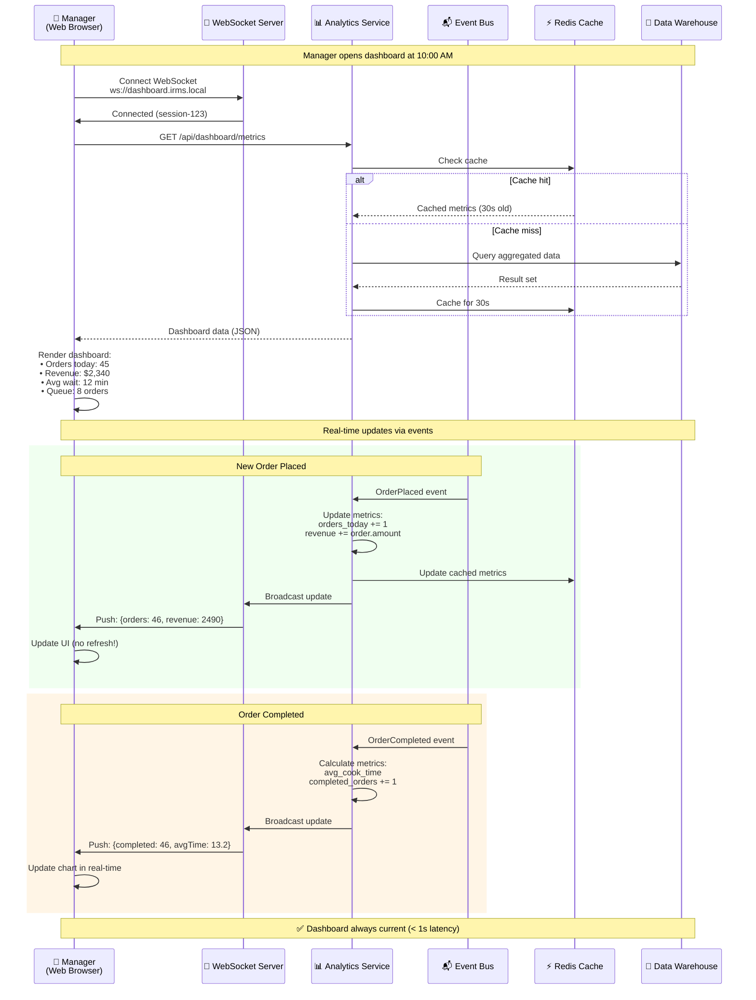

# Analytics Dashboard Update (S5)
## Cập nhật Dashboard Phân tích (S5)

## Purpose / Mục đích
Demonstrates how manager dashboard receives real-time updates from all services via event streaming, providing live business insights.

---



---

## Dashboard Metrics

### Real-Time Metrics (via WebSocket)
- Orders per minute
- Current queue length
- Revenue counter
- Kitchen load status

### Aggregated Metrics (via API, cached 30s)
- Daily/weekly/monthly summaries
- Top menu items
- Peak hour analysis
- Table turnover rate

---

## WebSocket Protocol

```javascript
// Client-side
const ws = new WebSocket('ws://dashboard.irms.local/ws');

ws.onmessage = (event) => {
  const update = JSON.parse(event.data);
  
  switch(update.type) {
    case 'ORDER_METRIC':
      updateOrderCount(update.data.ordersToday);
      break;
    case 'REVENUE_METRIC':
      updateRevenue(update.data.totalRevenue);
      break;
    case 'QUEUE_METRIC':
      updateQueueLength(update.data.queueLength);
      break;
  }
};
```

---

**Last Updated**: 2026-02-21
**Status**: Production-Ready
