```mermaid
sequenceDiagram
    actor C1 as 👤 Customer 1-50
    participant T as 📱 Tablets (50x)
    participant AG as 🚪 API Gateway
    participant OS as 📝 Ordering Service<br/>(3 → 10 instances)
    participant EB as 📬 Event Bus<br/>(Kafka)
    participant KS as 🍳 Kitchen Service<br/>(2 → 5 instances)
    participant KLM as 📊 Kitchen Load Monitor
    participant PS as ⭐ Priority Service
    participant KDS as 📺 Kitchen Display
    participant NS as 🔔 Notification Service
    participant M as 👔 Manager

    Note over C1,M: 🕐 12:00 PM - Lunch Rush Begins

    rect rgb(255, 240, 230)
    Note over C1,T: Initial Orders (Orders 1-20)
    loop 20 customers order
        C1->>T: Place order
        T->>AG: POST /api/orders
        AG->>OS: Route request
        OS->>EB: Publish OrderPlaced
    end
    Note over OS: Ordering Service handling<br/>20 concurrent requests
    end

    rect rgb(230, 255, 240)
    Note over EB,KS: Kitchen Processes Initial Batch
    loop 20 orders
        EB->>KS: Deliver OrderPlaced events
        KS->>PS: Calculate priority
        PS-->>KS: Priority: 40-60 (Normal)
        KS->>KS: Add to queue<br/>Queue: 1 → 20
        KS->>KDS: Display order
    end
    Note over KS: Queue Length: 20<br/>Status: NORMAL
    end

    rect rgb(255, 230, 230)
    Note over C1,M: More Orders Arrive (Orders 21-35)
    loop 15 more customers
        C1->>T: Place order
        T->>AG: POST /api/orders
        AG->>OS: Route request
        OS->>EB: Publish OrderPlaced
        EB->>KS: Deliver event
        KS->>KS: Add to queue
    end

    Note over KS: ⚠️ Queue Length: 35<br/>Threshold Exceeded (30)

    KS->>KLM: Check load status
    KLM->>KLM: getCurrentLoad() = 35<br/>Status: OVERLOAD
    end

    rect rgb(255, 200, 200)
    Note over KLM,M: OVERLOAD DETECTED - TRIGGER ALERTS

    KLM->>KLM: detectOverload()<br/>Calculate metrics:<br/>• Queue: 35 orders<br/>• Avg wait: 18 min<br/>• Capacity: 120%

    KLM->>EB: Publish KitchenOverloadEvent<br/>{queueLength: 35,<br/>threshold: 30,<br/>avgWaitTime: 18m,<br/>severity: HIGH}

    par Alert Manager
        EB->>NS: KitchenOverload event
        NS->>M: 🚨 URGENT: Kitchen Overload<br/>"35 orders in queue<br/>Avg wait: 18 minutes"
        M->>M: View dashboard<br/>Assess situation
    and Auto-Scale Kitchen Service
        KLM->>KS: Trigger scale-up
        Note over KS: Kubernetes HPA detects<br/>high CPU + custom metric<br/>(queue_length > 30)
        KS->>KS: Scale: 2 → 5 instances
        Note over KS: Additional capacity online<br/>in 30 seconds
    end
    end

    rect rgb(240, 240, 255)
    Note over PS,KS: Priority Rebalancing (Every 1 min)

    PS->>PS: Scheduled rebalance triggered
    PS->>KS: Get all queued orders (35)

    loop For each order
        PS->>PS: Recalculate priority:<br/>• Complexity: unchanged<br/>• Wait time: INCREASED<br/>• Kitchen load: HIGH<br/>• Customer type: check VIP

        alt VIP Customer
            PS->>PS: Priority: 85/100<br/>(High priority)
        else Regular Customer, Long Wait
            PS->>PS: Priority: 70/100<br/>(Wait time penalty)
        else Regular Customer, Short Wait
            PS->>PS: Priority: 50/100<br/>(Normal)
        end
    end

    PS->>KS: Update queue priorities
    KS->>KS: Re-sort queue by new priorities
    KS->>KDS: Update display order

    Note over KDS: VIP orders moved to top<br/>Long-wait orders prioritized
    end

    rect rgb(230, 255, 230)
    Note over C1,M: More Orders Continue (Orders 36-45)

    loop 10 more customers
        C1->>T: Place order
        T->>AG: POST /api/orders
        AG->>OS: Route request

        Note over OS: Ordering Service<br/>auto-scaled to 10 instances<br/>handling load easily

        OS->>EB: Publish OrderPlaced
        EB->>KS: Deliver event (5 instances)

        KS->>PS: Calculate priority

        alt Peak load - prioritize simple dishes
            PS->>PS: Boost priority for:<br/>• Beverages: +20<br/>• Simple dishes: +10<br/>Complex dishes: no boost
        end

        PS-->>KS: Priority score
        KS->>KS: Insert with priority
    end

    Note over KS: Queue Peak: 45 orders<br/>But processing faster<br/>(5 instances working)
    end

    rect rgb(230, 240, 255)
    Note over KS,M: Kitchen Processing at Scale

    par 5 Kitchen Service instances working
        Note over KS: Instance 1-5<br/>Each processing orders<br/>in parallel

        loop Kitchen processes orders
            KS->>KS: extractMax() from queue<br/>Get highest priority order
            KS->>KDS: Update status: IN_PROGRESS

            Note over KDS: Chef starts cooking

            KS->>EB: Publish OrderInProgress

            Note over KDS: 15 minutes later...

            KS->>KDS: Update status: READY
            KS->>EB: Publish OrderCompleted
            EB->>NS: OrderCompleted event
            NS->>C1: 🔔 "Your order is ready!"
        end
    end

    Note over KS: Queue Length: 45 → 40 → 35 → 30<br/>Gradually decreasing
    end

    rect rgb(255, 255, 230)
    Note over KLM,M: Load Monitoring (Every 30 sec)

    loop Monitor every 30 seconds
        KLM->>KS: Get current load
        KS-->>KLM: Queue: 35 → 30 → 25

        alt Queue still high (> 25)
            KLM->>M: Status update:<br/>"Queue: 30 orders<br/>Processing normally"
        else Queue normalized (< 20)
            KLM->>M: ✅ "Kitchen load normal<br/>Queue: 18 orders"
            KLM->>KS: Trigger scale-down<br/>(if sustained < 20)
            Note over KS: Kubernetes HPA<br/>scales down: 5 → 3 instances
        end
    end
    end

    rect rgb(240, 255, 240)
    Note over C1,M: Rush Hour Ending (13:00)

    Note over KS: Queue Length: 12<br/>Status: NORMAL

    KLM->>KLM: detectOverload() = false<br/>Load within limits

    KLM->>EB: Publish KitchenLoadNormalEvent
    EB->>NS: Event delivered
    NS->>M: ✅ "Kitchen load normalized<br/>Queue: 12 orders"

    Note over KS: Auto-scale down: 3 → 2 instances<br/>(base capacity)

    M->>M: Review rush hour metrics:<br/>• Peak queue: 45 orders<br/>• Max wait: 22 minutes<br/>• Orders completed: 45<br/>• Orders lost: 0 ✅
    end

    Note over C1,M: ✅ Rush hour handled successfully!
```

# Kitchen Overload Scenario (S2)
## Kịch bản Bếp Quá tải (S2)

## Purpose / Mục đích
Demonstrates how IRMS handles peak hours when kitchen receives more orders than normal capacity, using priority queue management, auto-scaling, and staff alerts.

Minh họa cách IRMS xử lý giờ cao điểm khi bếp nhận nhiều đơn hàng hơn công suất bình thường, sử dụng quản lý hàng đợi ưu tiên, tự động mở rộng và cảnh báo nhân viên.

## Scenario Description / Mô tả Kịch bản

**Context**: Lunch rush hour (12:00-13:00), 50+ customers ordering simultaneously
**Trigger**: Queue length exceeds threshold (30 orders)
**Goal**: Prioritize orders, alert staff, scale services, maintain quality

**Success Criteria**:
- ✅ Orders prioritized correctly (VIP, complexity, wait time)
- ✅ Manager alerted when overload detected
- ✅ Kitchen Service auto-scales to handle load
- ✅ No orders lost despite high volume
- ✅ Average wait time remains acceptable (< 25 minutes)

---



---

## Timeline Breakdown / Phân tích Thời gian

| Time | Event | Queue Length | Status |
|------|-------|--------------|--------|
| **12:00** | Rush hour begins | 0 | NORMAL |
| **12:05** | 20 orders placed | 20 | NORMAL |
| **12:10** | 15 more orders | 35 | **OVERLOAD** ⚠️ |
| **12:11** | Overload detected, alerts sent | 35 | OVERLOAD |
| **12:12** | Kitchen Service scales: 2 → 5 instances | 35 | SCALING |
| **12:15** | Priority rebalance | 40 | OVERLOAD |
| **12:20** | 10 more orders (peak) | **45** | **CRITICAL** 🚨 |
| **12:25** | Processing accelerates (5 instances) | 40 | OVERLOAD |
| **12:30** | Queue decreasing | 30 | BUSY |
| **12:40** | Load normalizing | 20 | NORMAL |
| **12:50** | Scale down: 5 → 3 instances | 15 | NORMAL |
| **13:00** | Rush hour ends | 12 | NORMAL |
| **13:05** | Scale down: 3 → 2 instances (baseline) | 8 | NORMAL |

**Total Duration**: 1 hour
**Peak Load**: 45 orders simultaneously
**Max Wait Time**: 22 minutes (within acceptable limits)

---

## Load Thresholds / Ngưỡng Tải

```java
public enum KitchenLoadStatus {
    NORMAL(0, 20, "GREEN"),      // 0-20 orders
    BUSY(21, 30, "YELLOW"),      // 21-30 orders
    OVERLOAD(31, 40, "ORANGE"),  // 31-40 orders
    CRITICAL(41, 100, "RED");    // 41+ orders

    private final int minQueue;
    private final int maxQueue;
    private final String color;
}
```

---

## Priority Calculation During Overload / Tính toán Ưu tiên Khi Quá tải

### Normal Operation
```
Priority = (Complexity × 0.3) + (WaitTime × 0.4) + (LoadFactor × 0.2) + (CustomerType × 0.1)
```

### During Overload (Modified Algorithm)
```java
public Priority calculatePriorityDuringOverload(KitchenOrder order) {
    // Standard factors
    double complexity = order.getComplexity() / 10.0;
    double waitTime = Math.min(order.getWaitTimeSeconds() / 600.0, 1.0);
    double customerType = order.isVIP() ? 1.0 : 0.5;

    // Modified load factor - inverse priority for complex dishes
    double load = getCurrentLoad() / MAX_LOAD;  // e.g., 45/40 = 1.125

    // During overload, REDUCE priority of complex dishes
    // to clear simpler orders faster
    double loadPenalty = 0.0;
    if (load > 1.0) {
        loadPenalty = (load - 1.0) * complexity * 0.3;  // Penalty for complex
    }

    // Boost simple dishes during overload
    double simplicityBoost = 0.0;
    if (load > 1.0 && complexity < 0.3) {
        simplicityBoost = 0.15;  // +15 points for simple dishes
    }

    // Calculate final priority
    double score =
        (complexity * 0.25) +           // Reduced weight
        (waitTime * 0.50) +             // INCREASED weight (fairness)
        (customerType * 0.15) +         // Slightly increased
        simplicityBoost -
        loadPenalty;

    return new Priority((int) (score * 100));
}
```

**Strategy**: During overload, prioritize:
1. **VIP customers** (always high priority)
2. **Long-waiting orders** (fairness)
3. **Simple dishes** (throughput)
4. De-prioritize complex dishes temporarily

---

## Auto-Scaling Configuration / Cấu hình Tự động Mở rộng

### Kitchen Service HPA (Horizontal Pod Autoscaler)

```yaml
apiVersion: autoscaling/v2
kind: HorizontalPodAutoscaler
metadata:
  name: kitchen-service-hpa
  namespace: irms-app
spec:
  scaleTargetRef:
    apiVersion: apps/v1
    kind: Deployment
    name: kitchen-service
  minReplicas: 2
  maxReplicas: 5
  metrics:
  # CPU-based scaling
  - type: Resource
    resource:
      name: cpu
      target:
        type: Utilization
        averageUtilization: 70

  # Custom metric: Queue length
  - type: Pods
    pods:
      metric:
        name: kitchen_queue_length
      target:
        type: AverageValue
        averageValue: "30"  # Scale up when queue > 30

  behavior:
    scaleUp:
      stabilizationWindowSeconds: 0  # Scale up immediately
      policies:
      - type: Pods
        value: 2              # Add 2 pods at a time
        periodSeconds: 30     # Every 30 seconds
      - type: Percent
        value: 100            # Or double the pods
        periodSeconds: 30
      selectPolicy: Max       # Use fastest policy

    scaleDown:
      stabilizationWindowSeconds: 300  # Wait 5 min before scaling down
      policies:
      - type: Pods
        value: 1              # Remove 1 pod at a time
        periodSeconds: 60     # Every minute
```

**Scaling Behavior**:
- **Scale Up**: Aggressive (2 pods every 30s when queue > 30)
- **Scale Down**: Conservative (1 pod every minute, after 5 min stability)

---

### Ordering Service HPA

```yaml
apiVersion: autoscaling/v2
kind: HorizontalPodAutoscaler
metadata:
  name: ordering-service-hpa
spec:
  scaleTargetRef:
    apiVersion: apps/v1
    kind: Deployment
    name: ordering-service
  minReplicas: 3
  maxReplicas: 10
  metrics:
  - type: Resource
    resource:
      name: cpu
      target:
        type: Utilization
        averageUtilization: 70
  - type: Pods
    pods:
      metric:
        name: http_requests_per_second
      target:
        type: AverageValue
        averageValue: "100"  # Scale at 100 req/s per pod
```

---

## Alert Configuration / Cấu hình Cảnh báo

### Kitchen Overload Alert

```yaml
apiVersion: monitoring.coreos.com/v1
kind: PrometheusRule
metadata:
  name: kitchen-overload-alert
spec:
  groups:
  - name: kitchen_alerts
    interval: 30s
    rules:
    # Warning: Queue approaching limit
    - alert: KitchenQueueHigh
      expr: kitchen_queue_length > 25
      for: 2m
      labels:
        severity: warning
      annotations:
        summary: "Kitchen queue high"
        description: "Queue has {{ $value }} orders (threshold: 25)"

    # Critical: Queue overloaded
    - alert: KitchenOverload
      expr: kitchen_queue_length > 30
      for: 1m
      labels:
        severity: critical
      annotations:
        summary: "Kitchen OVERLOAD detected"
        description: "Queue has {{ $value }} orders (threshold: 30). Auto-scaling triggered."

    # Critical: Very high wait time
    - alert: HighWaitTime
      expr: kitchen_avg_wait_time_seconds > 1500  # 25 minutes
      for: 2m
      labels:
        severity: critical
      annotations:
        summary: "Customer wait time too high"
        description: "Average wait time: {{ $value }}s (> 25 min)"
```

**Alert Destinations**:
- **Slack**: `#kitchen-ops` channel
- **PagerDuty**: On-call manager
- **SMS**: Restaurant manager (critical alerts only)
- **Dashboard**: Real-time visual indicator

---

## Manager Dashboard During Overload / Dashboard Quản lý Khi Quá tải

### Real-Time Metrics Display

```
╔══════════════════════════════════════════════════════════╗
║  🚨 KITCHEN OVERLOAD ALERT - 12:20 PM                   ║
╠══════════════════════════════════════════════════════════╣
║                                                          ║
║  Queue Status:              🔴 CRITICAL                  ║
║  Current Queue Length:      45 orders                    ║
║  Threshold:                 30 orders                    ║
║  Capacity:                  112% (overload)              ║
║                                                          ║
║  Performance Metrics:                                    ║
║  ├─ Average Wait Time:      18 minutes                   ║
║  ├─ Oldest Order:           22 minutes ago               ║
║  ├─ Orders/Hour:            90 (peak: 120)               ║
║  └─ Completion Rate:        45 orders/hour               ║
║                                                          ║
║  Auto-Scaling Status:                                    ║
║  ├─ Kitchen Service:        2 → 5 instances ⬆️          ║
║  ├─ Ordering Service:       3 → 8 instances ⬆️          ║
║  └─ Scale-up Time:          45 seconds ago               ║
║                                                          ║
║  Priority Distribution:                                  ║
║  ├─ VIP Orders:             8 (17%)                      ║
║  ├─ High Priority:          12 (27%)                     ║
║  ├─ Normal Priority:        20 (44%)                     ║
║  └─ Low Priority:           5 (11%)                      ║
║                                                          ║
║  Station Load:                                           ║
║  ├─ Main Kitchen:           18 orders (90% capacity)     ║
║  ├─ Grill:                  12 orders (80% capacity)     ║
║  ├─ Beverage:               10 orders (50% capacity)     ║
║  └─ Dessert:                5 orders (40% capacity)      ║
║                                                          ║
╚══════════════════════════════════════════════════════════╝

[Actions]
[✓ Auto-scale triggered]  [Send staff notification]  [View details]
```

---

## Lessons Learned / Bài học Kinh nghiệm

### What Worked ✅
1. **Auto-scaling**: Kubernetes HPA scaled services automatically
2. **Priority queue**: VIP and long-wait orders handled fairly
3. **Real-time alerts**: Manager notified within seconds
4. **No data loss**: All 45 orders processed successfully
5. **Event-driven architecture**: Services scaled independently

### What Could Improve 🔧
1. **Predictive scaling**: Scale up BEFORE overload (based on time patterns)
2. **Load shedding**: Temporarily disable complex dishes during peak
3. **Staff scheduling**: More chefs during predicted rush hours
4. **Menu optimization**: Promote simple dishes during peak

### Future Enhancements 🚀
1. **ML-based prediction**: Forecast rush hours based on historical data
2. **Dynamic pricing**: Incentivize off-peak ordering
3. **Kitchen capacity reservations**: Pre-allocate slots for large orders
4. **Multi-region failover**: Route orders to less busy branches

---

## Performance Metrics / Chỉ số Hiệu năng

### During Rush Hour

| Metric | Target | Actual | Status |
|--------|--------|--------|--------|
| **Max Queue Length** | < 50 | 45 | ✅ Pass |
| **Avg Wait Time** | < 25 min | 18 min | ✅ Pass |
| **Max Wait Time** | < 30 min | 22 min | ✅ Pass |
| **Orders Lost** | 0 | 0 | ✅ Pass |
| **Scale-up Time** | < 60s | 30s | ✅ Pass |
| **Alert Latency** | < 30s | 15s | ✅ Pass |
| **Service Uptime** | 99.9% | 100% | ✅ Pass |

---

## Related Diagrams / Sơ đồ Liên quan

- [**Kitchen Service Component**](../components/kitchen-service.md) - Priority queue implementation
- [**Kubernetes Deployment**](../deployment/kubernetes-deployment.md) - Auto-scaling configuration
- [**Order Placement Flow**](order-placement-flow.md) - Normal operation baseline
- [**Event-Driven Architecture**](../architecture/event-driven-architecture.md) - KitchenOverload event

---

## Conclusion / Kết luận

This scenario demonstrates that IRMS successfully handles peak load through:

1. **Intelligent Prioritization**: Orders prioritized by VIP status, wait time, and complexity
2. **Auto-Scaling**: Kubernetes HPA scales services automatically based on load
3. **Real-Time Monitoring**: Continuous load monitoring with 30-second intervals
4. **Proactive Alerts**: Manager notified within 15 seconds of overload
5. **Graceful Degradation**: System adjusts priorities to maintain throughput

**Result**: All 45 orders processed successfully with max wait time of 22 minutes, demonstrating system reliability under stress. ✅

---

**Last Updated**: 2026-02-21
**Status**: Validated through load testing
