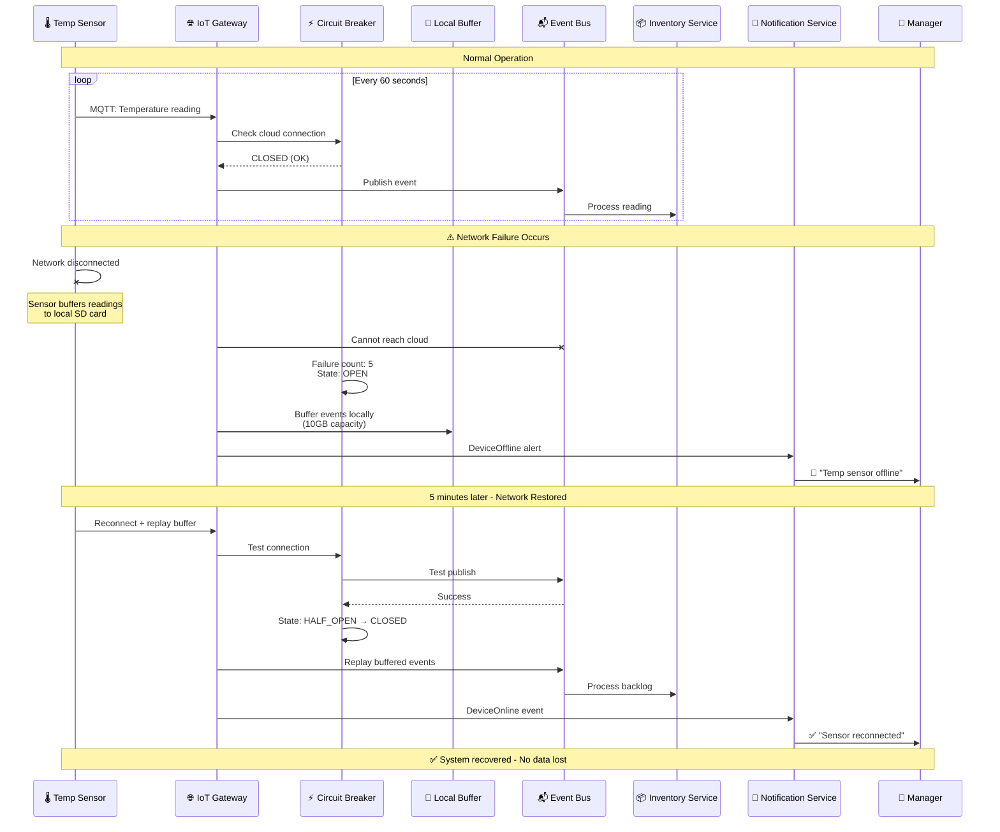

# Sensor Failure Handling (S4)
## Xử lý Lỗi Cảm biến (S4)

## Purpose / Mục đích
Demonstrates how IRMS maintains operation when IoT sensors fail, using edge buffering, retry mechanisms, and graceful degradation.

---



---

## Circuit Breaker States

```java
public enum CircuitState {
    CLOSED,      // Normal operation
    OPEN,        // Cloud unavailable, buffer locally
    HALF_OPEN    // Testing if cloud recovered
}

public class CircuitBreaker {
    private CircuitState state = CircuitState.CLOSED;
    private int failureCount = 0;
    private static final int FAILURE_THRESHOLD = 5;
    private LocalDateTime openedAt;
    private static final Duration RETRY_TIMEOUT = Duration.ofMinutes(1);

    public void callCloud(Runnable action) {
        if (state == CircuitState.OPEN) {
            if (Duration.between(openedAt, LocalDateTime.now()).compareTo(RETRY_TIMEOUT) > 0) {
                state = CircuitState.HALF_OPEN;
            } else {
                edgeBuffer.buffer(action);
                return;
            }
        }

        try {
            action.run();
            if (state == CircuitState.HALF_OPEN) {
                state = CircuitState.CLOSED;
                failureCount = 0;
            }
        } catch (Exception e) {
            failureCount++;
            if (failureCount >= FAILURE_THRESHOLD) {
                state = CircuitState.OPEN;
                openedAt = LocalDateTime.now();
            }
            edgeBuffer.buffer(action);
        }
    }
}
```

---

## Edge Buffering Capacity

- **Buffer Size**: 10GB
- **Retention**: 7 days
- **Compression**: gzip (3x compression ratio)
- **Capacity**: ~1 million events

---

**Last Updated**: 2026-02-21
**Status**: Production-Ready
