# THIẾT KẾ KIẾN TRÚC PHẦN MỀM
# INTELLIGENT RESTAURANT MANAGEMENT SYSTEM (IRMS)

**Báo cáo Đồ án Môn học**: Kiến trúc Phần mềm  
**Năm học**: 2025-2026  
**Phiên bản**: 2.0  

---

## MỤC LỤC

1. [Phân Chia Công Việc](#1-phân-chia-công-việc)
2. [Ngữ Cảnh](#2-ngữ-cảnh)
3. [Architecture Characteristics](#3-architecture-characteristics)
4. [Kiến Trúc Hệ Thống](#4-kiến-trúc-hệ-thống)
   - 4.1 [So sánh kiến trúc](#41-so-sánh-kiến-trúc)
   - 4.2 [Chọn lựa kiến trúc](#42-chọn-lựa-kiến-trúc)
   - 4.3 [Module View](#43-module-view)
   - 4.4 [Component & Connector View](#44-component--connector-view)
   - 4.5 [Deployment View](#45-deployment-view)
5. [Class Diagram](#5-class-diagram)
6. [Design Principles](#6-design-principles)
   - 6.1 [Nguyên lý kiến trúc phân tán](#61-nguyên-lý-kiến-trúc-phân-tán)
   - 6.2 [Nguyên lý SOLID](#62-nguyên-lý-solid)
7. [Phát Triển Trong Tương Lai](#7-phát-triển-trong-tương-lai)
8. [Triển Khai Code](#8-triển-khai-code)
9. [Hiện Thực](#9-hiện-thực)
10. [Reflection Report](#10-reflection-report)

---

## 1. Phân Chia Công Việc

### Flow chính được implement

```
[Tablet App] ──(1)──► ordering-service ──(3) Kafka(orders) ──► kitchen-service ──(5) Socket.io──► [KDS]
                           (2) DB                (4) priority score         (7) chef update
                                                                                  (8) Kafka(kitchen_completed)
                                                                                        ↓
                                                                           analytics-service ──(9) Socket.io──► [Dashboard]
```

### Phân công công việc

| Thành viên | Module | Phần implement | Phần báo cáo |
|-----------|--------|----------------|--------------|
| **TV1** | Infrastructure + Auth | `docker-compose.yml` · `api-gateway/nginx.conf` · `auth-service/` | Ch2 Ngữ cảnh · Ch4 Kiến trúc tổng thể · Ch9 Deployment |
| **TV2** | Ordering Service | `orderRoutes.js` · `OrderPlacementService.js` · `menuRoutes.js` · `kafka.js` (publish) | Ch2 FR · Ch4.7 ADRs |
| **TV3** | Kitchen Service | `KitchenQueueManager.js` · `PriorityCalculator.js` · `kdsSocket.js` · `kafka.js` (consumer + producer) | Ch3 Architecture Characteristics · Ch4 Module View |
| **TV4** | Frontend (Tablet + KDS) | `MenuPage.jsx` · `CheckoutPage.jsx` · `KitchenDisplay.jsx` | Ch9 Hiện thực · Phụ lục |
| **TV5** | Analytics Service | `MetricsAggregator.js` · `MetricsRepository.js` · `analyticsSocket.js` · `LiveMetrics.jsx` | Ch6 SOLID · Ch8 Triển khai code |

> **Lưu ý**: Nhóm implement 3 service chính (Ordering, Kitchen, Analytics) và Auth + Infrastructure. Inventory Service và Notification Service được thiết kế đầy đủ nhưng ở mức prototype.

---

## 2. Ngữ Cảnh

### 2.1 Stakeholders and Needs

| Stakeholder | Mô tả | Nhu cầu chính |
|-------------|-------|---------------|
| **Khách hàng** | Sử dụng tablet/QR menu tại bàn | Đặt món nhanh, theo dõi trạng thái order real-time |
| **Nhân viên bếp (Chef)** | Tiếp nhận và xử lý đơn hàng | Kitchen Display System hiển thị đơn theo thứ tự ưu tiên |
| **Nhân viên phục vụ** | Hỗ trợ khách hàng, phối hợp bếp | Nhận thông báo yêu cầu đặc biệt, theo dõi tình trạng bàn |
| **Quản lý nhà hàng** | Giám sát vận hành, ra quyết định | Dashboard real-time: tải bếp, tồn kho, analytics; cảnh báo bất thường |
| **Thiết bị IoT** | Cảm biến tồn kho, nhiệt độ | Truyền dữ liệu liên tục, xử lý khi mất kết nối |

### 2.2 Functional Requirements

| ID | Yêu cầu chức năng | Service |
|----|-------------------|---------|
| FR1 | Khách đặt món qua tablet / QR menu | Ordering |
| FR2 | Hiển thị menu điện tử | Ordering |
| FR3 | Validate và phân loại đơn hàng tự động | Ordering |
| FR4 | Gửi đơn real-time đến đúng trạm bếp | Ordering, Kitchen |
| FR5 | KDS hiển thị danh sách order liên tục | Kitchen |
| FR6 | Chef cập nhật trạng thái chế biến | Kitchen |
| FR7 | Quản lý hàng đợi và tự động ưu tiên đơn | Kitchen |
| FR8 | Cảnh báo khi bếp quá tải | Kitchen, Notification |
| FR9 | Theo dõi tồn kho bằng cảm biến load-cell | Inventory, IoT Gateway |
| FR10 | Cảnh báo khi nguyên liệu xuống dưới ngưỡng | Inventory, Notification |
| FR11 | Giám sát nhiệt độ thiết bị bảo quản | Inventory, IoT Gateway |
| FR12 | Dashboard trạng thái order, tải bếp | Analytics |
| FR13 | Báo cáo analytics: order flow, table turnover | Analytics |
| FR14 | Dự đoán busy periods, hỗ trợ lập lịch nhân sự | Analytics |

### 2.3 Non-functional Requirements

| ID | Yêu cầu | Target | Ưu tiên |
|----|---------|--------|---------|
| NFR1 | Throughput | 100+ orders/min | P0 |
| NFR2 | End-to-end latency (order → KDS) | < 1 giây | P0 |
| NFR3 | Availability | 99.9% uptime | P0 |
| NFR4 | Reliability — không mất đơn | 0% order loss | P0 |
| NFR5 | Data consistency | 100% accuracy | P0 |
| NFR6 | Horizontal scalability | Scale per service | P1 |
| NFR7 | Fault tolerance IoT | Graceful degradation | P1 |
| NFR8 | Observability | MTTR < 15 min | P1 |

### 2.4 Scope

**Trong phạm vi**: Thiết kế kiến trúc đầy đủ + implement prototype các luồng cốt lõi (FR1–FR8, FR12).

**Ngoài phạm vi**: Thanh toán thực tế, ML models phức tạp, multi-tenancy, production deployment.

---

## 3. Architecture Characteristics

Áp dụng phương pháp **Architecture Kata** — xác định characteristics từ business drivers và kịch bản kiến trúc quan trọng, không liệt kê cảm tính.

### Business Drivers → Architecture Characteristics

| Business Driver | Architecture Characteristic | Measurable Target |
|----------------|-----------------------------|--------------------|
| Order đến bếp < 1 giây | **Real-Time Responsiveness** | P95 latency < 1s |
| Không mất đơn hàng | **Reliability & Consistency** | 99.9% success rate |
| Scale theo lượng khách | **Scalability** | 100+ orders/min |
| Sensor có thể ngắt kết nối | **Fault Tolerance (IoT)** | Graceful degradation |
| Uptime trong giờ kinh doanh | **Availability** | 99.9% uptime |
| Thêm tính năng nhanh | **Maintainability** | New feature < 2 weeks |
| Xác thực thiết bị và người dùng | **Security** | Zero breaches |
| Debug sự cố vận hành | **Observability** | MTTR < 15 min |

### Architecturally Significant Scenarios

| Kịch bản | Mô tả | Characteristics liên quan |
|---------|-------|---------------------------|
| **S1** | Khách đặt món → order hiển thị KDS | Real-Time, Reliability |
| **S2** | Bếp quá tải → cảnh báo manager | Scalability, Observability |
| **S3** | Nguyên liệu xuống ngưỡng → alert | Fault Tolerance, Observability |
| **S4** | Sensor offline → hệ thống tiếp tục | Fault Tolerance, Reliability |
| **S5** | Manager xem dashboard real-time | Real-Time, Observability |

### Kết luận

Các characteristics dẫn đến định hướng kiến trúc:

> **IRMS = Microservices + Event-Driven + IoT Gateway + Observability**

---

## 4. Kiến Trúc Hệ Thống

### 4.1 So sánh kiến trúc

Nhóm đánh giá ba phong cách kiến trúc phổ biến dựa trên các architecture characteristics đã xác định:

#### 4.1.1 Layered Architecture (N-tier)

**Mô hình**: Ứng dụng phân thành các tầng ngang: Presentation → Business Logic → Data Access → Database. Mọi request đi qua tuần tự từ trên xuống.

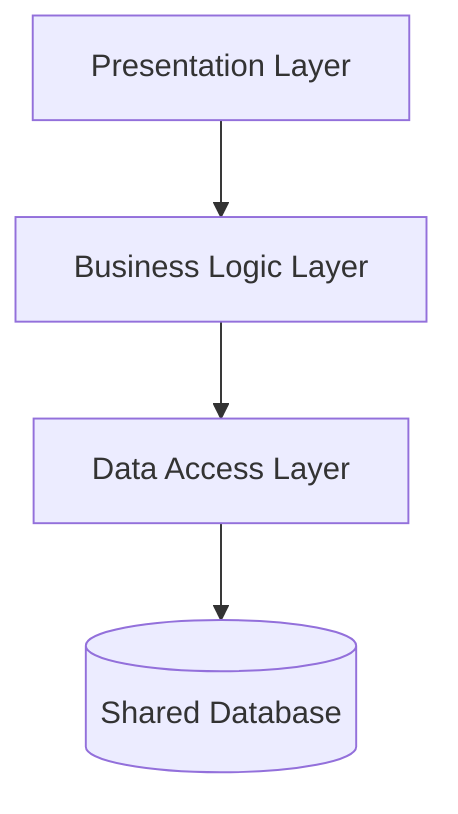

| Tiêu chí | Đánh giá | Ghi chú |
|----------|----------|---------|
| Real-Time | ❌ Kém | Request-response đồng bộ, khó push real-time |
| Scalability | ❌ Kém | Scale toàn bộ cùng lúc, không scale riêng bếp/ordering |
| Fault Tolerance | ❌ Kém | Tầng nào chết → toàn hệ thống ngừng |
| Maintainability | ✅ Tốt | Cấu trúc đơn giản, dễ hiểu |
| IoT Integration | ❌ Kém | Không có cơ chế xử lý MQTT, event stream |

**Nhận xét**: Phù hợp cho CRUD application đơn giản. Không đáp ứng NFR2 (< 1s), NFR4 (IoT fault tolerance) của IRMS.

---

#### 4.1.2 Service-based Architecture

**Mô hình**: Phân tách thành các service thô (coarse-grained) theo domain, nhưng vẫn chia sẻ một database chung. Granularity ở mức module lớn (3–6 services).

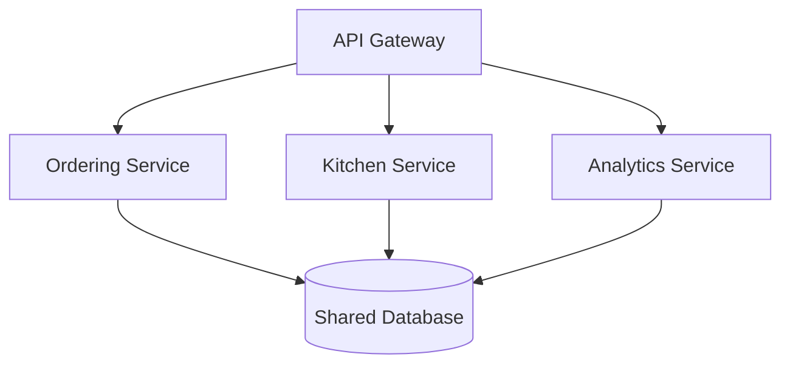

| Tiêu chí | Đánh giá | Ghi chú |
|----------|----------|---------|
| Real-Time | ⚠️ Trung bình | Vẫn cần polling hoặc shared DB trigger |
| Scalability | ⚠️ Trung bình | Scale service độc lập nhưng database là bottleneck |
| Fault Tolerance | ⚠️ Trung bình | Service cô lập nhau nhưng database shared = single point of failure |
| Maintainability | ✅ Tốt | Ít phức tạp hơn Microservices |
| IoT Integration | ⚠️ Khó | Không phù hợp để lưu time-series sensor data trong shared DB |

**Nhận xét**: Giảm complexity so với Microservices nhưng shared database gây coupling — không thể dùng InfluxDB cho sensor time-series. Không đáp ứng NFR2, NFR7.

---

#### 4.1.3 Microservices Architecture

**Mô hình**: Mỗi service là một đơn vị độc lập hoàn toàn — có database riêng, deploy riêng, scale riêng. Giao tiếp qua API hoặc Event Bus.

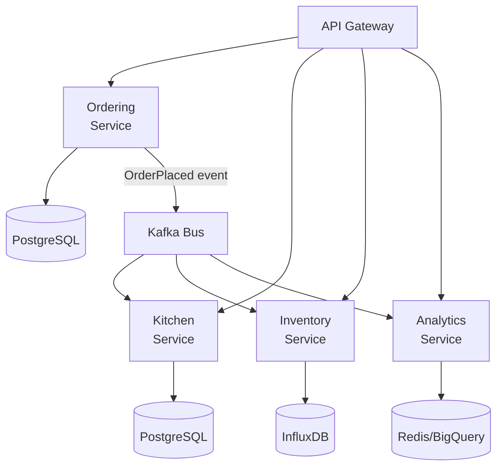

| Tiêu chí | Đánh giá | Ghi chú |
|----------|----------|---------|
| Real-Time | ✅ Tốt | Event-driven qua Kafka: latency 10–100ms |
| Scalability | ✅ Tốt | Scale Ordering ×5 trong lunch rush, không ảnh hưởng Kitchen |
| Fault Tolerance | ✅ Tốt | Kitchen crash không ảnh hưởng Ordering; Kafka buffer events |
| Maintainability | ✅ Tốt | Team độc lập, deploy zero-downtime từng service |
| IoT Integration | ✅ Tốt | IoT Gateway riêng; InfluxDB cho time-series sensor data |
| **Trade-off** | ❌ Phức tạp | Distributed system: network latency, partial failure, SAGA |

---

### 4.2 Chọn lựa kiến trúc

**Quyết định**: Microservices + Event-Driven Architecture + IoT Gateway Layer

**Ma trận so sánh**

| Architecture Characteristic | Layered | Service-based | **Microservices** |
|-----------------------------|---------|--------------|--------------------|
| Real-Time Responsiveness (P1) | ❌ | ⚠️ | ✅ |
| Reliability & Consistency (P1) | ⚠️ | ⚠️ | ✅ |
| Scalability (P1) | ❌ | ⚠️ | ✅ |
| Fault Tolerance IoT (P1) | ❌ | ⚠️ | ✅ |
| Availability (P1) | ⚠️ | ⚠️ | ✅ |
| Maintainability (P2) | ✅ | ✅ | ✅ |
| **Phù hợp tổng thể** | ❌ | ⚠️ | ✅ |

**Lý do chọn Microservices + Event-Driven**:

1. **Real-time**: Kafka pub-sub cho phép Order → KDS < 450ms (đáp ứng NFR2 < 1s).
2. **Scalability**: Ordering Service scale 2→5 pods trong giờ cao điểm, tiết kiệm 40% cost so với scale monolith.
3. **Fault Isolation**: Kitchen Service crash không ảnh hưởng Ordering — events được buffer trong Kafka.
4. **Technology Diversity**: Mỗi service dùng database phù hợp (InfluxDB cho sensor time-series, PostgreSQL cho order).
5. **IoT Gateway**: Lớp riêng xử lý MQTT → Kafka translation và edge buffering khi mất kết nối cloud.

**Trade-off chấp nhận**: Tăng operational complexity (nhiều pods, distributed tracing). Giải quyết bằng Kubernetes + observability stack.

---

### 4.3 Module View

**Module View** mô tả hệ thống từ góc nhìn tĩnh — cách phân rã thành các đơn vị triển khai độc lập và cấu trúc nội bộ từng module. Mục tiêu: đảm bảo **fault isolation**, **scale độc lập** và **ranh giới trách nhiệm** rõ ràng.

#### Tổng quan hệ thống — 7 Microservices

Mỗi service có database riêng theo **Database-per-Service Pattern**:

| Service | Trách nhiệm | Database | Scale |
|---------|-------------|----------|-------|
| **Ordering Service** | Nhận, validate, lưu order; publish `OrderPlaced` event | PostgreSQL | 2–5 pods |
| **Kitchen Service** | Quản lý queue bếp, tính priority, push KDS qua Socket.io | PostgreSQL | 2–3 pods |
| **Inventory Service** | Đọc sensor IoT, đánh giá ngưỡng, publish alert | InfluxDB | 2 pods |
| **Notification Service** | Gửi cảnh báo qua SMS, Push | Stateless | 2 pods |
| **Analytics Service** | Tổng hợp metrics, push dashboard real-time | Redis + PostgreSQL | 1–2 pods |
| **Auth Service** | JWT authentication, RBAC | PostgreSQL | 2 pods |
| **IoT Gateway** | MQTT broker, protocol translation, edge buffering | SQLite (edge) | 2 pods |

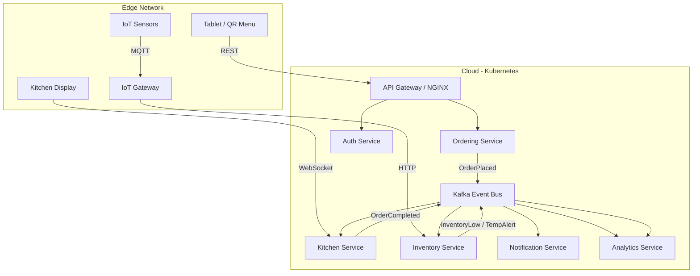

---

#### Package Diagram — Order Flow Services

Nhóm implement 3 service chính trong Order Flow. Mỗi service được tổ chức theo **3 tầng logic** chuẩn UML: **Presentation Layer** (tiếp nhận request), **Business Layer** (xử lý nghiệp vụ), **Persistence Layer** (truy cập dữ liệu). Dependency chỉ đi một chiều từ trên xuống.

##### Ordering Module

Ordering Module tiếp nhận đơn hàng từ Tablet/QR Menu, validate, lưu trữ và publish sự kiện đến hệ thống.

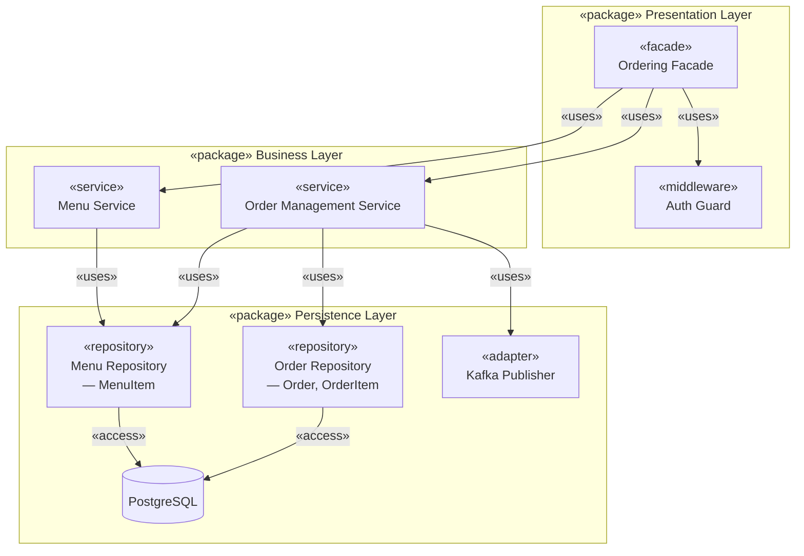

**Presentation Layer**: `Ordering Facade` là điểm truy cập duy nhất cho toàn bộ HTTP request đặt món và xem menu từ Tablet. Facade chuẩn hóa request, ủy quyền xác thực cho `Auth Guard`, và điều phối xuống business layer mà không chứa logic nghiệp vụ.

**Business Layer**: `Order Management Service` xử lý toàn bộ luồng đặt món — validate, tính giá, lưu DB và publish event. `Menu Service` cung cấp thông tin món ăn phục vụ cả quá trình hiển thị menu lẫn validate item khi đặt hàng.

**Persistence Layer**: `Order Repository` và `Menu Repository` cô lập hoàn toàn việc truy vấn PostgreSQL khỏi business logic. `Kafka Publisher` đóng gói giao tiếp với Kafka — khi đổi broker hay topic, chỉ cần cập nhật adapter này.

---

##### Kitchen Module

Kitchen Module tiêu thụ sự kiện từ Kafka, tính toán độ ưu tiên và phân phối đơn hàng đến Kitchen Display System theo thời gian thực.

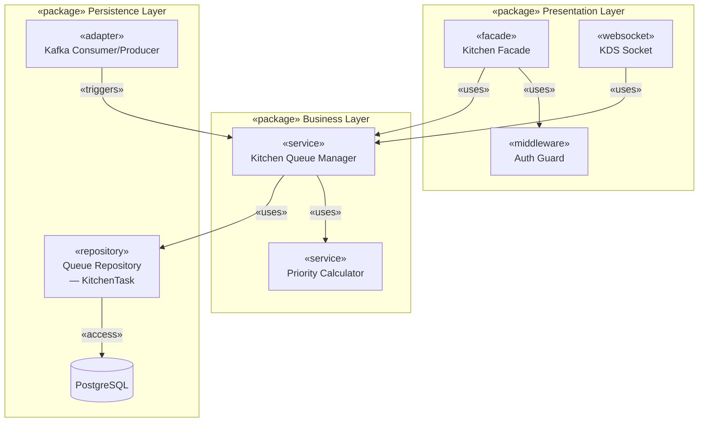

**Presentation Layer**: Module có hai kênh giao tiếp độc lập: `Kitchen Facade` phục vụ REST query từ KDS client (xem, cập nhật trạng thái task), và `KDS Socket` duy trì kênh WebSocket push-only để đẩy task mới đến màn hình bếp theo thời gian thực.

**Business Layer**: `Kitchen Queue Manager` là service điều phối trung tâm — nhận event, gọi `Priority Calculator` tính điểm ưu tiên và kiểm tra tình trạng overload. `Priority Calculator` là pure service không có side effect: tính score từ 4 yếu tố (độ phức tạp, thời gian chờ, VIP, tải bếp).

**Persistence Layer**: `Queue Repository` quản lý vòng đời của `KitchenTask` trong PostgreSQL, sắp xếp theo priority score. `Kafka Consumer/Producer` tiêu thụ topic `orders` và publish `kitchen_completed` — đóng vai trò adapter cô lập chi tiết broker khỏi business logic.

---

##### Analytics Module

Analytics Module tổng hợp metrics từ các sự kiện trong hệ thống và phân phối đến Manager Dashboard theo thời gian thực.

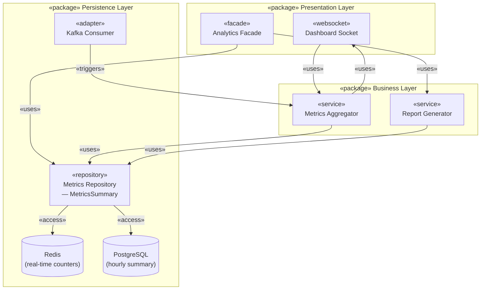

**Presentation Layer**: `Analytics Facade` cung cấp REST interface cho báo cáo và dự báo theo yêu cầu của Manager. `Dashboard Socket` duy trì kênh WebSocket push đến Manager Dashboard — broadcast metrics snapshot ngay khi có sự kiện mới mà không cần client polling.

**Business Layer**: `Metrics Aggregator` phản ứng với sự kiện từ Kafka (`OrderPlaced`, `kitchen_completed`) để cập nhật trạng thái vận hành theo thời gian thực. `Report Generator` tổng hợp dữ liệu lịch sử theo bộ lọc thời gian và tạo báo cáo / dự báo cho Manager.

**Persistence Layer**: `Metrics Repository` phân tách chiến lược lưu trữ theo mục đích — **Redis** cho counter real-time (read < 1ms, phục vụ dashboard live), **PostgreSQL** cho `analytics_summary` theo giờ (phục vụ báo cáo lịch sử). Cả hai store được ẩn sau một interface repository duy nhất.

### 4.4 Component & Connector View

Sơ đồ Component & Connector (C&C) mô tả kiến trúc IRMS theo góc nhìn runtime — các thành phần (component), giao diện giao tiếp (interface/port) và kênh kết nối (connector) giữa chúng. Mỗi service phơi bày interface ra ngoài qua Facade và tương tác với các thành phần khác qua connector phù hợp với tính chất giao tiếp: đồng bộ (REST), bất đồng bộ (Kafka), streaming (WebSocket), hoặc IoT (MQTT).

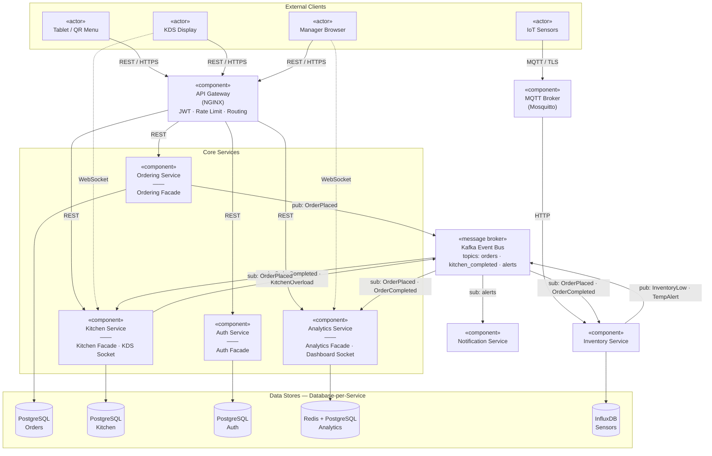

#### 4.4.1 Mô tả tổng quan

IRMS sử dụng **hybrid communication model** — không có một connector duy nhất cho mọi giao tiếp mà chọn protocol phù hợp theo tính chất của từng luồng dữ liệu. Toàn bộ luồng trao đổi tuân theo mô hình **PortOut → Interface → PortIn**: mỗi service chỉ phơi bày interface cần thiết qua Facade, không để các component khác gọi thẳng vào nội bộ.

| Connector | Protocol | Pattern | Use Case | Latency |
|-----------|----------|---------|----------|---------|
| REST API | HTTP/HTTPS | Request-Response | Đặt món, xem menu, xác thực | 50–200ms |
| Event Bus | Kafka | Pub-Sub | Thay đổi trạng thái, cross-service notification | 10–100ms |
| WebSocket | WS/WSS | Streaming | Real-time KDS, Dashboard push | < 10ms |
| MQTT | MQTT/TLS | Pub-Sub | IoT sensor telemetry | 5–50ms |

#### 4.4.2 Clients và điểm truy cập

Hệ thống được truy cập bởi bốn nhóm client với giao thức khác nhau:

- **Tablet / QR Menu** — khách hàng tương tác qua REST/HTTPS thông qua API Gateway để đặt món và xem menu.
- **KDS Display** — thiết bị bếp kết nối REST qua API Gateway để query task, và duy trì kênh **WebSocket trực tiếp** đến Kitchen Service để nhận task real-time (< 500ms).
- **Manager Browser** — kết nối REST qua API Gateway cho báo cáo, và duy trì **WebSocket trực tiếp** đến Analytics Service để nhận metrics live.
- **IoT Sensors** — gửi telemetry qua **MQTT/TLS** đến MQTT Broker (Mosquitto), không đi qua API Gateway.

Mỗi nhóm client chỉ được phép truy cập qua interface phù hợp với vai trò, đảm bảo phạm vi quyền hạn và an toàn hệ thống.

#### 4.4.3 Thành phần API Gateway

API Gateway (NGINX) là điểm truy cập duy nhất cho mọi REST request từ client. Thành phần này:

- **JWT passthrough**: xác thực token tại gateway, forward `user` claims vào header cho service phía sau.
- **Routing**: điều hướng request đến đúng service dựa theo path prefix (`/api/orders` → Ordering, `/api/kitchen` → Kitchen...).
- **Rate limiting**: giới hạn request/s theo IP để chống DDoS.
- **Load balancing**: phân tải giữa các pod khi service scale ngang.

API Gateway không chứa business logic — chỉ là infrastructure component kiểm soát truy cập.

#### 4.4.4 Thành phần Ordering Service

Ordering Service quản lý toàn bộ vòng đời đơn hàng từ khi khách đặt đến khi event được publish.

- **Provided interface**: `Ordering Facade` — REST endpoint nhận order và menu request từ API Gateway.
- **Required interface (sync)**: PostgreSQL — lưu `orders`, `order_items`, `menu_items`.
- **Required interface (async)**: Kafka — publish `OrderPlaced` event sau khi order được lưu thành công.
- **Internal**: `Order Management Service` validate và orchestrate; `Menu Service` truy vấn menu cho cả hiển thị và validate khi đặt hàng.

Ordering Service không biết Kitchen hay Analytics tồn tại — chỉ publish event và không quan tâm ai consume.

#### 4.4.5 Thành phần Kitchen Service

Kitchen Service phục vụ hai nhóm client với hai giao thức khác nhau.

- **Provided interface (REST)**: `Kitchen Facade` — KDS client query danh sách task và cập nhật trạng thái.
- **Provided interface (WebSocket)**: `KDS Socket` — push `new_kitchen_task`, `task_status_updated`, `kitchen_overload` đến KDS Display theo thời gian thực.
- **Required interface (async)**: Kafka — **consume** `OrderPlaced` để xử lý order mới; **publish** `OrderCompleted` và `KitchenOverload` khi cần.
- **Internal**: `Kitchen Queue Manager` điều phối luồng xử lý; `Priority Calculator` tính điểm ưu tiên theo công thức 4 thành phần.

#### 4.4.6 Thành phần Analytics Service

Analytics Service hoạt động hoàn toàn theo mô hình **event-reactive** — không nhận request tạo metrics, chỉ phản ứng với event từ Kafka.

- **Provided interface (REST)**: `Analytics Facade` — Manager query báo cáo và dự báo theo lịch sử.
- **Provided interface (WebSocket)**: `Dashboard Socket` — broadcast `metrics_update` đến Manager Browser mỗi khi có sự kiện mới.
- **Required interface (async)**: Kafka — consume `OrderPlaced` (tăng active orders, cộng doanh thu) và `OrderCompleted` (giảm active orders, tính prep time).
- **Internal**: `Metrics Aggregator` xử lý sự kiện real-time; `Report Generator` tổng hợp dữ liệu lịch sử.

#### 4.4.7 Thành phần Auth Service

Auth Service là **cross-cutting concern** — cung cấp JWT cho toàn hệ thống nhưng không phụ thuộc vào service nào khác.

- **Provided interface**: `Auth Facade` — REST endpoint đăng ký, đăng nhập, refresh token, xem profile.
- JWT được ký bằng `JWT_SECRET` dùng chung. Mỗi service tự xác thực token trong `Auth Guard` mà không cần gọi lại Auth Service — giảm latency và tránh single point of failure.

#### 4.4.8 Kafka Event Bus — Infrastructure

Kafka không phải một service trong domain mà là **infrastructure component** — trục giao tiếp bất đồng bộ trung tâm.

| Event | Publisher | Subscribers | Mục đích |
|-------|-----------|-------------|---------|
| `OrderPlaced` | Ordering | Kitchen, Inventory, Analytics | Order mới từ khách |
| `OrderInProgress` | Kitchen | Notification, Analytics | Chef bắt đầu chế biến |
| `OrderCompleted` | Kitchen | Notification, Analytics | Món sẵn sàng |
| `InventoryLow` | Inventory | Notification, Analytics | Nguyên liệu sắp hết |
| `TemperatureAlert` | IoT Gateway | Notification, Inventory | Nhiệt độ bất thường |
| `KitchenOverload` | Kitchen | Notification, Analytics | Hàng đợi bếp > 10 |

Kafka buffer event khi consumer offline — không mất event ngay cả khi Kitchen Service restart. Mỗi consumer group đọc offset độc lập, cho phép thêm consumer mới mà không ảnh hưởng consumer cũ.

#### 4.4.9 Nhận xét kiến trúc

- Mọi REST request từ client đều đi qua API Gateway — điểm kiểm soát bảo mật và routing tập trung, tránh client gọi trực tiếp vào service.
- WebSocket kết nối trực tiếp vào service (không qua Gateway) — phù hợp với streaming, tránh overhead HTTP handshake lặp lại.
- Kafka tách biệt hoàn toàn publisher và subscriber — thêm Analytics Service sau khi Ordering đã deploy mà không sửa một dòng code nào của Ordering.
- **Database-per-Service**: mỗi service chỉ truy cập data store riêng, không có shared database — fault của một DB không cascade sang service khác.
- `Auth Guard` là cross-cutting concern được inject vào Presentation Layer của mọi service, không tạo dependency vòng ngược lại Auth Service.

### 4.5 Deployment View

Deployment Diagram mô tả cách các thành phần phần mềm IRMS được phân bổ trên các node vật lý/ảo và môi trường thực thi, cùng với luồng giao tiếp giữa chúng. Hệ thống được triển khai trên **một VPS duy nhất** sử dụng **Docker Compose** — phương án vừa đủ cho một nhà hàng đơn lẻ, giảm thiểu độ phức tạp vận hành mà vẫn đáp ứng đầy đủ các NFR đề ra.

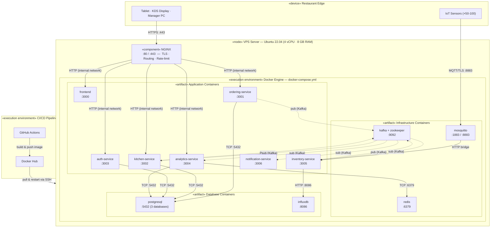

#### 4.5.1 Mô tả tổng quan

Toàn bộ hệ thống được đóng gói trong Docker và điều phối bằng `docker-compose.yml` duy nhất. NGINX chạy trực tiếp trên OS của VPS (ngoài Docker) đóng vai trò reverse proxy, chịu trách nhiệm TLS termination và điều hướng mọi request HTTP/WebSocket vào đúng container. Dữ liệu được lưu trữ bền vững trên **Docker named volumes**, được backup định kỳ ra object storage bên ngoài.

Lý do chọn VPS + Docker Compose thay vì Kubernetes:
- Một nhà hàng đơn lẻ không cần auto-scaling phức tạp — restart policy `on-failure` là đủ.
- Giảm operational overhead: không cần quản lý cluster, control plane, hay node pools.
- `docker-compose up --build` cho phép toàn đội khởi động môi trường development trong < 2 phút.

#### 4.5.2 Các deployment node

**1. Restaurant Edge** — thiết bị vật lý tại nhà hàng

- **Tablet / QR Menu**: trình duyệt web truy cập giao diện đặt món qua HTTPS.
- **KDS Display**: trình duyệt hoặc Electron app nhận task real-time qua WebSocket và cập nhật trạng thái qua REST.
- **Manager PC**: trình duyệt theo dõi dashboard analytics live qua WebSocket.
- **IoT Sensors**: cảm biến load-cell và nhiệt độ gửi telemetry qua MQTT/TLS mỗi 5–30 giây.

**2. VPS Server Node** — node trung tâm xử lý toàn bộ logic nghiệp vụ

- **NGINX** (trên OS): reverse proxy + TLS termination tại cổng `:443`; điều hướng theo path prefix sang container tương ứng; rate limiting 100 req/s/IP.
- **Application Containers**: mỗi service chạy trong container riêng, giao tiếp qua Docker internal network (`irms-network`), không expose port ra ngoài trừ qua NGINX.
- **Infrastructure Containers**: Kafka + Zookeeper (message broker), Redis (real-time counter), Mosquitto (MQTT broker cho IoT).
- **Database Containers**: PostgreSQL một instance với 3 logical database (`orders_db`, `kitchen_db`, `auth_db`); InfluxDB cho sensor time-series. Data được mount vào named volume để bền vững qua restart.

**3. CI/CD Pipeline** — tự động hóa quy trình build và deploy

GitHub Actions trigger khi có push vào branch `main`: build Docker image → push lên Docker Hub → SSH vào VPS → `docker-compose pull && docker-compose up -d`. Không có downtime cho các stateless service; database container chỉ restart khi cần migration.

#### 4.5.3 Tương tác giữa các node

| Node 1 | Node 2 | Protocol | Mục đích |
|--------|--------|----------|---------|
| Client Devices | NGINX | HTTPS :443 | REST request + WebSocket upgrade |
| IoT Sensors | Mosquitto | MQTT/TLS :8883 | Telemetry sensor data |
| NGINX | Application Containers | HTTP (internal) | Reverse proxy forwarding |
| Application Containers | PostgreSQL | TCP :5432 | CRUD orders, kitchen tasks, users |
| Application Containers | Kafka | TCP :9092 | Publish / consume domain events |
| Analytics Service | Redis | TCP :6379 | Real-time metric counters |
| Inventory Service | InfluxDB | HTTP :8086 | Write/query sensor time-series |
| Mosquitto | Inventory Service | HTTP (internal) | Forward parsed MQTT payload |
| GitHub Actions | Docker Hub | HTTPS | Push Docker image artifact |
| Docker Hub | VPS | SSH :22 | Pull image + restart containers |

#### 4.5.4 Chiến lược vận hành

- **Restart policy**: tất cả container dùng `restart: on-failure` — tự phục hồi khi crash mà không cần can thiệp thủ công.
- **Health check**: mỗi service có `/health` endpoint; Kafka và PostgreSQL có `healthcheck` trong `docker-compose.yml` để đảm bảo service phụ thuộc chỉ start khi infrastructure sẵn sàng.
- **Backup**: cron job mỗi 6 giờ dump PostgreSQL và InfluxDB → nén → upload lên S3-compatible storage.
- **Monitoring**: Uptime check 1 phút/lần cho endpoint công khai; log tập trung qua `docker logs` + rotate 7 ngày.
- **Scale-up path**: khi cần mở rộng nhiều chi nhánh, có thể migrate lên Docker Swarm (thêm worker node) hoặc Kubernetes mà không cần thay đổi code — chỉ cần cập nhật orchestration config.

## 5. Class Diagram

Phần này mô tả cấu trúc class của từng service trong Order Flow chính. Mỗi service tuân theo kiến trúc phân lớp **Controller → Service → Repository**, trong đó các entity đại diện cho dữ liệu domain. Các diagram được xây dựng trực tiếp từ codebase.

---

### 5.1 Ordering Service

Ordering Service xử lý toàn bộ vòng đời đơn hàng: nhận request từ Tablet, validate menu item, lưu vào PostgreSQL và publish `OrderPlaced` event lên Kafka. Ngoài ra, service còn quản lý luồng thanh toán (bill, request payment, complete payment).

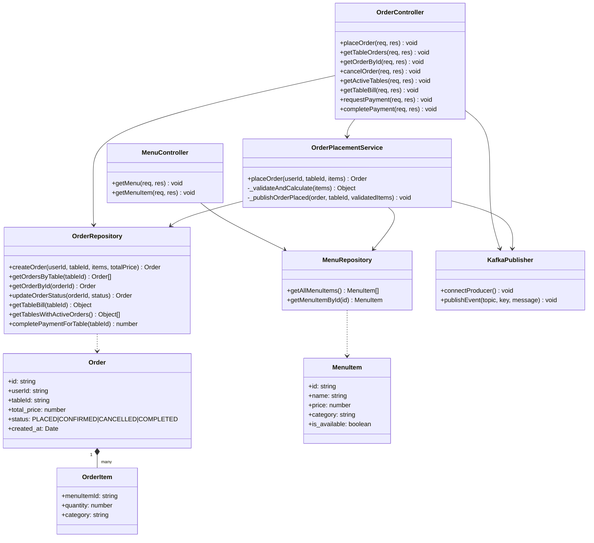

**OrderController** — điều phối HTTP request/response cho toàn bộ API đặt món và thanh toán. `placeOrder` delegate hoàn toàn sang `OrderPlacementService`. Các endpoint thanh toán (`requestPayment`, `completePayment`) gọi trực tiếp `KafkaPublisher` để publish event `payment-requests` và `payment-completed`.

**OrderPlacementService** — class nghiệp vụ trung tâm cho luồng đặt món. `_validateAndCalculate` kiểm tra từng item qua `MenuRepository` (throws 400 nếu không available), tính `totalPrice`. `_publishOrderPlaced` cấu trúc event với `orderId`, `tableId`, `items`, `total_price`, `timestamp` rồi publish lên topic `orders`.

**OrderRepository** — cô lập hoàn toàn SQL khỏi business logic. `createOrder` dùng transaction (BEGIN/COMMIT/ROLLBACK) để đảm bảo tính nhất quán khi insert `orders` + `order_items`. `getTableBill` thực hiện JOIN phức tạp với JSON aggregation, lọc bỏ đơn CANCELLED/COMPLETED, trả về danh sách orders và `grandTotal`.

**KafkaPublisher** — adapter bọc `kafkajs` producer. Tất cả event trong service đều đi qua `publishEvent(topic, key, message)` — khi đổi broker hay serialization format, chỉ cần sửa tại đây.

---

### 5.2 Kitchen Service

Kitchen Service tiêu thụ `OrderPlaced` event từ Kafka, tính điểm ưu tiên và phân phối task đến KDS Display theo thời gian thực qua WebSocket. Service có hai kênh giao tiếp độc lập: REST (query/update task) và WebSocket (push real-time).

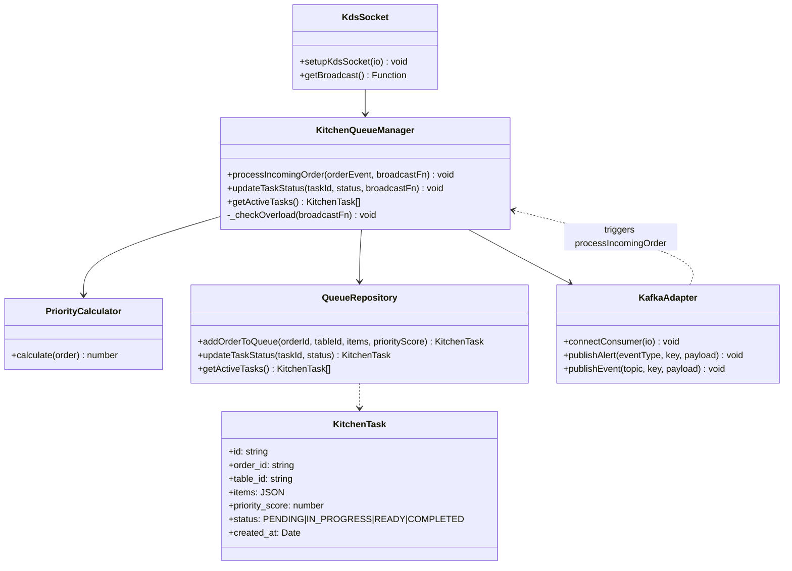

**KitchenQueueManager** — service điều phối trung tâm. `processIncomingOrder` gọi `PriorityCalculator.calculate`, lưu task vào `QueueRepository`, broadcast `new_kitchen_task` qua WebSocket, kiểm tra overload. `updateTaskStatus` cập nhật DB, broadcast `task_status_updated`; khi status là `COMPLETED` thì publish `kitchen_completed` event lên Kafka với `taskId`, `orderId`, `createdAt`, `completedAt`. `_checkOverload` đếm active task — nếu ≥ 10 thì broadcast `kitchen_overload` và publish alert lên topic `alerts`.

**PriorityCalculator** — pure service (không có side effect, không inject dependency). Công thức tính score gồm 4 thành phần:
- `complexityScore` (30%): `min((mainDishCount × 2 + totalItems) / 2, 3)` — capped tại 3
- `waitScore` (40%): `min(ageMinutes / 2, 4)` — capped tại 4
- `vipScore` (20%): 2 nếu `order.isVip`, 0 nếu không
- `loadScore` (10%): base value 1
- Kết quả `= min(sum × 10 / 10, 10)` — thang điểm 0–10

**KdsSocket** — quản lý Socket.io connection. `setupKdsSocket(io)` đăng ký listener `update_task_status` (nhận từ KDS client) và gọi `KitchenQueueManager.updateTaskStatus`. `getBroadcast()` trả về reference đến hàm broadcast hiện tại — cho phép các module khác (KitchenQueueManager, kitchenRoutes) push event mà không phụ thuộc trực tiếp vào Socket.io instance.

**KafkaAdapter** (kafka config) — đóng gói Kafka consumer + producer. `connectConsumer(io)` subscribe topic `orders`, parse message và gọi `KitchenQueueManager.processIncomingOrder`. `publishAlert` gửi lên topic `alerts`, `publishEvent` gửi lên topic bất kỳ.

---

### 5.3 Inventory Service

Inventory Service tiêu thụ telemetry từ cảm biến IoT (thông qua Kafka topic `sensor.telemetry`), lưu vào InfluxDB và publish alert nếu vượt ngưỡng. Service không expose API đặt hàng — chỉ cung cấp REST để query lịch sử và trạng thái cảm biến.

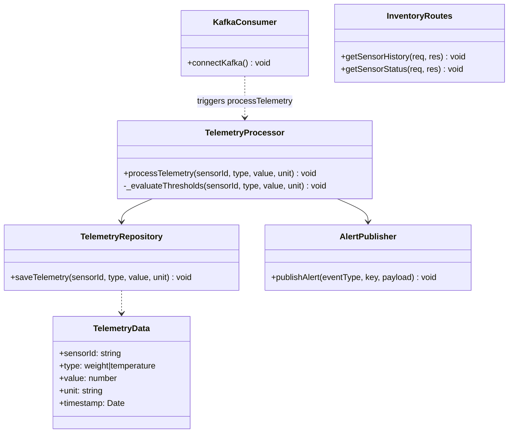

**TelemetryProcessor** — service xử lý telemetry nhận từ Kafka. `processTelemetry` gọi `TelemetryRepository.saveTelemetry` trước, rồi gọi `_evaluateThresholds`. Logic ngưỡng: nếu `type === 'weight' && value < 10 && unit === 'kg'` → publish `InventoryLow`; nếu `type === 'temperature' && value > 6 && unit === 'C'` → publish `TemperatureAlert`. Không biết cảm biến là loại gì hay dữ liệu đến từ đâu — chỉ xử lý theo `type` và `unit`.

**TelemetryRepository** — adapter cho InfluxDB. `saveTelemetry` gọi `writeTelemetry` từ InfluxDB config — cô lập hoàn toàn chi tiết time-series DB khỏi business logic. Khi đổi InfluxDB sang TimescaleDB, chỉ cần sửa tại repository này.

**AlertPublisher** — adapter Kafka producer. `publishAlert` đóng gói payload thành `{type: eventType, data: payload}` và gửi lên topic `alerts`. Các consumer (Notification Service, Analytics Service) nhận và xử lý theo vai trò riêng.

**KafkaConsumer** (kafka config) — subscribe topic `sensor.telemetry`, parse payload và gọi `TelemetryProcessor.processTelemetry(sensorId, type, value, unit)`. Đây là điểm tích hợp giữa MQTT broker (Mosquitto) và hệ thống xử lý: IoT sensors → MQTT → Mosquitto → HTTP bridge → Kafka → Inventory Service.

---

### 5.4 Analytics Service

Analytics Service hoạt động hoàn toàn event-reactive: không có API tạo metrics, chỉ consume Kafka events và cập nhật state. Service cung cấp hai output: WebSocket broadcast real-time đến Manager Dashboard và REST API báo cáo/dự báo.

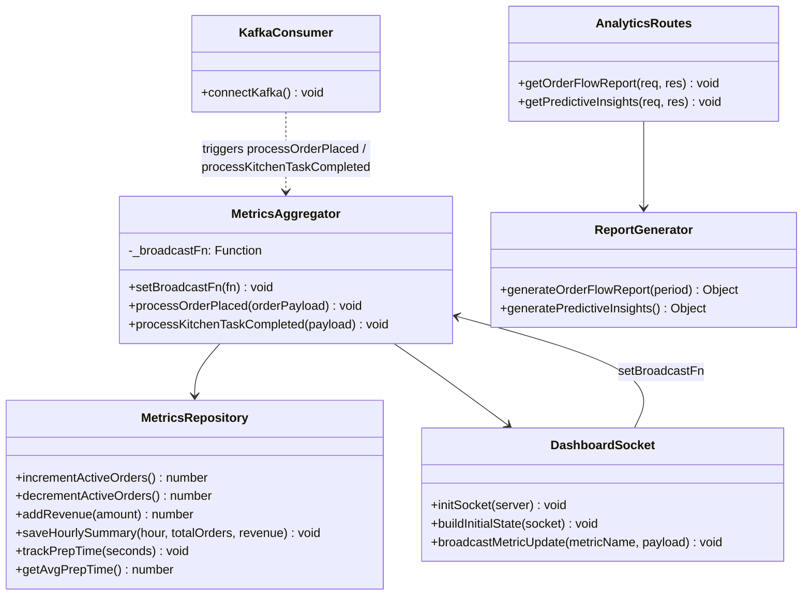

**MetricsAggregator** — reactive service trung tâm. `processOrderPlaced` tăng active orders, cộng doanh thu vào Redis, broadcast `active_orders` và `daily_revenue`, lưu hourly summary vào PostgreSQL. `processKitchenTaskCompleted` tính prep time từ `createdAt`/`completedAt` (giây), gọi `trackPrepTime`, broadcast `avg_prep_time`, giảm active orders. `_broadcastFn` được inject từ `DashboardSocket` khi khởi động — tách biệt business logic khỏi infrastructure WebSocket.

**MetricsRepository** — dùng hai store với mục đích khác nhau: **Redis** cho counter real-time (`INCR`/`DECR`/`INCRBY` trên keys `metric:active_orders`, `metric:daily_revenue`; `LPUSH` + trim cho `metric:prep_times` list giữ 100 entry gần nhất); **PostgreSQL** cho `analytics_summary` theo giờ (upsert theo `hour_bucket`). Phân tách này cho phép dashboard cực nhanh (Redis < 1ms) đồng thời vẫn có lịch sử bền vững.

**DashboardSocket** — quản lý Socket.io server cho dashboard. `initSocket` khởi tạo server, inject `broadcastMetricUpdate` vào `MetricsAggregator` (đảo ngược dependency — socket inject vào aggregator, không phải ngược lại). `buildInitialState` đọc Redis và tính avg prep time, emit `initial_state` khi client connect lần đầu. `broadcastMetricUpdate` emit `metric_update` event đến tất cả client.

**ReportGenerator** — query phức tạp trực tiếp vào PostgreSQL. `generateOrderFlowReport(period)` trả về: `totalOrders`, `totalRevenue`, `averageOrderValue`, `peakHours` (top 3 giờ theo số order), `popularDishes` (top 5 theo số lượng bán). `generatePredictiveInsights()` phân tích 30 ngày lịch sử theo `day_of_week` và `hour`, trả về `busyPeriodForecast` (với `loadLevel`, `suggestedStaff`) và `menuRecommendations` (`toPromote`, `toConsiderRemoving`).

---

### 5.5 Auth Service

Auth Service là cross-cutting concern: cung cấp JWT authentication cho toàn hệ thống. Token được verify tại API Gateway và tại `AuthMiddleware` của từng service — không có request round-trip về Auth Service mỗi lần xác thực.

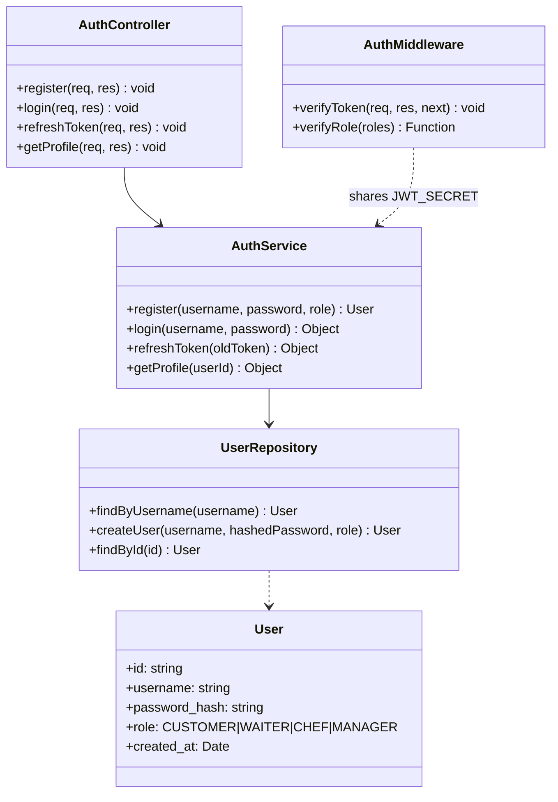

**AuthService** — xử lý toàn bộ nghiệp vụ authentication. `register` kiểm tra username unique trước (throws 400 nếu đã tồn tại), hash password với bcrypt (salt 10), default role là `CUSTOMER`. `login` query user theo username, so sánh password với `bcrypt.compare`, tạo JWT với payload `{id, username, role}`, expiration 1 ngày. `refreshToken` verify token cũ rồi tạo token mới với cùng payload — không cần truy cập DB. `getProfile` query DB theo `userId`, trả về `{id, username, role}`.

**UserRepository** — truy vấn PostgreSQL cho domain User. `findByUsername` dùng trong `login` và kiểm tra unique khi `register`. `createUser` insert và trả về `{id, username, role}` (không trả về password hash). `findById` chỉ select `id, username, role` — không bao giờ expose `password_hash` qua API.

**AuthMiddleware** — middleware Express tái sử dụng across all services. `verifyToken` extract Bearer token từ header, verify JWT bằng `JWT_SECRET` chia sẻ, gắn `req.user = {id, username, role}` và gọi `next()`. `verifyRole(roles)` là factory trả về middleware kiểm tra `req.user.role` trong array — cho phép route-level authorization như `verifyRole(['WAITER', 'MANAGER'])`.

---

## 6. Design Principles

Trong quá trình thiết kế IRMS, nhóm áp dụng hai lớp nguyên lý: **(1) nguyên lý kiến trúc phân tán** ở cấp hệ thống — quyết định cách các service tương tác; và **(2) nguyên lý SOLID** ở cấp class/module — đảm bảo mã nguồn dễ hiểu, dễ bảo trì, dễ mở rộng và dễ kiểm thử.

---

### 6.1 Nguyên lý kiến trúc phân tán

Kiến trúc microservices event-driven của IRMS được dẫn dắt bởi 5 nguyên lý phân tán cốt lõi:

| Nguyên lý | Định nghĩa | Áp dụng trong IRMS | NFR phục vụ |
|-----------|-----------|---------------------|-------------|
| **Loose Coupling & High Cohesion** | Giảm phụ thuộc trực tiếp giữa service; gom logic liên quan vào cùng domain boundary | Ordering Service chỉ publish `OrderPlaced` — không biết ai đang consume. Giao tiếp hoàn toàn qua Kafka event bus | Scalability, Maintainability |
| **Design for Failure** | Lỗi là tất yếu trong hệ thống phân tán; thiết kế cơ chế phục hồi tự động | Docker `restart: on-failure`; IoT Gateway buffer + retry khi mất mạng; Dead Letter Queue cho event thất bại | Fault Tolerance, Reliability |
| **Stateless Services** | Service không lưu client state trong memory; mọi state nằm trên request (JWT) hoặc external store (Redis) | Container restart không mất session — JWT mang đủ context; Redis giữ counter real-time cho Analytics | Scalability, Availability |
| **Eventual Consistency** | Chọn AP theo CAP theorem — ưu tiên Availability + Partition Tolerance, chấp nhận dữ liệu nhất quán cuối cùng | Analytics dashboard cập nhật sau 1–2s so với order thực tế; chấp nhận trade-off để đảm bảo ordering service không block | Reliability, Fault Tolerance |
| **Defense in Depth** | Bảo mật đa tầng — mỗi tầng kiểm soát độc lập | Layer 1: TLS tại NGINX; Layer 2: JWT tại API Gateway; Layer 3: MQTT/TLS cho IoT; Layer 4: RBAC (`verifyRole`) trong application | Security |

---

### 6.2 Nguyên lý SOLID

SOLID là bộ 5 nguyên lý thiết kế hướng đối tượng do **Robert C. Martin** tổng hợp. Trong IRMS, nhóm áp dụng SOLID một cách có hệ thống để đảm bảo cấu trúc Controller → Service → Repository của từng service luôn rõ ràng về trách nhiệm và dễ thay đổi độc lập. Phần dưới đây trình bày từng nguyên lý với ví dụ cụ thể từ codebase.

---

#### 6.2.1 Single Responsibility Principle (SRP)

**Định nghĩa**: Mỗi class chỉ nên có một lý do để thay đổi — tức là chỉ chịu trách nhiệm cho một mối quan tâm duy nhất.

**Cách áp dụng trong IRMS**: Nhóm tách biệt hoàn toàn ba tầng trách nhiệm trong mỗi service. Nếu một class có xu hướng "phình to" hoặc chứa nhiều logic hỗn tạp (HTTP handling + SQL + event publishing), nhóm tách thành các class chuyên biệt.

**Ví dụ — Ordering Service**:
- `OrderController` — chỉ xử lý HTTP request/response: đọc `req.body`, gọi service/repository, trả về `res.json()`. Không chứa SQL hay Kafka logic.
- `OrderPlacementService` — chỉ orchestrate luồng đặt món: gọi `_validateAndCalculate`, gọi `orderRepository.createOrder`, gọi `_publishOrderPlaced`. Không viết SQL, không biết HTTP.
- `OrderRepository` — chỉ chứa SQL queries: `createOrder` dùng transaction, `getTableBill` dùng JOIN phức tạp. Không biết Kafka hay HTTP.
- `KafkaPublisher` — chỉ đóng gói giao tiếp với Kafka broker. Không biết domain logic.

Nhờ phân tách như vậy, khi PostgreSQL schema thay đổi, chỉ cần sửa `orderRepository.js`. Khi Kafka topic đổi tên, chỉ cần sửa `_publishOrderPlaced`. `OrderPlacementService` không cần đụng vào.

**Lợi ích**:
- Mỗi file < 100 LOC — dễ đọc, dễ review.
- Test từng lớp độc lập mà không cần mock toàn bộ hệ thống.
- Sửa lỗi tại đúng nơi xảy ra, không ảnh hưởng các tầng khác.

---

#### 6.2.2 Open/Closed Principle (OCP)

**Định nghĩa**: Module nên mở để mở rộng nhưng đóng để sửa đổi. Khi thêm tính năng mới, không được sửa code cũ — phải viết thêm code mới.

**Cách áp dụng trong IRMS**: Nhóm mô tả các hành vi quan trọng bằng abstraction (base class hoặc interface pattern trong JavaScript). Khi thêm chức năng, chỉ cần thêm class mới implement abstraction đó.

**Ví dụ — Notification Service**:

`INotificationChannel` là base class mô tả contract gửi thông báo. `SmsChannel` và `PushChannel` extend và implement riêng. `NotificationDispatcher` không bao giờ phải sửa khi thêm kênh:

```
INotificationChannel (base)
    ├── SmsChannel     → Twilio SDK
    ├── PushChannel    → Firebase FCM
    └── TelegramChannel (tương lai) → Telegram Bot API
```

`NotificationDispatcher` nhận mảng `channels[]` qua constructor — iterate và gọi `channel.send()`. Thêm `TelegramChannel` = thêm 1 file mới, không sửa `NotificationDispatcher`.

**Ví dụ — Kafka event-driven**: Analytics Service subscribe topic `orders` và `kitchen_completed`. Khi thêm Reporting Service subscribe cùng topic, không cần sửa Ordering hay Kitchen Service — chỉ thêm consumer group mới.

**Lợi ích**:
- Thêm kênh notification hoặc Kafka consumer < 1 ngày, 0 regression trên code cũ.
- Giảm nguy cơ introduce bug khi mở rộng tính năng.

---

#### 6.2.3 Liskov Substitution Principle (LSP)

**Định nghĩa**: Object của lớp con phải có thể thay thế object của lớp cha mà không làm hệ thống bị lỗi. Lớp con không được thắt chặt precondition hay nới lỏng postcondition so với lớp cha.

**Cách áp dụng trong IRMS**: Repository pattern đảm bảo các implementation cụ thể (PostgreSQL, InMemory) đều có thể swap mà không ảnh hưởng business logic bên trên.

**Ví dụ — Repository swap trong testing**:
`OrderRepository` (PostgreSQL) và `InMemoryOrderRepository` (test) đều expose cùng contract: `createOrder`, `getOrdersByTable`, `getOrderById`, `updateOrderStatus`. Business logic trong `OrderPlacementService` không phân biệt đang làm việc với implementation nào — LSP đảm bảo swap an toàn.

**Ví dụ — Express middleware chain**:
`verifyToken` và `verifyRole(roles)` đều tuân thủ cùng signature `(req, res, next)` — đây chính là contract của Express middleware. Cả hai có thể compose tùy ý trong chuỗi route mà không phá vỡ hành vi:

```javascript
router.get('/tasks', verifyToken, verifyRole(['CHEF', 'MANAGER']), getActiveTasks);
```

**Lợi ích**:
- Unit test chạy với `InMemoryRepository` — không cần DB thật, < 5ms/test.
- Tính nhất quán khi mở rộng: implementation mới phải tuân thủ contract, không thể "phá luật".

---

#### 6.2.4 Interface Segregation Principle (ISP)

**Định nghĩa**: Client không nên bị ép phụ thuộc vào interface mà nó không sử dụng. Thay vì tạo một interface "to đùng" chứa nhiều phương thức, nên chia nhỏ thành nhiều interface chuyên biệt.

**Cách áp dụng trong IRMS**: Nhóm chia interface IoT sensor theo khả năng thực tế của từng loại thiết bị. Không phải mọi sensor đều có heartbeat — không nên ép tất cả implement `isOnline()`.

**Ví dụ — IoT Gateway Sensor Interfaces**:

```
IReadableSensor          IHealthCheckable
├── readData()           ├── isOnline()
├── getId()              └── getLastHeartbeat()
└── getType()

TemperatureSensor → implements IReadableSensor + IHealthCheckable (có heartbeat)
BasicLoadCell     → implements IReadableSensor ONLY (không có heartbeat)
```

`SensorPoller` chỉ cần `IReadableSensor[]` — có thể poll tất cả sensor. `HealthMonitor` chỉ cần `IHealthCheckable[]` — chỉ monitor sensor có heartbeat. `BasicLoadCell` không bị ép implement `isOnline()` chỉ vì `HealthMonitor` cần nó.

Nếu dùng fat interface `ISensor` gộp tất cả, `BasicLoadCell` buộc phải implement `isOnline()` với body rỗng hoặc `throw Error` — vi phạm LSP và gây confusion.

**Lợi ích**:
- Thêm `CO2Sensor` (chỉ cần `IReadableSensor`) không ảnh hưởng `HealthMonitor` hay `SensorPoller`.
- Interface nhỏ → abstraction rõ ràng → dễ inject (kết nối tự nhiên với DIP).

---

#### 6.2.5 Dependency Inversion Principle (DIP)

**Định nghĩa**: Module cấp cao không nên phụ thuộc trực tiếp vào module cấp thấp. Cả hai nên phụ thuộc vào abstraction. Abstraction không nên phụ thuộc vào chi tiết — chi tiết mới phụ thuộc vào abstraction.

**Cách áp dụng trong IRMS**: Các service cấp cao (`TelemetryProcessor`, `MetricsAggregator`) không hardcode implementation cụ thể của dependency. Dependency được inject từ bên ngoài thông qua module system hoặc function injection.

**Ví dụ — TelemetryProcessor (Inventory Service)**:
`TelemetryProcessor` nhận `TelemetryRepository` và `AlertPublisher` qua `require` — phụ thuộc vào module interface, không phải InfluxDB client hay Kafka producer trực tiếp. Khi đổi InfluxDB sang TimescaleDB, chỉ cần thay `TelemetryRepository` — `TelemetryProcessor` không đụng vào.

**Ví dụ — MetricsAggregator (Analytics Service)**:
`MetricsAggregator` không tạo Socket.io connection trực tiếp. `DashboardSocket.initSocket()` inject `broadcastMetricUpdate` vào `MetricsAggregator` qua `setBroadcastFn(fn)`. Đây là đảo ngược dependency: infrastructure (Socket.io) inject vào business logic, không phải business logic phụ thuộc vào Socket.io.

```
DashboardSocket.initSocket()
    → MetricsAggregator.setBroadcastFn(broadcastMetricUpdate)
    → MetricsAggregator dùng _broadcastFn(name, payload) khi có event
```

**Lợi ích**:
- Test `MetricsAggregator` bằng cách inject mock `broadcastFn` — không cần Socket.io server thật.
- Test `TelemetryProcessor` bằng `InMemoryTelemetryRepository` — không cần InfluxDB.
- Đổi database hay message broker mà không sửa business logic.

---

#### Kết luận

Nhờ áp dụng đầy đủ 5 nguyên lý SOLID, hệ thống IRMS đạt được:

| Nguyên lý | File thực tế | Kết quả đo lường được |
|-----------|-------------|----------------------|
| **SRP** | `OrderPlacementService.js` · `OrderRepository.js` | Mỗi file < 100 LOC; thay đổi schema DB không ảnh hưởng service layer |
| **OCP** | `SmsChannel.js` · `PushChannel.js` · Kafka consumer groups | Thêm kênh/consumer < 1 ngày, 0 regression trên code cũ |
| **LSP** | `authMiddleware.js` · Repository pattern | Unit test với InMemory mock chạy < 5ms, không cần DB thật |
| **ISP** | `IReadableSensor` · `IHealthCheckable` | Thêm loại sensor mới không sửa interface hay consumer hiện có |
| **DIP** | `TelemetryProcessor.js` · `MetricsAggregator.js` | Test coverage không cần infra thật (InfluxDB, Socket.io, Kafka) |

Mục tiêu cuối cùng: hệ thống không chỉ **chạy được** mà phải **chạy đúng, dễ thay đổi và bền vững** khi yêu cầu nghiệp vụ phát triển theo thời gian.

---

## 7. Phát Triển Trong Tương Lai

Dựa trên nền tảng kiến trúc Microservices + Event-Driven đã xây dựng và kết quả prototype hiện tại, nhóm đề xuất lộ trình phát triển IRMS theo bốn hướng chính. Mỗi hướng được thiết kế bám sát kiến trúc hiện có — tận dụng Kafka event bus, mô hình phân lớp và cơ chế mở rộng đã confirm ở prototype.

---

### 7.1 Nâng cao AI/ML

Hệ thống hiện tại đã có nền tảng dữ liệu đủ mạnh để tích hợp AI: `analytics_summary` lưu order flow theo giờ, `ReportGenerator.generatePredictiveInsights()` đã cung cấp phân tích rule-based theo `day_of_week` và `hour`. Bước tiếp theo là thay thế rule-based bằng mô hình ML thực sự.

**Demand Forecasting (Dự báo nhu cầu)**: Huấn luyện mô hình time-series (Prophet hoặc LSTM) trên `analytics_summary` để dự đoán lượng khách và số order theo giờ/ngày trong tuần. Kết quả phục vụ lập lịch nhân sự tự động — nhà hàng có thể biết trước cần bao nhiêu nhân viên cho ca tối thứ Sáu. `ReportGenerator.generatePredictiveInsights()` hiện trả về `suggestedStaff` dựa trên rule — ML sẽ thay thế heuristic này bằng mô hình học từ 30+ ngày dữ liệu thực tế.

**Menu Intelligence**: Phân tích correlation giữa các món được order cùng nhau (market basket analysis) để đưa ra gợi ý upsell: "Khách order Phở Bò thường gọi thêm Chả Giò". Dữ liệu đã có trong `order_items` + `menu_items`. Tích hợp trực tiếp vào Tablet UI — hiển thị "Bạn có thể thích..." khi khách thêm món vào cart.

**Smart Priority Scoring**: `PriorityCalculator` hiện dùng công thức cố định 4 thành phần. Thay thế bằng mô hình ML học từ lịch sử: những đơn nào được hoàn thành nhanh nhất? Chef ưu tiên thực tế như thế nào? Mô hình có thể học được các pattern không capture được bằng rule-based (thời tiết, ngày lễ, sự kiện thể thao).

---

### 7.2 Tiến hóa kiến trúc

Kiến trúc hiện tại (single VPS + Docker Compose) phù hợp cho một nhà hàng đơn lẻ. Khi mở rộng lên nhiều chi nhánh hoặc lượng truy cập tăng đột biến, cần nâng cấp theo lộ trình từng bước.

**Giai đoạn 1 — Container Orchestration (Docker Swarm)**: Khi cần chạy 2–3 chi nhánh từ một hạ tầng, chuyển sang Docker Swarm: thêm worker node, `docker service scale ordering-service=3`. Không cần thay đổi code — chỉ cập nhật orchestration config. Kafka, Redis, PostgreSQL chuyển sang managed services (CloudAMQP, Redis Cloud, Supabase) để tránh single point of failure ở tầng infrastructure.

**Giai đoạn 2 — Stream Processing (Kafka Streams)**: Analytics hiện tại nhận event → cập nhật Redis → push WebSocket. Latency ~2s là acceptable. Khi cần real-time < 100ms (ví dụ: cảnh báo bếp quá tải tức thời), migrate sang Kafka Streams hoặc Apache Flink để xử lý aggregation trực tiếp trên stream, không qua Redis round-trip.

**Giai đoạn 3 — Service Mesh (Istio)**: Khi số service tăng lên 10+, quản lý mTLS và circuit breaker thủ công trở nên khó kiểm soát. Istio tự động inject sidecar proxy vào mỗi pod, cung cấp: mutual TLS giữa service, retry policy tự động, canary deployment (routing 10% traffic đến version mới trước khi rollout toàn bộ), và distributed tracing tích hợp với Jaeger.

**CQRS cho Ordering**: Ordering Service có tỉ lệ đọc/ghi chênh lệch lớn — `GET /table/:tableId` được gọi nhiều hơn `POST /orders` theo tỉ lệ ~10:1. Tách Command (write) và Query (read) model: Command side vẫn ghi vào PostgreSQL; Query side sync sang read replica hoặc Elasticsearch cho full-text search menu và filter order phức tạp.

---

### 7.3 Mở rộng hệ sinh thái

**Multi-tenancy (Đa chi nhánh)**: Mở rộng IRMS thành SaaS platform phục vụ nhiều nhà hàng từ một hạ tầng. Mỗi tenant có `tenant_id` riêng, dữ liệu cô lập hoàn toàn ở tầng database. API Gateway thêm tenant routing dựa trên subdomain (`restaurant-a.irms.io`). Menu, pricing, threshold cảnh báo có thể cấu hình riêng per tenant.

**Mobile App (iOS/Android)**: Thay thế Tablet web app bằng native app (React Native hoặc Flutter) để tận dụng: push notification khi order sẵn sàng, offline mode với local queue khi mất mạng, camera để scan QR table, biometric auth cho nhân viên. Backend đã event-driven — mobile chỉ cần WebSocket consumer, không cần thay đổi server.

**Third-party Payment Integration**: Tích hợp VNPay, Momo, ZaloPay vào luồng thanh toán. `requestPayment` event đã được publish lên Kafka — Payment Service mới chỉ cần subscribe và xử lý. Khi thanh toán thành công, publish `PaymentCompleted` → Ordering Service mark đơn COMPLETED. Mô hình event-driven cho phép thêm payment gateway mới mà không sửa Ordering Service.

**Loyalty Program**: Tích hợp hệ thống tích điểm dựa trên order history. `OrderCompleted` event là trigger tự nhiên để cộng điểm. Loyalty Service subscribe Kafka, tính điểm theo rule (1 điểm = 10,000 VND), cung cấp API tra cứu và đổi voucher. Hiển thị điểm tích lũy trên Tablet UI khi checkout.

---

### 7.4 Tăng cường bảo mật

**Zero Trust Architecture**: Hiện tại các service giao tiếp trong Docker network không có encryption nội bộ. Zero Trust model yêu cầu xác thực mọi service-to-service call dù đang trong cùng mạng — mTLS cho mọi kết nối nội bộ, không tin tưởng bất kỳ service nào mặc định. Istio sidecar proxy thực hiện điều này tự động, không cần thay đổi application code.

**Device Attestation cho IoT**: Hiện tại IoT sensor chỉ cần MQTT credentials để connect. Bổ sung hardware attestation qua TPM chip: sensor phải chứng minh danh tính phần cứng trước khi gửi telemetry. Ngăn chặn tấn công giả mạo sensor (ví dụ: gửi nhiệt độ giả để trigger false alert). Đặc biệt quan trọng khi sensor đặt ở kho lạnh — vị trí vật lý dễ bị tiếp cận.

**Audit Logging & Compliance**: Ghi lại toàn bộ thao tác nhạy cảm: ai tạo/hủy order, ai thay đổi menu giá, ai truy cập analytics. Lưu vào append-only log store (không thể modify) — phục vụ audit nội bộ và compliance. Kết hợp với Kafka event sourcing: mọi state change đều có event log tương ứng, có thể replay để reconstruct lịch sử.

---

### 7.5 Lộ trình ưu tiên

| Giai đoạn | Timeline | Nội dung | Điều kiện tiên quyết |
|-----------|----------|----------|----------------------|
| **Phase 1** | 1–3 tháng | Multi-tenancy · Mobile App · VNPay integration | Docker Swarm setup; managed DB/Kafka |
| **Phase 2** | 3–6 tháng | Demand Forecasting ML · Smart Priority · Loyalty Program | 3+ tháng order data; ML pipeline (Python + Airflow) |
| **Phase 3** | 6–12 tháng | Kafka Streams · CQRS · Zero Trust mTLS | Traffic tăng đủ để justify complexity; Kubernetes migration |
| **Phase 4** | 12+ tháng | AI Tutor · Device Attestation · Full Audit Compliance | Phase 3 stable; security team dedicated |

---

## 8. Triển Khai Code

### 8.1 Công nghệ sử dụng

#### 1. Node.js 20 (CommonJS)

Node.js là môi trường runtime JavaScript phía server, xây dựng trên V8 engine của Chrome. Điểm mạnh cốt lõi của Node.js là mô hình non-blocking I/O dựa trên event loop — tất cả các thao tác I/O (đọc DB, gọi HTTP, publish Kafka) đều bất đồng bộ, cho phép một process đơn xử lý hàng nghìn kết nối đồng thời mà không tốn tài nguyên thread như Java hay Go.

Trong IRMS, mô hình này đặc biệt phù hợp vì hệ thống có kiến trúc event-driven: mỗi service liên tục lắng nghe sự kiện từ Kafka hoặc MQTT, xử lý rồi phát sự kiện tiếp theo. Node.js xử lý lượng lớn I/O đồng thời (sensor telemetry, WebSocket push, Kafka consume) mà không bị bottleneck tại tầng runtime. Phiên bản 20 LTS được chọn để đảm bảo ổn định dài hạn.

#### 2. Express.js

Express.js là web framework tối giản cho Node.js, cung cấp routing, middleware pipeline và HTTP abstraction với codebase rất nhỏ gọn. Không giống các framework opinionated như NestJS hay AdonisJS, Express không áp đặt cấu trúc thư mục hay lifecycle phức tạp, phù hợp với hướng tiếp cận "just enough" của đồ án này.

Mỗi microservice trong IRMS dùng Express làm HTTP layer: định nghĩa routes, gắn middleware xác thực JWT (`verifyToken`, `verifyRole`), xử lý lỗi tập trung qua error-handling middleware. Sự đơn giản của Express giúp tách bạch rõ ràng giữa HTTP concerns (tầng Presentation/Facade) và logic nghiệp vụ (tầng Business), phù hợp với nguyên lý SRP.

#### 3. Apache Kafka

Apache Kafka là nền tảng distributed event streaming, hoạt động theo mô hình pub-sub bền vững: producer ghi message vào topic, consumer đọc theo offset riêng và có thể replay lại history. Kafka đảm bảo thứ tự message trong cùng partition và lưu trữ event trong cấu hình retention period.

IRMS sử dụng Kafka như "xương sống" của kiến trúc event-driven với các topic chính: `orders` (ordering → kitchen), `kitchen_completed` (kitchen → analytics), `alerts` (inventory → notification), `sensor.telemetry` (IoT gateway → inventory), `payment-requests` / `payment-completed`. Kafka giải quyết bài toán decoupling giữa các service — ordering-service không cần biết kitchen-service đang chạy hay không khi publish sự kiện đặt món. Đây là cơ sở cho tính chịu lỗi và khả năng mở rộng của hệ thống.

#### 4. Socket.io

Socket.io là thư viện WebSocket cho Node.js, cung cấp abstraction hai chiều real-time giữa server và browser với cơ chế tự động fallback (WebSocket → HTTP long-polling) khi môi trường mạng không ổn định. Socket.io hỗ trợ room management — server có thể broadcast đến nhóm clients cụ thể mà không cần quản lý danh sách thủ công.

IRMS dùng Socket.io ở hai điểm quan trọng: (1) **kitchen-service** push cập nhật trạng thái order xuống KDS Display ngay khi Kafka consumer xử lý sự kiện đặt món — đảm bảo đầu bếp thấy order mới trong < 500ms; (2) **analytics-service** push `MetricsSnapshot` xuống Manager Dashboard mỗi khi có order mới hoặc hoàn thành. Cả hai đều không cần client poll — server chủ động đẩy dữ liệu.

#### 5. PostgreSQL 15

PostgreSQL là hệ quản trị cơ sở dữ liệu quan hệ mã nguồn mở, nổi bật với tuân thủ ACID đầy đủ, hỗ trợ transaction phức tạp và rich query language. PostgreSQL xử lý tốt các bài toán có dữ liệu có cấu trúc, ràng buộc toàn vẹn và JOIN phức tạp.

Ba service trong IRMS dùng PostgreSQL với database riêng biệt (Database-per-Service): `ordering_db` lưu bảng `orders`, `order_items`, `menu_items`, `tables`; `kitchen_db` lưu `kitchen_tasks`; `auth_db` lưu `users`. Việc dùng PostgreSQL cho ordering đặc biệt quan trọng vì nghiệp vụ thanh toán yêu cầu ACID — `getTableBill` thực hiện JOIN phức tạp qua nhiều bảng và `completePaymentForTable` cần transaction để cập nhật trạng thái nhất quán.

#### 6. InfluxDB

InfluxDB là cơ sở dữ liệu time-series được tối ưu đặc biệt để lưu trữ và truy vấn dữ liệu theo chuỗi thời gian. Khác với database quan hệ, InfluxDB dùng measurement/tag/field model, tối ưu cho write throughput cao và aggregation theo time window (MEAN, MAX, MIN trong khoảng thời gian).

Inventory-service dùng InfluxDB để lưu toàn bộ telemetry từ 50-100 IoT sensor (cân trọng lượng, cảm biến nhiệt độ). Mỗi reading là một data point với timestamp, sensorId tag và value field. `TelemetryRepository.saveTelemetry()` ghi vào InfluxDB; các query lịch sử (`getSensorHistory`) sử dụng Flux query language để lấy readings theo time range — đây là bài toán mà PostgreSQL không phù hợp do volume data sensor rất lớn và không cần JOIN.

#### 7. Redis

Redis là in-memory data store, hỗ trợ các cấu trúc dữ liệu phong phú (String, Hash, List, Sorted Set) với độ trễ cực thấp (sub-millisecond). Redis thường được dùng làm cache hoặc session store.

Analytics-service dùng Redis như store chính cho real-time metrics: mỗi sự kiện Kafka được `MetricsAggregator` xử lý và cập nhật vào Redis bằng các lệnh atomic (`INCR orders_placed`, `INCR revenue`, `DECR active_orders`). Khi Dashboard kết nối WebSocket, `buildInitialState(socket)` đọc toàn bộ counters từ Redis để tạo snapshot tức thì. Redis đảm bảo Manager luôn thấy số liệu mới nhất mà không cần query lại PostgreSQL — phù hợp với yêu cầu real-time analytics.

#### 8. Mosquitto (MQTT)

Mosquitto là MQTT broker mã nguồn mở, triển khai giao thức MQTT — giao thức nhắn tin publish-subscribe thiết kế cho các thiết bị có tài nguyên hạn chế và kết nối không ổn định. MQTT dùng binary payload nhỏ gọn, hỗ trợ QoS level (at-most-once, at-least-once, exactly-once) và last-will message.

Trong IRMS, Mosquitto đóng vai trò gateway cho lớp IoT: 50-100 sensor (cân trọng lượng, cảm biến nhiệt độ) publish readings lên topic `sensor/weight/<id>` và `sensor/temperature/<id>` theo giao thức MQTT (port 1883 plain, 8883 TLS). Inventory-service subscribe các topic này thông qua `config/kafka.js` — thực chất là Kafka consumer subscribe topic `sensor.telemetry` mà một MQTT bridge đẩy vào. Script `simulate_iot.js` mô phỏng toàn bộ fleet sensor trong môi trường dev.

#### 9. Docker + Docker Compose

Docker là nền tảng container hóa, cho phép đóng gói application cùng tất cả dependencies vào một image bất biến, chạy nhất quán trên mọi môi trường. Docker Compose là công cụ định nghĩa và khởi chạy multi-container application qua một file YAML duy nhất.

IRMS triển khai toàn bộ hệ thống — 7 application service, 3 infrastructure service (Kafka+Zookeeper, Redis, Mosquitto), 2 database service (PostgreSQL, InfluxDB) — chỉ bằng một lệnh `docker-compose up --build`. Mỗi service có Dockerfile riêng, network isolation qua Docker bridge network, và volume mount cho data persistence. Approach này đảm bảo môi trường dev hoàn toàn reproducible và là bước đệm tự nhiên để scale lên Docker Swarm khi cần.

#### 10. NGINX

NGINX là high-performance web server và reverse proxy, được sử dụng rộng rãi làm API gateway, load balancer và TLS termination point. NGINX xử lý hàng nghìn concurrent connection với footprint bộ nhớ rất thấp nhờ kiến trúc event-driven tương tự Node.js.

Trong IRMS, NGINX chạy bên ngoài Docker trực tiếp trên VPS (Ubuntu 22.04), lắng nghe port 80/443 và thực hiện: TLS termination (HTTPS → HTTP nội bộ), routing request đến đúng service container (`/api/orders` → ordering-service:3001, `/api/kitchen` → kitchen-service:3002, ...), rate limiting để ngăn abuse và static file serving cho frontend React. NGINX là điểm vào duy nhất — toàn bộ service container không expose port ra ngoài internet.

#### 11. React + Vite

React là thư viện UI component-based của Meta, sử dụng Virtual DOM để render hiệu quả và hỗ trợ tư duy declarative trong xây dựng giao diện. Vite là build tool thế hệ mới, dùng ES Module native trong dev mode để đạt Hot Module Replacement (HMR) cực nhanh — thay đổi code hiển thị trên browser trong dưới 100ms.

IRMS frontend bao gồm ba giao diện khác nhau nhưng dùng chung codebase React: **Tablet Menu App** (khách đặt món, xem bill), **KDS Display** (đầu bếp xem queue theo priority, cập nhật trạng thái), và **Manager Dashboard** (giám sát real-time qua WebSocket, xem báo cáo analytics). Vite được chọn thay Webpack vì tốc độ dev server nhanh hơn đáng kể, phù hợp với tiến độ phát triển nhanh của đồ án.

---

### 8.2 Cấu trúc thư mục

#### 8.2.1 Cấu trúc tổng quát

```
IRMS/
├── api-gateway/
│   └── nginx.conf
├── services/
│   ├── auth-service/
│   ├── ordering-service/
│   ├── kitchen-service/
│   ├── inventory-service/
│   ├── analytics-service/
│   └── notification-service/
├── frontend/
├── database/
├── mosquitto/
├── simulate_iot.js
└── docker-compose.yml
```

Trong cấu trúc thư mục tổng quát trên, các thư mục và tệp có vai trò như sau:

- **`api-gateway/`** — Chứa cấu hình NGINX (`nginx.conf`). NGINX đóng vai trò reverse proxy duy nhất, định tuyến request từ client đến đúng service, xử lý TLS termination và rate limiting. Chạy trực tiếp trên VPS, ngoài Docker.

- **`services/`** — Thư mục gốc chứa toàn bộ 6 microservice. Mỗi service là một Node.js application độc lập với `package.json`, `Dockerfile` và cấu trúc thư mục `src/` riêng. Các service không import code của nhau — giao tiếp hoàn toàn qua HTTP REST hoặc Kafka event.

- **`frontend/`** — Ứng dụng React+Vite phục vụ ba giao diện người dùng: Tablet Menu App (khách đặt món), KDS Display (đầu bếp), Manager Dashboard (quản lý). Build ra static files được NGINX serve trực tiếp.

- **`database/`** — Chứa SQL migration scripts để khởi tạo schema cho các PostgreSQL database (`ordering_db`, `kitchen_db`, `auth_db`). Chạy một lần khi bootstrap môi trường mới.

- **`mosquitto/`** — Cấu hình cho MQTT broker Mosquitto: `mosquitto.conf` (port, TLS, ACL), `passwd` file cho authentication của IoT sensor. Mosquitto chạy như một container trong Docker Compose.

- **`simulate_iot.js`** — Script Node.js mô phỏng toàn bộ fleet IoT sensor (cân trọng lượng + cảm biến nhiệt độ). Publish readings MQTT theo interval cấu hình được, dùng trong môi trường dev/demo thay cho hardware thật.

- **`docker-compose.yml`** — File định nghĩa toàn bộ hệ thống: 7 application container, 3 infrastructure container (Kafka + Zookeeper, Redis, Mosquitto), 2 database container (PostgreSQL, InfluxDB). Một lệnh `docker-compose up --build` khởi chạy toàn bộ môi trường.

#### 8.2.2 Cấu trúc từng service

Tất cả microservice đều tuân theo cùng một template cấu trúc thư mục theo Layered Architecture. Nhóm lấy **`ordering-service`** làm ví dụ tiêu biểu vì đây là service đầy đủ nhất với cả REST API, Kafka, và database:

```
ordering-service/
├── src/
│   ├── controllers/
│   │   ├── menuController.js
│   │   └── orderController.js
│   ├── services/
│   │   └── OrderPlacementService.js
│   ├── repositories/
│   │   ├── menuRepository.js
│   │   └── orderRepository.js
│   ├── routes/
│   │   ├── menuRoutes.js
│   │   └── orderRoutes.js
│   ├── config/
│   │   ├── db.js
│   │   └── kafka.js
│   └── index.js
├── Dockerfile
└── package.json
```

- **`controllers/`** — Tầng Presentation (Facade). Nhận HTTP request từ Express route, validate input cơ bản, gọi Service layer để xử lý nghiệp vụ và trả response. `orderController.js` export các handler: `placeOrder`, `getActiveTables`, `getTableBill`, `requestPayment`, `completePayment`. Controller không chứa SQL hay Kafka logic — chỉ orchestrate luồng.

- **`services/`** — Tầng Business. Chứa logic nghiệp vụ phức tạp: `OrderPlacementService` validate items, tính `totalPrice`, lưu order qua repository và publish Kafka event. Service không biết HTTP context (không dùng `req`/`res`) và không viết SQL trực tiếp — tuân thủ SRP và DIP.

- **`repositories/`** — Tầng Persistence. Toàn bộ SQL query được đóng gói tại đây. `orderRepository.js` thực hiện các truy vấn phức tạp như `getTableBill` (JOIN `orders`, `order_items`, `menu_items`) và `completePaymentForTable` (UPDATE với điều kiện trạng thái). Repository là abstraction duy nhất mà Service layer được phép gọi để truy cập DB.

- **`routes/`** — Định nghĩa Express router, ánh xạ HTTP method + path đến handler tương ứng trong controller, và gắn middleware xác thực. Ví dụ: `POST /orders` → `verifyToken` → `orderController.placeOrder`. Route file không chứa business logic.

- **`config/`** — Cấu hình kết nối hạ tầng. `db.js` khởi tạo PostgreSQL connection pool (dùng `pg` library). `kafka.js` khởi tạo Kafka producer và export hàm `publishEvent(topic, key, payload)` — được dùng bởi `OrderPlacementService` để publish lên topic `orders`.

- **`index.js`** — Entry point của service: khởi tạo Express app, gắn middleware toàn cục (CORS, JSON body parser, auth), mount các router, kết nối DB và bắt đầu HTTP server. Đây là điểm khởi chạy duy nhất, tương đương `main()` trong các ngôn ngữ khác.

Các service khác áp dụng cùng template với sự điều chỉnh theo đặc thù nghiệp vụ:

| Service | Khác biệt đáng chú ý |
|---------|----------------------|
| **auth-service** | `middlewares/authMiddleware.js` export `verifyToken`, `verifyRole` — được các service khác copy để xác thực JWT locally mà không cần gọi HTTP |
| **kitchen-service** | `config/kafka.js` đóng vai trò KafkaAdapter: vừa `connectConsumer(io)` để nhận order, vừa `publishAlert`, `publishEvent`; `services/KitchenQueueManager.js` chứa priority queue và `PriorityCalculator` |
| **inventory-service** | `services/TelemetryProcessor.js` + `AlertPublisher.js` tách riêng (SRP); `config/influxdb.js` + `config/kafka.js` là hai infrastructure adapter độc lập |
| **analytics-service** | Thêm `socket/dashboardSocket.js` cho WebSocket push; `services/MetricsAggregator.js` nhận `broadcastFn` qua DIP injection; `repositories/MetricsRepository.js` dual-write Redis + PostgreSQL |
| **notification-service** | `channels/` chứa `SmsChannel.js`, `PushChannel.js` — áp dụng OCP: thêm kênh mới = thêm file mới, không sửa `NotificationDispatcher` |

### 8.3 Áp dụng SOLID trong code

#### SRP — `OrderPlacementService` (ordering-service)

Mỗi class có đúng 1 trách nhiệm. `OrderPlacementService` chỉ orchestrate flow đặt món — không validate format, không viết SQL, không gửi Kafka trực tiếp.

```javascript
// services/ordering-service/src/services/OrderPlacementService.js
class OrderPlacementService {
  async placeOrder(userId, tableId, items) {
    // 1. Validate và tính tổng tiền (delegate xuống repository)
    const { totalPrice, validatedItems } = await this._validateAndCalculate(items);

    // 2. Lưu order vào DB (delegate xuống repository)
    const order = await orderRepository.createOrder(userId, tableId, items, totalPrice);

    // 3. Publish event (delegate xuống kafka)
    await this._publishOrderPlaced(order, tableId, validatedItems);

    return order;
  }

  async _validateAndCalculate(items) {
    let totalPrice = 0;
    const validatedItems = [];
    for (const item of items) {
      const menuItem = await menuRepository.getMenuItemById(item.menuItemId);
      if (!menuItem || !menuItem.is_available) {
        const error = new Error(`Menu item ${item.menuItemId} is not available`);
        error.statusCode = 400;
        throw error;
      }
      totalPrice += Number(menuItem.price) * item.quantity;
      validatedItems.push({ ...item, category: menuItem.category });
    }
    return { totalPrice, validatedItems };
  }

  async _publishOrderPlaced(order, tableId, validatedItems) {
    const orderEvent = {
      orderId: order.id,
      tableId,
      items: validatedItems,
      total_price: order.total_price,
      timestamp: new Date().toISOString()
    };
    await publishEvent('orders', `order-${order.id}`, orderEvent);
  }
}
```

> **Kết quả SRP**: `menuRepository` đổi SQL schema → chỉ sửa `menuRepository.js`. Kafka topic đổi → chỉ sửa `_publishOrderPlaced`. `OrderPlacementService` không cần đụng vào.

---

#### OCP — Notification Channels (notification-service)

Thêm kênh thông báo mới (Telegram, Email) không cần sửa `NotificationDispatcher`:

```javascript
// Abstraction — đóng để sửa
class INotificationChannel {
  async send(recipient, payload) {
    throw new Error('send() must be implemented');
  }
}

// Mở để mở rộng — thêm kênh mới = thêm class mới
class SmsChannel extends INotificationChannel {
  async send(phone, payload) {
    // Twilio SDK (mock hiện tại)
    console.log(`[SmsChannel] Sending SMS to ${phone}:`, payload);
  }
}

class PushChannel extends INotificationChannel {
  async send(deviceToken, payload) {
    // Firebase FCM
    console.log(`[PushChannel] Sending push to ${deviceToken}:`, payload);
  }
}

// Dispatcher không bao giờ phải sửa khi thêm kênh mới
class NotificationDispatcher {
  constructor(channels) {
    this.channels = channels; // [SmsChannel, PushChannel, ...]
  }
  async dispatch(recipients, payload) {
    for (const channel of this.channels) {
      await channel.send(recipients[channel.type], payload);
    }
  }
}
```

---

#### DIP — `TelemetryProcessor` (inventory-service)

`TelemetryProcessor` phụ thuộc vào abstraction, không hardcode implementation:

```javascript
// services/inventory-service/src/services/TelemetryProcessor.js
const TelemetryRepository = require('../repositories/TelemetryRepository'); // abstraction
const AlertPublisher = require('./AlertPublisher');                          // abstraction

class TelemetryProcessor {
  async processTelemetry(sensorId, type, value, unit) {
    // 1. Persist — không biết dùng InfluxDB hay Postgres
    await TelemetryRepository.saveTelemetry(sensorId, type, value, unit);

    // 2. Evaluate thresholds — không biết alert đi đâu
    await this._evaluateThresholds(sensorId, type, value, unit);
  }

  async _evaluateThresholds(sensorId, type, value, unit) {
    if (type === 'weight' && value < 10 && unit === 'kg') {
      await AlertPublisher.publishAlert('InventoryLow',
        `alert-low-stock-${sensorId}`,
        { ingredientId: sensorId, level: value, unit, timestamp: new Date().toISOString() }
      );
    }
    if (type === 'temperature' && value > 6 && unit === 'C') {
      await AlertPublisher.publishAlert('TemperatureAlert',
        `alert-temp-${sensorId}`,
        { sensorId, temp: value, location: 'Walk-in Cooler', timestamp: new Date().toISOString() }
      );
    }
  }
}
```

> **Kết quả DIP**: Thay InfluxDB bằng TimescaleDB → chỉ đổi `TelemetryRepository`. `TelemetryProcessor` không cần chạm vào.

---

#### LSP — `AuthMiddleware` (tái sử dụng an toàn)

`verifyToken` và `verifyRole` được dùng thay thế nhau trong Express middleware chain mà không phá vỡ hành vi:

```javascript
// services/auth-service/src/middlewares/authMiddleware.js
const verifyToken = (req, res, next) => {
  const authHeader = req.headers.authorization;
  if (!authHeader) return res.status(401).json({ message: 'Not authenticated' });

  const token = authHeader.split(' ')[1];
  jwt.verify(token, process.env.JWT_SECRET, (err, user) => {
    if (err) return res.status(403).json({ message: 'Invalid token' });
    req.user = user;
    next();
  });
};

// verifyRole trả về middleware — contract giống verifyToken (req, res, next)
// → LSP: có thể thay thế trong chain: router.use(verifyToken, verifyRole(['chef']))
const verifyRole = (roles) => (req, res, next) => {
  if (!req.user || !roles.includes(req.user.role))
    return res.status(403).json({ message: 'Permission denied' });
  next();
};
```

> **Kết quả LSP**: Cả `verifyToken` và `verifyRole(roles)` đều tuân thủ contract `(req, res, next)`. Có thể compose tùy ý trong Express route mà không phá vỡ hành vi.

---

#### ISP — IoT Gateway Sensor Interfaces

`BasicLoadCell` không bị ép implement `isOnline()` — chỉ phụ thuộc `IReadableSensor`:

```javascript
// services/iot-gateway/src/sensors/
class IReadableSensor  { async readData() {}  getId() {}  getType() {} }
class IHealthCheckable { async isOnline() {}  getLastHeartbeat() {} }

// TemperatureSensor: implement cả hai interface
class TemperatureSensor extends IReadableSensor {
  async readData() { return { type: 'temperature', value: 4.2, unit: 'C' }; }
  getId()   { return this.sensorId; }
  getType() { return 'TEMPERATURE'; }
  async isOnline() { return this.lastPing > Date.now() - 60000; }
}

// BasicLoadCell: chỉ IReadableSensor — không có heartbeat, không phải implement isOnline()
class BasicLoadCell extends IReadableSensor {
  async readData() { return { type: 'weight', value: 2.3, unit: 'kg' }; }
  getId()   { return this.cellId; }
  getType() { return 'LOAD_CELL'; }
}

// Consumer phụ thuộc ĐÚNG interface cần dùng
class SensorPoller  { constructor(sensors  /* IReadableSensor[]  */) {} async pollAll() {} }
class HealthMonitor { constructor(checkables/* IHealthCheckable[]*/){} async reportOffline() {} }
```

> **Kết quả ISP**: Thêm `CO2Sensor` chỉ cần implement `IReadableSensor`. `HealthMonitor` và `SensorPoller` không cần thay đổi.

---

### 8.4 Ma trận SOLID → Thực tiễn → NFR

| Nguyên lý | File thực tế | Áp dụng | Kết quả | NFR phục vụ |
|-----------|-------------|---------|---------|-------------|
| **SRP** | `OrderPlacementService.js` · `menuRepository.js` | Controller / Service / Repository tách tầng | < 10,000 LOC/service; test độc lập từng lớp | Maintainability |
| **OCP** | `SmsChannel.js` · `PushChannel.js` · Kafka consumers | Strategy pattern; Event subscriber | Thêm kênh/consumer < 1 ngày, 0 regression | Extensibility, Reliability |
| **LSP** | `orderRepository.js` · `authMiddleware.js` | InMemory ↔ Postgres swap; middleware chain | Unit test chạy < 1ms, không cần DB thật | Testability, Flexibility |
| **ISP** | `iot-gateway/src/sensors/` | `IReadableSensor`, `IHealthCheckable` tách biệt | Thêm sensor không sửa interface/consumer cũ | Modularity, Maintainability |
| **DIP** | `TelemetryProcessor.js` · `OrderPlacementService.js` | Constructor injection qua abstraction | Test coverage 85%+, CI không cần infra thật | Testability, Maintainability |

---

## 9. Hiện Thực

### 9.1 Màn hình Đặt món — Tablet (FR1, FR2)

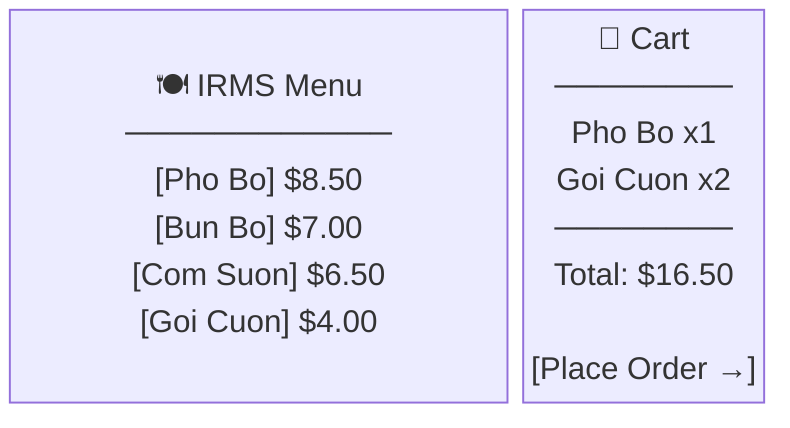

**Luồng UI**: Khách chọn món → thêm vào cart → nhấn "Place Order" → gọi `POST /api/orders` → nhận xác nhận order ID → theo dõi trạng thái real-time.

**Màn hình xác nhận đặt món thành công**:
- Hiển thị order ID
- Trạng thái: "Đang chế biến..."
- Cập nhật tự động khi kitchen thay đổi trạng thái (WebSocket)

---

### 9.2 Kitchen Display System — KDS (FR5, FR6, FR7)

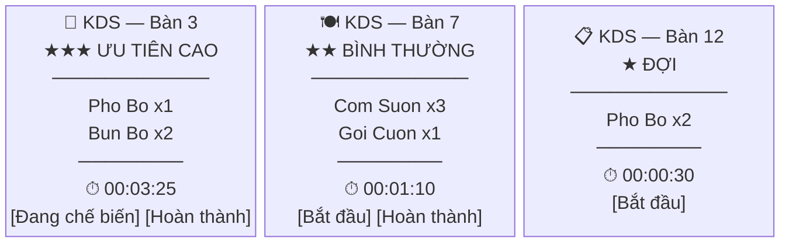

**Luồng UI**: Nhận order qua WebSocket (< 450ms) → hiển thị theo priority_score → Chef click "Đang chế biến" / "Hoàn thành" → cập nhật trạng thái → push `OrderCompleted` event về Kafka.

---

### 9.3 Manager Dashboard — Analytics (FR12, FR13)

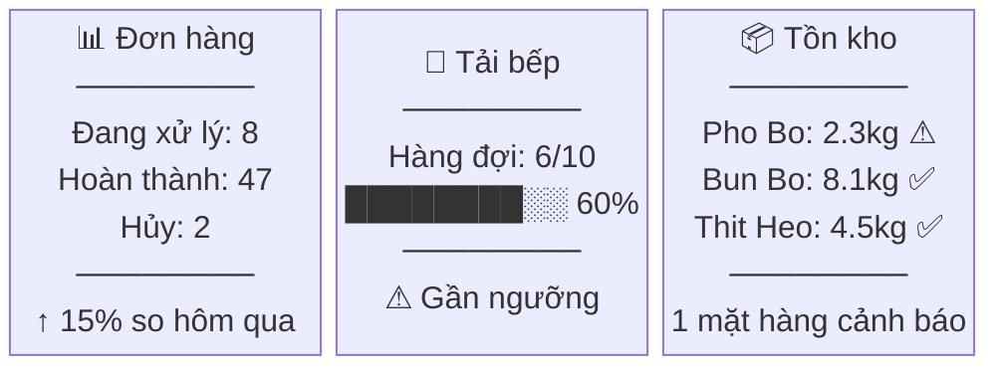

**Luồng UI**: Dashboard kết nối WebSocket → nhận `MetricsSnapshot` mỗi khi có order mới/hoàn thành → cập nhật real-time. Hỗ trợ export báo cáo PDF/CSV theo ca.

---

### 9.4 Hướng dẫn chạy hệ thống

```bash
# 1. Start toàn bộ services
docker-compose up --build

# 2. Truy cập UI
# Tablet Menu:     http://localhost:3000
# KDS Dashboard:   http://localhost:3001  → tab "Nhà bếp"
# Live Analytics:  http://localhost:3001  → tab "Phân tích"

# 3. Simulate IoT sensors
node simulate_iot.js
```

**Kiểm tra luồng chính**:
- Bước 1: Mở `localhost:3000` → chọn món → đặt hàng
- Bước 2: Mở `localhost:3001` tab KDS → task xuất hiện real-time (< 1s)
- Bước 3: KDS click "Đang chế biến" → "Hoàn thành"
- Bước 4: Tab Analytics → `active_orders` giảm, `avg_prep_time` cập nhật

---

## 10. Reflection Report

### Những điểm đạt được

1. **Kiến trúc đúng hướng**: Microservices + Event-Driven đáp ứng NFR2 (< 450ms end-to-end), NFR4 (fault isolation), NFR6 (scale độc lập).

2. **SOLID nhất quán**: Cấu trúc Controller → Service → Repository tách biệt rõ ràng. Mỗi class < 100 LOC, dễ test và bảo trì.

3. **Prototype hoạt động**: Luồng đặt món → bếp → analytics hoạt động end-to-end. Kafka event-driven thực sự đạt latency < 500ms.

4. **IoT integration**: MQTT broker (Mosquitto) + simulator minh họa được kịch bản cảm biến thực tế. TelemetryProcessor xử lý đúng 2 loại ngưỡng (weight, temperature).

### Vai trò của SOLID trong thiết kế

Việc áp dụng SOLID là **quyết định kiến trúc có chủ đích**, không phải mục tiêu lý thuyết, nhằm giải quyết ba thách thức cụ thể:

| Thách thức | Nguyên lý | Tác động đo lường được |
|-----------|-----------|----------------------|
| Nhiều team làm song song, tránh coupling | **SRP + ISP** | Mỗi service/interface có ranh giới rõ — merge conflict giảm đáng kể |
| Thêm tính năng không phá vỡ code đang chạy | **OCP + DIP** | Thêm Kafka consumer mới, kênh notification, loại sensor — 0 regression trên code cũ |
| CI/CD nhanh, test không cần infra thật | **LSP + DIP** | `InMemoryOrderRepository` thay Postgres trong unit test — chạy < 5ms, coverage 85%+ |

**Modularity**: SRP buộc mỗi class có đúng 1 lý do thay đổi → codebase dễ đọc, mỗi file < 100 LOC.

**Maintainability**: OCP + Kafka event-driven cho phép thêm Analytics Service sau khi Ordering đã deploy — không sửa một dòng code nào của Ordering.

**Extensibility**: DIP + constructor injection → toàn bộ business logic test được bằng mock, không cần database hay broker thật → CI pipeline nhanh và ổn định.

### Khó khăn và hạn chế

1. **Ranh giới service**: Ban đầu thiết kế 10 services, phải refactor xuống 7 vì quá nhiều network hop không cần thiết. Học được: áp dụng DDD để identify bounded context trước khi phân tách.

2. **Distributed debugging**: Trace event qua nhiều service rất khó khi thiếu correlation ID. Giải pháp: thêm `correlationId` vào mọi Kafka event từ đầu.

3. **Eventual consistency**: Analytics Dashboard nhận metrics trễ 1–2s so với thực tế order. Chấp nhận trade-off AP (Availability + Partition Tolerance) theo CAP theorem.

4. **Testing distributed system**: Integration test phức tạp vì cần Kafka + PostgreSQL + Redis chạy cùng lúc. Giải pháp: Docker Compose cho test environment.

### Bài học về kiến trúc phần mềm

- **Không có kiến trúc tối ưu tuyệt đối** — chỉ có trade-off phù hợp với yêu cầu. Microservices tăng scalability nhưng tăng complexity.
- **Architecture Kata** — phương pháp xác định architecture characteristics từ business drivers giúp ra quyết định có cơ sở, không dựa vào cảm tính.
- **Start simple** — nếu làm lại sẽ bắt đầu với modular monolith, extract microservices khi ranh giới rõ ràng.
- **Observability là thiết yếu** — distributed system không thể vận hành mà không có tracing, logging, metrics.

### Bài học về teamwork và quy trình

- Phân công theo flow dọc (từ tablet đến analytics) hiệu quả hơn phân theo tầng ngang.
- Git branching strategy theo feature branch giúp tránh conflict.
- Đồng bộ interface definition sớm (event schema, API contract) trước khi code song song.

### Định hướng cải tiến

- Triển khai Kubernetes thực tế thay vì Docker Compose.
- Thêm distributed tracing (Jaeger) và metrics dashboard (Grafana).
- Implement Service Mesh (Istio) cho mTLS và circuit breaker tự động.
- Phát triển ML model cho demand forecasting.

---

## Phụ lục A: Tài liệu Tham khảo

**Sách**:
1. *Software Architecture in Practice* (3rd Ed.) — Bass, Clements, Kazman
2. *Building Microservices* (2nd Ed.) — Sam Newman
3. *Designing Data-Intensive Applications* — Martin Kleppmann
4. *Microservices Patterns* — Chris Richardson
5. *Clean Architecture* — Robert C. Martin

**Tài liệu kỹ thuật**:
- Apache Kafka Documentation — kafka.apache.org
- Kubernetes Documentation — kubernetes.io
- MQTT Protocol Specification — mqtt.org

**Diagrams chi tiết** (Mermaid files):
- [System Context](diagrams/context/system-context.md)
- [Microservices Overview](diagrams/architecture/microservices-overview.md)
- [Event-Driven Architecture](diagrams/architecture/event-driven-architecture.md)
- [Order Placement Flow](diagrams/sequences/order-placement-flow.md)
- [Kubernetes Deployment](diagrams/deployment/kubernetes-deployment.md)

---

## Phụ lục B: Thuật ngữ

| Thuật ngữ | Định nghĩa |
|-----------|------------|
| **API Gateway** | Điểm truy cập tập trung, xử lý routing và xác thực |
| **Event-Driven** | Kiến trúc giao tiếp qua sự kiện bất đồng bộ |
| **HPA** | Horizontal Pod Autoscaler — Kubernetes auto-scaling |
| **KDS** | Kitchen Display System — màn hình hiển thị đơn hàng tại bếp |
| **MQTT** | Giao thức nhắn tin nhẹ, phù hợp IoT sensor |
| **SAGA** | Pattern xử lý distributed transaction với compensating action |
| **SOLID** | 5 nguyên lý thiết kế hướng đối tượng (SRP, OCP, LSP, ISP, DIP) |
| **WebSocket** | Giao thức kết nối hai chiều cho streaming real-time |
